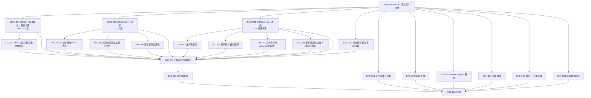

# 工程控制 / RELEASE-03 任务列表（TASK_LIST）

> 规范依据：`CONTROL_PACK_SPEC.md` §4（模板）、§5.1（拆分原则：**一个任务 = 一个可独立验证的 commit**；
> **按文件域互斥拆分**；**科学/架构/性能/文档不混**；每任务必须给出**验收命令**）。
> 逐任务书见 `tasks/*.md`（每任务一份，§5 模板）。

## 1. 依赖图

**并行说明**：DOC-201..204 与 EXP-201..206 **可全并行**（文件域互斥，互不依赖）；
FIX-201..208 各自依赖对应文档订正完成后开工；BLD-201 收口。

## 2. 任务总表

### A 类：逐级文档订正（已敲定，直接订正）

| 任务 | 标题 | 依赖 | 文件域 | 核心验收门 |
|---|---|---|---|---|
| **DOC-201** | 详细层「权重模式」整套作废（A44） | — | `docs/contracts/**`、`docs/modules/**`、`docs/architecture/**`、`docs/science/v6/**`、`README.md` | 全仓 `weight_mode` 家族**零残留**（除「已作废」留痕）；机器门可红可绿 |
| **DOC-202** | 详细层其余 🔴 订正（36 条） | — | `docs/architecture/**`、`docs/interfaces/**`、`docs/standards/**`、`docs/modules/**` | 四报告 🔴 全部有归宿；**不得两边并存** |
| **DOC-203** | 同批同步订正（12 条）+ 4 前置裁决 | — | `docs/contracts/**`、`docs/development/**`、`docs/design/**` | Q2/Q4/Q6/Q8 四条**先定**；其余随之 |
| **DOC-204** | 权威链与状态字段清理 | — | `docs/**`（非 science/algorithms）、`README.md` | 无下级文档自称「唯一权威」；登记表**零状态字段**；「本目录为空」类失实声明清零 |

### B 类：代码订正（已敲定，直接订正）

| 任务 | 标题 | 依赖 | 文件域 | 核心验收门 |
|---|---|---|---|---|
| **FIX-201** | aio 文件级唯一 I/O 边界 | DOC-202 | `lib/infrastructure/aio/**`、`lib/algorithms/drizzle/healpix_drizzle/**`、`lib/**/fits_output/**` | 除 aio 外文件写操作为 **0**（机器判据可执行）；块↔文件 API 删除或降级并登记 |
| **FIX-202** | HiPS 格式内部权重枚举作废 | DOC-201 | `lib/infrastructure/aio/include/aio_ahpx_format.h`、`src/ahpx/**` | HiPS 只存**帧级 SNR + 稀疏相对 SNR 比值**；权重枚举清零；兼容读取显式拒绝 |
| **FIX-203** | 提升键落地 | DOC-203 | `lib/infrastructure/cli/**`、`ci/ledgers/dead_config_keys.json` | `snr_path`/`rotation_deg`/`crpix_px` 进白名单；`precision` 用 `drizzle.precision_mode`；零消费登记台账 |
| **FIX-204** | 排异按 N 自动选择 | DOC-203 | `lib/algorithms/**rejection**`、`lib/infrastructure/scheduler/src/module_adapters.cpp` | 逐像素按 N 选（N<6 percentile / 6–15 winsorized / >15 linear fit）；**min/max 禁用**；能红能绿；1/N worker 一致 |
| **FIX-205** | 投影未实现显式报不支持 | DOC-202 | `lib/algorithms/coverage/**`（`p3_projection.cpp`） | 8 种冻结投影中未实现的**显式报错**；当前仅 TAN 可声明；负例锁定 |
| **FIX-206** | 原子性缺口闭合 | DOC-202 | `lib/infrastructure/aio/**`（HiPS writer）、`lib/algorithms/coverage/**` | HiPS tile 改原子发布；阶段二经暂存区；最高设计「本期例外」可移除 |
| **FIX-207** | 三命令同构 schema/模板统一 | DOC-203 | `contracts/schemas/phase_config_*.schema.json`、`config/templates/**` | 旧分支**保留** + 新增 `blocks[]`；模板/help 由**同一份键表**生成；旧形态**显式拒绝 + 迁移提示** |
| **FIX-208** | 事件流默认输出 + 磁盘门收窄 | DOC-203 | `lib/infrastructure/cli/**`、`lib/infrastructure/observability/**` | 事件流**无需旗标**即输出；唯一 schema；退出码 10 收窄为磁盘；`-y`/`-yes`/`-force` 保留 |

### C 类：实验（待确定，做实验定案）

| 任务 | 标题 | 依赖 | 文件域 | 核心验收门 |
|---|---|---|---|---|
| **EXP-201** | 天光采样点权重：`SNR²` vs `control_ivar` | — | `run/RELEASE-02/实验/E0x-*/`（**不入库**） | 三种数据面定案；判据非退化；≥5 轮独立复核 |
| **EXP-202** | NaN 处置：传播 vs 掩膜 | — | 同上 | 定案并写进产品内容证据；两处相反文档收敛为一 |
| **EXP-203** | Phase2 signal 量纲：面亮度 vs 通量 | — | 同上 | 定案；与投影导出语义守卫一致 |
| **EXP-204** | 排异 `N ≤ 3` 是否保留「不排异」 | — | 同上 | 定案；与 WBPP 表对齐 |
| **EXP-205** | SNR 三口径精度对比 | — | 同上 | 三条路径精度排序（**不得预设稀疏一定最好**）；判据 SP-0 |
| **EXP-206** | 噪声模型两套取哪套 | — | 同上 | 定案；与 §9.66 B / §9.67 定案 3 收口 |

### D 类：构建与验收

| 任务 | 标题 | 依赖 | 文件域 | 核心验收门 |
|---|---|---|---|---|
| **BLD-201** | 全量构建与机器门 | 全部 A+B | 构建产物（`build/`） | cmake/ninja 0 警告；ctest 全绿；全部机器门转绿；**无 waiver** |
| **E2E-201** | 端到端重跑 | BLD-201 | `run/RELEASE-03/**` | 三命令 rc=0；1/N worker 一致；无 CWD 残留；产品结构/数值校验过 |
| **ACC-201** | 验收（§7.1 三层） | E2E-201 + 全部 EXP | `ACCEPTANCE.md` | 每任务有归宿：CLOSED（附证据）/ 变更 claim / 待定（附实验结论） |

## 3. 实验纪律（C 类，§9.72 + RELEASE-02 第二优先级）

- 实验材料**全部落 `run/RELEASE-02/实验/`**（按**实验单元**划分，含**实验代码 + 实验报告**）；
- **三种数据面**（负责人明确要求）：① **纯合成数据**；② **基于哈勃真实信号 + 科学生产噪声梯度的合成数据**；③ **`testdata` 真实数据**；
- **判据必须非退化**（能红能绿）；**门禁阈值只能来自误差预算**；
- **≥5 轮独立复核**（最高设计 §11.1.1）；
- **科学问题不得预设结论**——实验说了算；结论与预期相反时**改结论，不改数据**；
- 实验**不阻塞** A 类订正。

## 4. 执行纪律

- **`CONTROL_PACK_SPEC.md` §6.1**：负责人指示「执行控制包 RELEASE-03」后才启动；
- A 类 4 个文档任务 + C 类 6 个实验任务**可全并行**，各由独立 SubAgent 承担；
- B 类代码任务在对应文档订正完成后开工，前台负责接口对齐与合并；
- **同一工作区 tracked 文件写入必须串行**（§6.2）；审查/测试可并行；
- **任何代码改动改了科学口径 ⇒ 先补合成数据 Oracle 用例再改实现**；
- 任务状态：`NOT_STARTED → IN_PROGRESS → PASS / FAIL / BLOCKED`（**PASS 仅由前台验收后写入**，§6.3）；
- 前台**独立复跑**验证后才提交（§7.1 三层）；**SubAgent 零 git 写**；
- **论文/实验材料不入库**（`run/*` gitignore，只留本地痕迹）。
