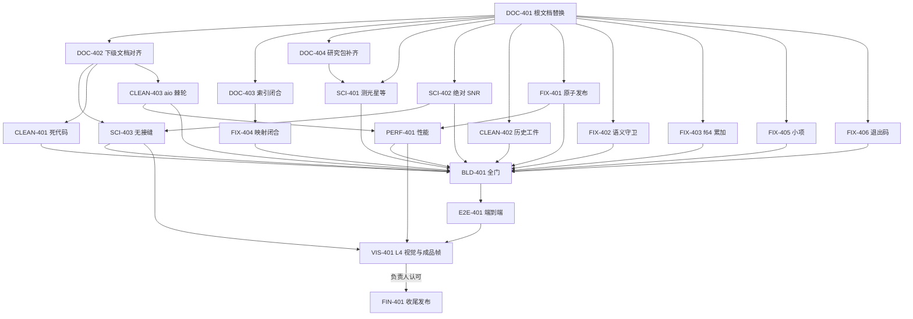

# TASK_LIST — RELEASE-04

## 任务总表

| ID | 标题 | 文件域 | 依赖 | 验收门（可机器复跑） |
|---|---|---|---|---|
| DOC-401 | 替换五份根文档 | 仓库根 5 份 .md | — | 根文档与包内逐字节一致；`ci --all` 文档门通过 |
| DOC-402 | 下级文档对齐新最高设计 | docs/plugins、docs/science、docs/algorithms、docs/design | DOC-401 | 无日期/任务编号/历史叙事；术语与最高设计一致；五档排异/control_ivar/面亮度/NaN 掩膜/噪声模型 A 口径一致；`ci --all` 全绿 |
| DOC-403 | 双向层级索引闭合 | docs/DOCUMENT_INDEX.yaml、各文档抬头、eng/ci/checks.json | DOC-401 | 最高设计每节索引指针可达；每份下级文档有上游条款；悬空索引门红/绿双向测试 |
| DOC-404 | 研究包与测光文档补齐 | docs/research、docs/science/PHOTOMETRY.md | DOC-401 | 最高设计附录 B 引用的研究包全部存在；测光文档含 Gaia XP×QE×透过率积分的完整方法学与文献 |
| SCI-401 | 实验单元 SCI-A：测光星等坐标系 | 实验/SCI-A、docs/science/PHOTOMETRY.md（只读引用，订正走 DOC-402 协调） | DOC-401、DOC-404 | 报告八要素齐全；三重佐证；非退化负例；独立审稿；判据表逐项 PASS |
| SCI-402 | 实验单元 SCI-B：绝对 SNR 传递链 | 实验/SCI-B、docs/research/SNR_WEIGHT_RESEARCH_PACK.md | DOC-401 | 报告八要素；天光抬升 SNR 趋零负例；三口径适用域图谱；ΣSNR² 集成对拍；独立审稿 |
| SCI-403 | 实验单元 SCI-C：加性天光与无接缝 | 实验/SCI-C、docs/science/PHASE2_UPM.md | DOC-401、SCI-402 | 纯加性世界阶跃归零；乘性世界归 Phase1 后归零；非退化接缝判据；真实数据接缝度量；独立审稿 |
| CLEAN-401 | 死代码与退役实现处置 | lib/（v6、orchestrator、psfsw 残留、噪声模型 B、第三 σ 估计器） | DOC-402 | 无注释死代码；保留件有统一注释块（是什么/为什么/现状/删除条件/依据）；构建测试全绿；退役分支不可达测试 |
| CLEAN-402 | 历史治理工件清理 | 工程控制/、reports/、docs/{archive,backlog,governance,owner,review} | DOC-401 | 只保留当前包；有长期价值结论已并入正式文档；删除清单回执；悬空引用门全绿 |
| CLEAN-403 | aio 唯一 I/O 棘轮收口 | lib/ 47 处 PRODUCTION-RESIDUAL | DOC-402 | 生产路径 I/O 全部经 aio；TEST-HARNESS 白名单显式登记；棘轮门红/绿双向测试 |
| FIX-401 | HiPS tile 原子发布 + Phase2 暂存区 | infrastructure/aio、phase2 写路径 | DOC-401 | 中途 kill 无半成品 tile；phase2 先写暂存区再原子发布；负例测试 |
| FIX-402 | Phase3 语义守卫接线 + 写端口单位 | phase3、module_adapters、p3_v6_export | DOC-401 | 非面亮度输入显式拒绝；写端口 SURFACE_BRIGHTNESS；BUNIT/provenance 齐全；负例测试 |
| FIX-403 | HiPS hierarchy 累加 f64 | aio_hips_writer.cpp | DOC-401 | dk=9 层级累加偏差降到合同容差内；Oracle 对拍；负例注入能红 |
| FIX-404 | 登记与映射闭合 | MODULE_MAP.yaml、lib/ 注释、DATA_SEMANTICS 标准块表、aio_pipeline.h | DOC-403 | 53 条假路径清零；40 条悬空注释清零；variance 入标准块表；映射门全绿 |
| FIX-405 | 配置/产物/事件/导出小项 | p2_final.json、drizzle 计数、事件 kind、export 判据、variance_floor | DOC-401 | weight_mode 残留清零；n_rejected_nonfinite 暴露；10 类 kind 登记；导出严格字节判据可过；variance_floor fail-closed |
| FIX-406 | SIGTERM 退出码与 v6 SIN 容差 | cli 信号处理、v6 SIN 内核 | DOC-401 | SIGTERM 全阶段 exit 9；SIN 往返 2.5e-5px 与冻结容差对齐（或经 SCI 复核后冻结） |
| PERF-401 | cfitsio 全局锁与 Phase2 并行 | aio FITS 读、scheduler、phase2 | FIX-401、CLEAN-403 | Phase2 并行区间 CPU 均值利用率达标（无 ≥10s 低利用窗）；吞吐基线对比归档；L2 门通过 |
| BLD-401 | 双平台构建与全门转绿 | ci、.github、tests | 除 VIS/FIN 外全部 | `ci --all` 全 PASS、ctest 全绿、零 waiver、exemptions 空；双平台 CI 通过 |
| E2E-401 | 三命令端到端与预检语义 | run/、testdata 小批量 | BLD-401 | 三命令 rc=0；JSON 串行；预检 correct/warn/error 与 yes/-y/-force 语义对拍；1/N worker 一致；SIGTERM exit 9 |
| VIS-401 | L4 两组真实数据全流程与成品帧 | run/RELEASE-04（不入库） | E2E-401、SCI-403、PERF-401 | M42+银心 R 通道全流程 rc=0；两张平面 FITS + 拉伸切块 PNG；无黑洞/亮斑/接缝；分段计时与热点分析；agent 初审通过 |
| FIN-401 | 收尾与发布准备 | README.md、cli version、发布清单、工程控制/RELEASE-04 | VIS-401 负责人认可 | README 更新；`--version` 输出 0.0.1alpha；发布包白名单/SBOM；控制包收口自清理；READY_FOR_OWNER_REVIEW |

## 依赖图

## 并行派发建议（文件域互斥）

- 第一波（D1 完成后）：D2、D3、D4、S1、S2、C2、F1..F6 可并行（各自文件域不重叠）；
- 第二波：S3（待 S2 结论）、C1/C3（待 D2）、P1（待 F1/C3）；
- 第三波：BLD 收口 → E2E → VIS → FIN（严格串行）。

## 状态登记

每任务在 `ACCEPTANCE.md` 登记 NOT_STARTED / IN_PROGRESS / PASS / FAIL / BLOCKED；PASS 仅由前台独立验证后写入。
