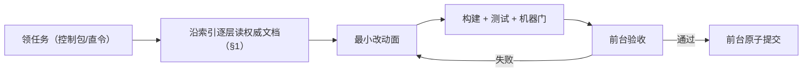
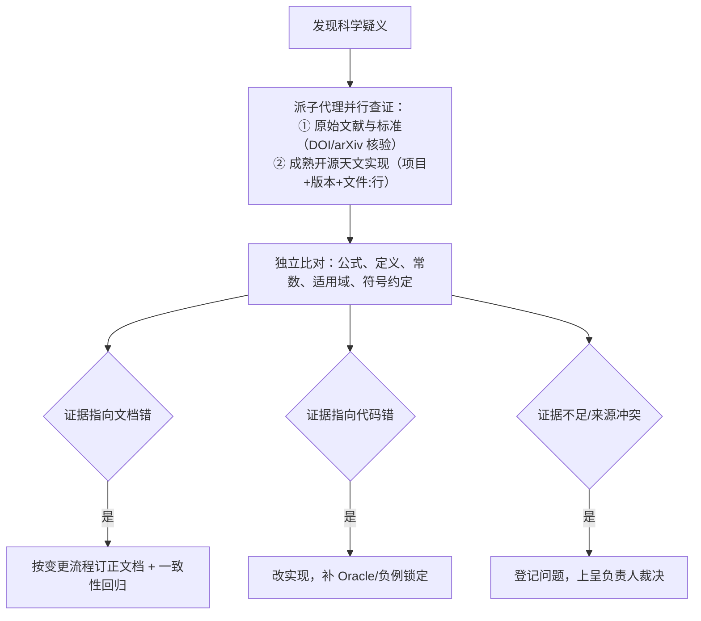

# AGENTS.md — AstroCS 机器干活手册

---

## 1. 开工前必读：从最高设计逐层下钻，读完再做

接受任何任务前，按以下顺序读文档：

1. `ASTROCS_DESIGN.md` —— 项目是什么、做到什么、CLI/架构/验收（最高权威），先通读与任务相关的章节；
2. 沿该章节末尾的**索引指针**逐层下钻：`docs/design/`（数据对象与设计细节）→ `docs/plugins/`（涉及模块的工作细节）→ `docs/science/` 与 `docs/algorithms/`（公式与推导，只读权威，不改）；
3. `docs/contracts/` —— 涉及的 schema 与数据合同；
4. `ENGINEERING_SPEC.md` —— 代码/测试/提交/CI 规则；
5. `ACCEPTANCE_SPEC.md` —— 四层验收标准与预览版发布门；
6. `CONTROL_PACK_SPEC.md` —— 任务来自控制包时读；
7. `docs/ci/` —— 相关检查项怎么跑；
8. `docs/research/` —— 涉及科学方法选型或公式核实时，按研究包规定研读一手公开资料、开源代码与文献。

**读法是"逐层下钻"，不是"挑一篇读"**：先在最高设计确认这件事的规范与上下游，再沿索引读到该模块的详细文档，把"规范怎么说、公式怎么写、合同字段是什么、现状在哪"查清后才动手。**不读就开工 = 违规。**

### 1.1 铁律：任何任务先到最高文档确定规范，再动手

做任何事之前——写代码、改文档、出控制包、写测试、改门禁、命名、定目录结构、定提交格式——先回到权威链（`ASTROCS_DESIGN.md` 起，按 §0 的索引）把"这件事的规范在哪、怎么规定的"查清。

- 规范已存在：照它做，不凭印象、惯例或别的项目样子另发明一套；
- 规范不存在：先在最高设计或它指向的那一层补上规范，再按新规范做；
- 规范在别的文档：去那一份读，不只看最高设计；
- 自检：交付前必须能回答"我这件事的规范依据是哪一份文档的哪一条、沿哪个索引找到的"。答不出来 = 违规。

---

## 2. 一句话项目定位

AstroCS = 天文 CCD/CMOS 图像校准与标准化数据库。三个独立命令：`normalize`（单帧标准化）、`mosaic`（马赛克）、`export`（投影导出）。核心科学方法是三个紧密相连的创新点：测光校准到星等坐标系、跨帧绝对 SNR、加性天光与无接缝叠加（最高设计 §2）。阶段间只通过磁盘产品 + manifest + 哈希交换。正式平台 Windows x64 与 Linux amd64，纯 CPU 生产，ACR 生产不可达。

---

## 3. 环境与构建（Linux 开发节点）

```bash
# 配置（仓库根，唯一根 CMake）
cmake -S . -B build -G Ninja -DCMAKE_BUILD_TYPE=Release
# 构建
ninja -C build
# 测试（最小到全量按需）
ctest --test-dir build --output-on-failure
# 机器一致性检查
python3 eng/ci/run_checks.py            # 具体以 docs/ci/CI_SPEC.md 为准
```

- 构建/测试/检查先于任何"完成"声明；
- 所有外部命令带 `timeout` 并保存日志（`run/<task>/logs/`）；
- 在仓库内工作，不写死服务器绝对路径。

---

## 4. 标准工作流



1. 领任务后先按 §1 逐层读文档，确认改动范围（文件域）；
2. 只改任务声明允许的文件，不顺手改无关代码；
3. 每个任务 = 最小改动面，科学/架构/性能/文档不混提；
4. 构建、测试、机器门全过后交前台验收；SubAgent 不 commit/push。

---

## 5. 科学工作纪律

- **三个创新点是 alpha 前必须跑通的核心算法**（最高设计 §2、§12.3）：测光星等坐标系（SCI-A）、绝对 SNR 传递链（SCI-B）、加性天光与无接缝（SCI-C），各自以独立实验单元呈现，必须有论文、开源代码、三类实验数据相互佐证。
- 科学公式、权重/variance/ivar/SNR 定义、排异规则、归约顺序、精度与默认容差按 `docs/science/`、`docs/algorithms/` 执行，改动走变更流程（见 §8）。
- 实验数据三类齐备：HST 真实信号模板 + 完整物理前向仿真、纯解析代数合成（含"真值无效应⇒归零"负例）、testdata 真实数据（最高设计 §12.2）。
- 判据必须非退化：真值无效应时度量归零或判红；恒真门没有证据资格。
- 实验单元自包含：报告（假说/方法/数据/结果/结论/诚实边界/复现命令/佐证来源）、固定 seed 的 code、results、data；结论经独立子代理多轮审稿。
- 发现科学文档或自己的前提可能有错时，先质疑前提、做实验/查一手证据，不盲从文档也不盲从现有代码；开源实现同样可能有错，回到它引用的文献核对。

---

## 6. 硬禁令（违反即回退）

- 不动科学公式、默认容差、SCI/ALG 冻结定义（除非按变更流程批准）；
- 不串三阶段：不把 normalize/mosaic/export 隐式串成一次运行；
- 不硬编码线程/ISA/block：由 `benchmark` 生成的 profile 决定；
- 不在 main 外开分支/worktree/额外 clone；只 main 原子提交；
- 不 force push / amend / 历史重写；
- 不把运行产物散落根目录：一切输出落 `output_dir` 或 `run/`，不入库；
- 不宣布发布：发布决定只属负责人；
- 不用 facade/空骨架/no-op 冒充实现完成；
- 不以"环境问题/工具问题"掩盖失败，必须给出可复现证据；
- 不用 waiver 盖红灯；
- 不复制文档长文进 AGENTS.md 或提交消息；
- 不读取/打印密钥与凭据（如 Fatduck 密钥只用 `-i` 路径引用）。

---

## 7. 目录落位速查

```text
lib/algorithms/      科学算法（并联放置；phase 为内部指代）
lib/infrastructure/  基建（cli/normalize·mosaic·export + scheduler/pipeline/aio/benchmark/observability/gaia/acr/hips_browser）
docs/                自解释文档集（science 公式 / algorithms 推导 / plugins 插件 / design 设计 / contracts 合同 / ci 规范）
contracts/           合同 schema（唯一事实源）
tests/               测试（与模块共址可复用）
实验/                 科学实验单元（SCI-A/B/C 等，随仓库维护、可独立复核）
工程控制/             控制包（收口后按 CONTROL_PACK_SPEC §9 清理）
run/                 临时产物/日志（gitignore，不入库）
```

根目录固定条目见 ENGINEERING_SPEC §7；新根目录条目先登记并经负责人确认。

---

## 8. 提交纪律与科学查证

- 一个 commit = 一个明确目的；验证后立即提交；提交消息写清"做了什么 + 依据哪条权威条款"，不写流水账与任务编号长串；
- SubAgent 零 git 写权限；前台按序串行提交；每次 push 后 fetch 核对三 SHA 一致（HEAD=main=origin/main）。

**科学疑义查证流程**：实现、测试现象与 `docs/science/` / `docs/algorithms/` 对不上，或怀疑科学文档本身有误时：



- 查证记录证据来源（文献号/章节、开源项目与版本、复算过程），写入变更 claim 或任务回执；
- 科学问题由 agent 按"发现问题 → 派子代理研究 → 订正文档 → 修改代码 → 补 Oracle/负例 → 前台独立验证 → 统一提交"闭环自行推进，一个问题走到闭环再进下一个；
- 穷尽文献与实验仍无法收敛、且存在互斥产品方向取舍时，带证据与推荐方案上呈负责人。

---

## 9. 自查自修

交付前自行发现并解决问题，不把可自查的问题留给负责人。

- 完成实现后主动做：构建 + 全量相关测试 + 机器门、负例注入（能红能绿）、1/N worker 一致性、端到端试跑、产品 schema 与 manifest 核对；红灯先自修到全绿再交前台；
- 提交验收（`ACCEPTANCE_SPEC.md` 各层）前按验收清单自跑一遍并保存证据；视觉层（L4）提交前自行逐块检查（分辨率不足时对疑问区域裁剪放大再读），并做分段计时找热点优化；
- 对"看起来通过"的结果保持怀疑：空断言、SKIP 充数、证据文件为空、检查器静默退化都算未完成；
- 门禁/判据本身不合理时改进门禁本身，配可执行正例/负例与 `--self-test`，而不是放松判据。

---

## 10. 何时必须停下来问负责人

- 顶层合同的结构性变更：三命令划分、JSON 输入输出合同的结构性破坏、HiPS 产品数据模型的破坏性变更；
- 科学定义有歧义或两篇权威文档打架，经 §8 查证仍无法判定，或穷尽实验后存在互斥产品方向；
- 许可证存疑；
- 删除或覆盖 testdata、用户数据、交付物；
- 权限/数据/环境缺失导致任务无法推进（登记 BLOCKED，不硬编）；
- 任何涉及"发布"的决定与版本号。

机器门禁通过后自动推进，不设频繁人工 checkpoint；上述情况才请求负责人。
