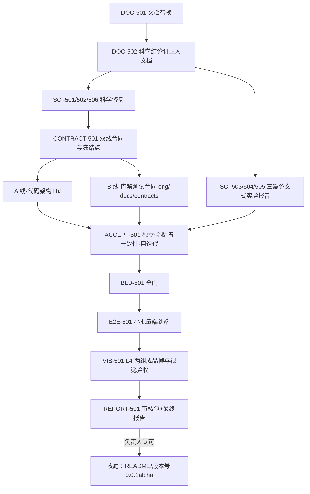

# 工程控制 / RELEASE-05 启动文档（00_README）

> 规范依据：`CONTROL_PACK_SPEC.md`（包内 `docs/` 为最新版，执行首步替换仓库文档）。
> 本包主题：**科学闭环 → 架构落地与门禁审计双线并行 → 独立验收 → 全流程与视觉验收 → 报告**。

## 1. 背景与负责人裁决

RELEASE-04 三个科学实验单元全部 PASS（含独立审稿），但留下四类问题，负责人已逐项裁决：

1. **架构路线已定**：三个命令是三个独立进程、各自实例化调度器与内存管线；阶段间只走 HiPS 磁盘产品。阶段内是命名块内存管线——模块读块、写新块、显式销毁旧块（块有生命周期：raw 在校准后销毁、calibrated 在测光归一化后销毁，WCS/PSF/SNR 等长生命周期块存活到导出）。三阶段调度形态：
   - normalize：工序多流程长，**异步工作流编排**（多帧并行、帧内流水、空闲时异步预取/预解析星表/预建 PSF），调度器是性能重点，性能优化放在功能跑通之后，**用预埋探针的实测数据优化编排**；
   - mosaic：像素相互独立，**天球窗口并行**，窗口大小显式权衡内存与 CPU；
   - export：算法最简单，**子块流式**（读块→投影→写 FITS，有界队列背压，不整幅驻留）。
   现行整阶段 Session 与未接入的 orchestrator 按此目标态接入/重写并退役，数值等价验证通过后删除旧实现。优化细节 agent 自解释，前提是遵守上述架构。
2. **科学遗留必须修**：SNR 噪声项重复计入读出噪声（σ_F 高估 12.8%~36.6%）、UPM 三个生产缺陷（容差永不收敛、converged 缺档、正规方程近奇异）、唯一 ctest 红 p1001；测光不设星数门槛，星少到 SCI-PHOT-001 §4 求解前提不成立即 NO_DATA 拟合失败（见 `OPEN_QUESTIONS.md` Q-5）。
3. **门禁与测试有很多问题**：L2 性能门是恒真门、监控字段不生效、测试断言不存在的措辞、空断言等。门禁/测试/合同的合理性审计与代码整理**双线并行、互不打扰**，需要约定的地方提前在合同里写清楚。
4. **文档四处订正已由负责人侧完成**（包内 docs/，执行首步原样替换）：架构章重写、目录结构现行态、历史流水账清除、合同两处分工、测光适用域、UPM 表示能力边界。

## 2. 阶段划分

## 3. 双线纪律（重点）

CONTRACT-501 先冻结文件域与接口约定，之后两线并行：

| | A 线（代码架构） | B 线（门禁测试合同） |
|---|---|---|
| 文件域 | `lib/**`、`实验/**/code`、`实验/**/results`（报告归 SCI-503..505） | `eng/ci/**`、`eng/tests/**`、`eng/contracts/**`、`docs/contracts/**`、`docs/ci/**` |
| 内容 | 命名块机制、三阶段调度器、节点改写、旧架构退役、死代码、探针性能优化 | 门禁合理性审计与修复、测试合理性审计与补充、合同预先约定、双向对应 |
| 禁止 | 不改门禁阈值/注册表、不改测试断言口径 | 不改 lib/ 生产代码；发现代码缺陷登记派单给 A 线 |

- 共享面（`docs/science`、`docs/plugins`、`docs/architecture`、`docs/owner`）在阶段 1（DOC-502）一次性改完冻结；双线期间共享面改动走前台登记、串行合并；
- A 线节点改写以 B 线审计前的现有测试为数值等价基线；B 线若需改变科学断言口径，提差异单在每日合并点由前台裁决，不私自改；
- 两线各自小步提交、文件域互斥，避免 merge 冲突与互相阻塞。

## 4. 科学工作纪律（重申）

- 科学结论三重佐证（DOI/arXiv 核验、开源项目+版本+文件:行、仓内实测）；三类数据互证（HST 物理仿真、纯代数合成含非退化负例、testdata）；
- 发现科学文档/前提有误：派子代理查一手文献与开源、做实验，按"研究→订正文档→改代码→补 Oracle/负例→独立验证→统一提交"闭环；
- 无法裁决的分歧（互斥方向、证据冲突）不硬改，写入审核包 `OPEN_QUESTIONS.md` 随报告交付。

## 5. 三篇论文式实验报告（负责人阅读件）

SCI-503/504/505 各产出一篇**论文形式的精细中文报告**（放 `实验/<单元>/REPORT_paper.md`）：摘要、引言（问题与意义）、方法（公式与口径）、实验设计（数据/对照/判据）、结果（精选图表与关键数字，不堆原始数据）、讨论（适用域、反例、与 PixInsight/Siril 等对照、诚实边界）、结论、参考文献。面向负责人阅读，说清"猜想是否成立、在什么条件下成立、工程上怎么做"。原始数据仍留 results/，报告不搬运。

## 6. 自主裁决与上呈

可自行裁决：有出处与实验的科学方法问题、门禁/判据改进（配正负例与 --self-test）、工程实现选型、死代码与工件清理（清单回执）。
必须上呈：发布与成品帧判定、版本号、顶层合同结构性变更、创新点被证伪或互斥方向、许可证、删 testdata/用户数据、双线合同争议前台无法裁决的。

## 7. 入口

负责人明确指示"**执行控制包 RELEASE-05**"启动；先 `git pull`，首步 DOC-501 替换文档。任务总览 `TASK_LIST.md`，差距 `GAP_AUDIT.md`，任务书 `tasks/`，启动提示词 `PROMPT.md`。
