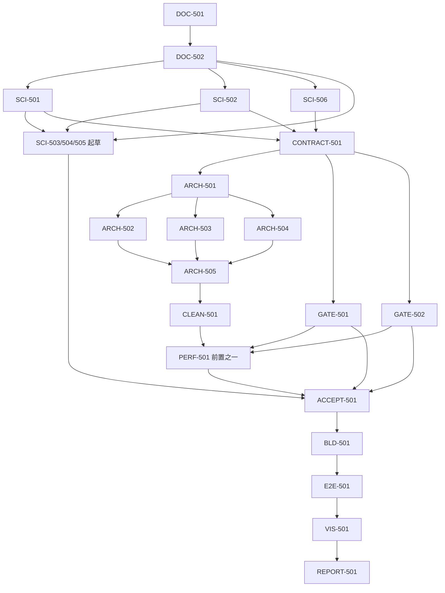

# TASK_LIST — RELEASE-05

## 任务总表

| ID | 标题 | 线 | 文件域 | 依赖 | 验收门 |
|---|---|---|---|---|---|
| DOC-501 | 替换五根文档 + PROJECT_SPEC | 0 | 仓库根 5md、docs/owner/PROJECT_SPEC.md | — | 逐字节一致；doc-index 全绿 |
| DOC-502 | 科学结论订正入文档 | 1 | docs/science、docs/plugins、docs/research、docs/algorithms | DOC-501 | 四处结论入文（见任务书）；无历史叙事；索引闭合 |
| SCI-501 | SNR 噪声项双计修复（FIX-407） | 1 | lib/algorithms/noise_snr、module_adapters 相关行、eng/tests 对应测试* | DOC-502 | σ_F 与 Monte Carlo 真值一致；双计臂判红负例；ctest 绿 |
| SCI-502 | UPM 三生产缺陷修复 | 1 | lib phase2 upm/scheduler 适配、测试* | DOC-502 | 相对容差在 300e⁻ 尺度收敛；converged 0/1/2/3；近奇异 κ 有正则化与 provenance；SCI-C 全判据复跑全绿 |
| SCI-506 | p1001_real_nodes 产品行为红修复 | 1 | 缺陷定位文件、测试* | DOC-501 | 该 ctest 转绿；根因记录；负例保护 |
| SCI-503 | 论文式报告：测光星等坐标系 | 1 | 实验/photometric-magnitude/REPORT_paper.md | SCI-501 后定稿 | 论文八段结构；n≥100 适用域表述；负责人可读 |
| SCI-504 | 论文式报告：跨帧绝对 SNR | 1 | 实验/absolute-snr/REPORT_paper.md | SCI-501 | 同上；含双计问题的正确口径与修复后结果 |
| SCI-505 | 论文式报告：加性天光无接缝 | 1 | 实验/additive-sky-seamless/REPORT_paper.md | SCI-502 | 同上；含表示能力边界与条件结论 |
| CONTRACT-501 | 双线合同与冻结点约定 | 前置 | eng/contracts、docs/contracts、docs/ci（新增调度/块生命周期/性能门/文件域合同） | SCI-501/502 | 合同评审表；双线文件域、块生命周期、调度器接口、性能判据、监控字段语义全部成文；schema 与说明双向对应 |
| ARCH-501 | 命名块机制与块生命周期（A 线） | A | lib/infrastructure/pipeline | CONTRACT-501 | 块创建/消费/销毁单测；生命周期 DAG 校验器；内存即时归还可观测 |
| ARCH-502 | normalize 异步工作流调度器（A 线） | A | lib/infrastructure/scheduler、cli/normalize | ARCH-501 | 多帧并行+预取+空闲工作流；探针落事件流；1/N worker 数值一致 |
| ARCH-503 | mosaic 天球窗口并行调度器（A 线） | A | scheduler、cli/mosaic | ARCH-501 | 窗口大小可配；窗口间无共享可变状态；归约顺序冻结；确定性测试 |
| ARCH-504 | export 子块流式调度器（A 线） | A | scheduler、cli/export | ARCH-501 | RSS 与子块大小成正比、与总图无关；I/O 计算重叠；背压测试 |
| ARCH-505 | 生产节点改写与旧架构退役（A 线） | A | lib/phase*_session、pipeline/orchestrator、20 节点 | ARCH-502/503/504 | 全部节点走块读写；三命令合成全链数值等价（冻结容差）；session/orchestrator 按 ENGINEERING §2 退役（删除或统一注释）；CHK-RETIRED-CODE 绿 |
| CLEAN-501 | 死代码与注册表缺口收尾（A 线） | A | lib、eng/ci 注册表（删代码在 A，清单解除） | ARCH-505 | RELEASE-04 D-2 的 B1–B5、66 路径/72 能力缺口逐项处置；MODULE_MAP fake=0 |
| GATE-501 | 门禁合理性审计与修复（B 线） | B | eng/ci、docs/ci | CONTRACT-501 | L2 门真判红（违规必红）；worker_balance 去恒定值；requires_monitor/mutates_workspace 语义二选一落地；D-14 陈旧路径修复；全部门禁 fail-closed 普查表；每门有正负例 |
| GATE-502 | 测试体系审计与补充（B 线） | B | eng/tests、docs/api、docs/contracts | CONTRACT-501 | linux-main 15 红处置；api 5 条不存在措辞、CFG002-04 反例修复；空断言普查；66/72 缺口对应测试补齐；ctest 全绿 |
| PERF-501 | 探针驱动的编排性能优化（A 线，最后） | A | scheduler、aio 读路径 | ARCH-505、GATE-501 | 基于探针数据定位串行段/读放大；L2 真门下平均利用率/低利用窗/读放大达标或给出证据化上限；1/N 确定性不破 |
| ACCEPT-501 | 独立验收：五一致性自迭代 | 独立 | 只读全仓 + 审核报告 | 双线、PERF 完成 | 科学-文档-合同-代码-测试逐项映射表；问题回派闭环；OPEN_QUESTIONS.md；不参与实现者审 |
| BLD-501 | 双平台全门 | 收尾 | ci、.github | ACCEPT-501 | ci --all 全绿、ctest 全绿、零 waiver；Windows CI 构建过 |
| E2E-501 | 小批量端到端 + 预检矩阵 | 收尾 | run/（不入库） | BLD-501 | 三命令 rc=0；correct/warn/error × yes/-y/-force 矩阵；1/N 一致；SIGTERM 9 |
| VIS-501 | L4 两组成品帧与视觉验收 | 收尾 | run/RELEASE-05 | E2E-501 | M42+银心 R 通道两张平面 FITS+拉伸切块 PNG；无黑洞/亮斑/接缝；SCI-C 接缝度量互证；计时热点；agent 初审通过交负责人 |
| REPORT-501 | 审核包与最终报告 | 收尾 | 报告（artifacts 或控制包） | VIS-501 | 三篇论文报告 + 五一致性审核报告 + OPEN_QUESTIONS + 性能/视觉证据索引，交负责人 |

\* SCI 修复如必须改 eng/tests：只改对应科学断言的测试文件，按双线约定在前台登记，不动门禁注册表。

## 依赖图

## 并行派发

- 阶段 1：DOC-502 与 SCI 修复可按文件域并行（科学文档与对应代码同任务内闭环）；三篇报告在修复有结论后定稿；
- 双线：CONTRACT-501 冻结后 A1 与 B1/B2 并行；A 线内部 ARCH-502/503/504 在 ARCH-501 后并行；
- 收尾严格串行：独立验收 → 全门 → 端到端 → 视觉 → 报告。
