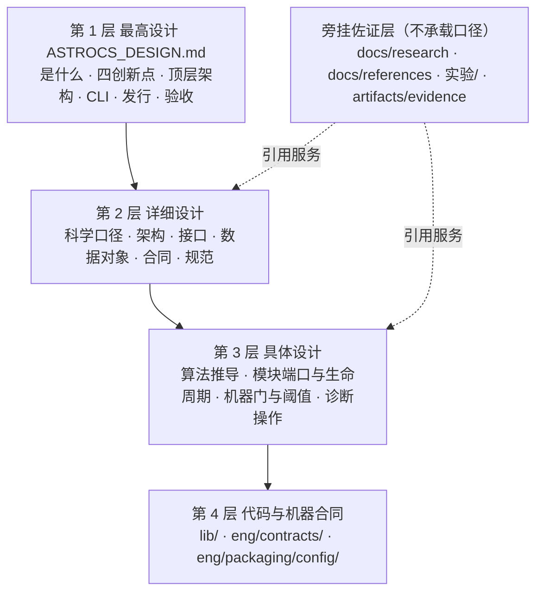
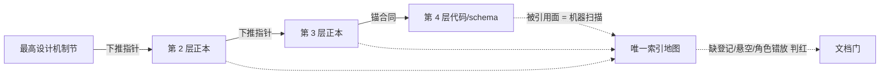

# 目标文档架构

ACSD 文档体系的重建目标态：一条权威链、每个主题一份正本、每个目录承载固定角色。开发节点据此判定"某份内容该写在哪、某份文档该在哪一格"。

## 1 权威链与层级归属



| 层级 | 该层文档回答的问题 | 允许承载 | 禁止承载 |
|---|---|---|---|
| 第 1 层 | 项目是什么、做到什么、顶层怎么分 | 顶层决策、机制定义、状态阶梯、验收与发行原则 | 公式推导、数值表、源码行号、实验过程数据 |
| 第 2 层 | 这一块具体怎么设计 | 口径定义、模块划分、数据流、接口与合同语义、规范判据 | 函数级端口表、逐符号行号锚、门阈值读数快照 |
| 第 3 层 | 怎么实现这一块、怎么验 | 算法推导与数值方法、模块端口与生命周期、门登记表、构建/诊断操作 | 与上位不同的第二套口径、独立演化的术语 |
| 第 4 层 | 实际是什么 | 代码、schema、出厂配置、profile | 规范说明正文（说明写在下位文档，机器面是事实源） |
| 旁挂佐证 | 凭什么信 | 文献综述、开源对照、实验单元报告与结果表 | 规范性判据、状态阶梯、"唯一口径"声明 |

层间关系：下位与上位冲突时以上位为准，冲突本身按缺陷消除；任何文档不声明第二套权威顺序或自外的"唯一口径"。每层只写该层的结论与约束，指向下层的细节一律用索引指针。

## 2 目标目录树与目录职责

```text
ASTROCS_DESIGN.md              第 1 层  最高设计：是什么/四创新点/顶层架构/CLI/发行/验收
AGENTS.md                      第 2 层  干活手册：读文档顺序、环境构建、工作流、落位速查
ENGINEERING_SPEC.md            第 2 层  工程规范：语言风格、测试、Git、目录、文档集、提交
ACCEPTANCE_SPEC.md             第 2 层  验收规范：四层验收逐项判据、专项验收、发布门清单
CONTROL_PACK_SPEC.md           第 2 层  任务包治理：任务卡/回执/收口与清理
README.md                      入口     导航：权威链图、三命令、往哪读
docs/
  DOCUMENT_INDEX.yaml                    全文档集唯一索引地图（§3 双向索引的机器面）
  GLOSSARY.md                            术语与词表正本
  KNOWN_LIMITATIONS.md                   限制与未决登记正本
  VERSIONING.md                          版本与命名空间治理
  DEVELOPER_GUIDE.md                     开发上手（构建/调试/测试的入口页）
  science/                               第 2 层  科学定义：物理量、公式、口径为何正确
  architecture/                          第 2 层  架构设计：模块划分、数据流动、执行与资源模型
  design/                                第 2 层  阶段详细设计与数据对象、产品落盘形态
  interfaces/                            第 2 层  接口契约：CLI、ABI、I/O、阶段间产品交换
  contracts/                             第 2 层  合同说明：JSON/schema/字段语义（对应 eng/contracts/）
  standards/                             第 2 层  标准与检查：跨模块规范判据
  algorithms/                            第 3 层  算法推导：数值方法、复杂度、实现级合同
  plugins/                               第 3 层  模块工作细节正本：职责、端口、生命周期、已知缺陷（被门机器解析）
  modules/                               第 3 层  模块映射面：MODULE_MAP.yaml + registry/ 生成式合同页（手写短页折入 plugins/）
  ci/                                    第 3 层  机器门：门清单、流水线、工件、阈值登记
  development/                           第 3 层  操作：编码风格、配置模式、测试操作
  operations/                            第 3 层  运营：主机与工具链接入、离线策略
  performance/                           第 3 层  性能：优化路径与基线口径
  diagnostics/                           第 3 层  诊断：排障流程与故障定位
  traceability/                          第 3 层  追溯登记：机制 ↔ 门 ↔ 证据 的机器可读映射
  research/                              旁挂     研究包：文献综述与开源对照
  references/                            旁挂     文献：外部标准与论文条目登记
  owner/                                 治理     负责人面：发布状态、验收面、总览
实验/                                     旁挂     创新点实验单元（报告 + 固定 seed 代码 + 结果 + 数据）
工程控制/                                  过程     任务包工作区，收口后整树出库
artifacts/                               证据     CI 产物与证据锚（含台账快照）
```

目录职责逐格说明（回答什么问题 + 权威层级 + 收口判据）：

| 目录 | 回答的问题 | 层级 | 一份文档进该目录的判据 |
|---|---|---|---|
| `docs/science/` | 这个物理量是什么、这条公式为什么对、口径的适用域到哪 | 2 | 内容给出量定义、推导前提或口径判定，且不含函数签名 |
| `docs/algorithms/` | 这个算法怎么算、数值怎么稳、复杂度多少 | 3 | 内容是离散化/求解/统计实现步骤，锚到接口级符号 |
| `docs/architecture/` | 模块怎么划分、数据怎么流、执行与资源模型是什么 | 2 | 内容跨两个以上生产模块，改它会影响划分或调用方向 |
| `docs/design/` | 一个阶段（或一类对象）内部怎么设计 | 2 | 内容按阶段/对象展开第 1 层的机制条目，不落到函数端口 |
| `docs/interfaces/` | 调用方与实现方之间的边界约定是什么 | 2 | 内容规定命令面、符号面、读写面或交换面的可校验契约 |
| `docs/contracts/` | 落盘 JSON/schema 的字段语义是什么 | 2 | 每条字段能在 `eng/contracts/` 找到对应机器件 |
| `docs/standards/` | 跨模块的编码/数值/并发/发布纪律是什么 | 2 | 内容是可判定的普适约束，不依附单一模块 |
| `docs/plugins/` | 这个模块做什么、输入输出、端口、生命周期、已知缺陷 | 3 | 内容对应一个可构建单元（`module.yaml` 或 descriptor 有登记），且模块 ID 出现在 `docs/plugins/00_INDEX.md §2` |
| `docs/modules/` | 模块↔文档↔源码的机器映射与生成式合同页 | 3 | 内容是映射表或生成页，不含手写职责叙事（叙事落 `docs/plugins/`） |
| `docs/ci/` | 哪些门在跑、每道门判什么、阈值取在哪 | 3 | 内容是门清单、门语义或门阈值的登记面 |
| `docs/development/`、`operations/`、`performance/`、`diagnostics/` | 怎么建、怎么跑、怎么快、怎么修 | 3 | 内容以人或 agent 的一次操作为单位可读完成 |
| `docs/traceability/` | 某机制的正本、门、证据分别在哪一行记录 | 3 | 行内容是 机制 ID ↔ 门 ID ↔ 证据路径 的映射 |
| `docs/research/`、`references/` | 文献说了什么、别家怎么实现 | 旁挂 | 不写"我们必须怎样"，只写"依据来自哪里、差异是什么" |
| `docs/owner/` | 现在能交付到哪一步、负责人该看什么 | 治理 | 读者是负责人而非实现者；内容由状态阶梯派生 |
| `实验/` | 这个创新点的假设成立吗、证据是什么 | 旁挂 | 自包含单元：报告 + 代码 + 结果 + 数据，可独立复跑 |

## 3 角色表补全

标准 01 §2 的九格覆盖 17 个目录，`docs/` 实际有 23 个一级子目录另有 7 份根散件。补全方式是给新格子**判据**，而不是给每份现存文档发一个目录。

### 3.1 由现有九格吸收的对象（不新增角色）

| 现对象 | 归入角色 | 判据 | 落位 |
|---|---|---|---|
| `docs/api/*` | 架构设计（接口面） | 内容与 `docs/interfaces/` 同为"调用方—实现方边界契约"，判据用"是否可被机器一致性检查直接比较" | `docs/interfaces/cli/`（命令面与事件流）、`docs/interfaces/abi/`（符号与 ABI） |
| `docs/browser/HIPS_BROWSER.md` | 模块工作细节 | 描述的是 `lib/infrastructure/hips_browser/` 一个可构建单元的输入输出 | 与 `docs/plugins/infrastructure/23_hips_browser.md` 合一 |
| `docs/audit/*` | 不入正式文档层 | 登记对象是文档集自身、由脚本再生、无规范语义（标准 01 §2 末条） | `artifacts/evidence/audit/`，由 `docs/DOCUMENT_INDEX.yaml` 指针引用 |
| `docs/quality/complexity_baseline_v1.md`、`coverage_baseline_v1.md` | 拆两半：阈值属标准与检查；测量记录属台账 | 同一文件里"门拿来比较的数值"与"某次测量的读数"可分行判定 | 阈值进 `docs/ci/`（唯一阈值登记面），读数快照进 `artifacts/evidence/quality/` |
| `docs/validation/SCIENCE_FREEZE.md`、`docs/validation/v6/**` | 判据属标准与检查；活动矩阵属证据 | 冻结后的**判据条款**是规范，**执行结果矩阵**是台账 | 判据条款并入 `docs/standards/`（验证标准）与 `docs/ci/`，矩阵落 `artifacts/evidence/validation/` |
| `docs/standards/checks/`、`docs/algorithms/anchors/*.py` | 第四层代码 | 可执行脚本不是文档；其说明另有正本 | 脚本落 `eng/tools/doccheck/`，锚合同留 `docs/algorithms/anchors/ANCHOR_CONTRACT.md` |

### 3.2 新增角色格（附判据）

| 新角色 | 回答的问题 | 目标目录 | 层级 | 判据（满足即属该格） |
|---|---|---|---|---|
| 索引与登记面 | 全文档集有哪些文档、各自承担什么、上下游是谁 | `docs/DOCUMENT_INDEX.yaml` + `docs/contracts/INDEX.yaml` | 2 | 行内容 = 一份文档或一条合同 ID，且由工具核对再生；同一主题只允许一个登记面，其余以指针引用 |
| 术语与词表 | 一个词/符号/状态词在全仓的唯一含义 | `docs/GLOSSARY.md`（科学符号族另立 `docs/science/` 词表节） | 2 | 同一名词或符号在两处以上文档出现且需唯一语义；任何文档只引用不重定义 |
| 限制与未决登记 | 当前在什么条件下做不到、缺哪条证据 | `docs/KNOWN_LIMITATIONS.md` | 2 | 条目形如"在某适用域外不成立 / 某项未测量 / 某能力未接线"，且对外是可引用的缺口事实；科学文档内的失效条件段以指针上收至此 |
| 追溯登记 | 机制 ↔ 门 ↔ 证据 ↔ 代码的对应关系 | `docs/traceability/` | 3 | 每条记录含机制标识并指向门或证据；不含新口径 |
| 任务包与过程记录 | 本轮谁做什么、收口了吗 | `工程控制/`（收口后出库） | 过程 | 主键是任务对象而非机制对象；判据 = 抽出其中任何一条约束都能在正式文档层找到上位原句 |
| 实验单元 | 创新点假设的证据链 | `实验/<单元>/` | 旁挂 | 自包含报告八要素齐备、可独立复跑；规范性结论以指针交还 `docs/science/` |

### 3.3 双目录归一（模块工作细节）

`docs/modules/`（24 份短页 + `registry/` 27 份合同页）与 `docs/plugins/`（24 份）承载同一角色。判定保留哪一面用机器读取面，不用文档数量：

| 证据 | 读数 | 命令口径 |
|---|---|---|
| `docs/modules/MODULE_MAP.yaml` 的 `plugin_doc` 字段 | 24 个字段、指向 `docs/plugins/**` 的路径 56 处、指向 `docs/modules/` 的 0 处 | `git show <基线>:docs/modules/MODULE_MAP.yaml \| grep -c "docs/plugins/"` |
| 模块映射门与测试 | 解析 `docs/plugins/00_INDEX.md §2` 的 23 篇模块总表并断言与映射表 ID 集合相等 | `eng/tools/quality/check_module_map.py`、`eng/tests/quality/test_module_map.py` |
| 出厂配置登记面 | `eng/packaging/config/config_registry.json` 的 `plugin_docs` 值 = `docs/plugins/**`，登记项 `registration: plugin_docs` 多处 | 同文件 |
| 上位点名 | 最高设计 §0.2 权威链图节点与 §4.6 指针均写 `docs/plugins/`、"插件工作细节" | `ASTROCS_DESIGN.md` |

目标态：

- **正本目录 = `docs/plugins/`**（被上位点名、被门解析、被机器登记面引用）；一页一模块，页内固定八节（职责、输入、输出、端口与生命周期、配置与阈值、边界与失效、测试与门、已知缺陷）；
- `docs/modules/*.md` 短页的手写独有内容（源码符号锚、缺陷登记 `DISP-*`、端口与五态实测）折入对应插件页后，该目录只保留 `MODULE_MAP.yaml`（机器映射面）与 `registry/`（生成式合同页）；
- 生成式 registry 页只提供机器事实（descriptor、ABI 摘要），不重复手写职责；
- `docs/plugins/00_INDEX.md §2` 是模块 ID 的阅读层与门解析双重面，新增/合并模块页必须同步该表，否则模块映射门判红；
- 同一模块的"设计叙事"（第 2 层）留在 `docs/design/` 与 `docs/architecture/`，端口表与缺陷登记（第 3 层）留在插件页——两层各写各的，靠指针连接。

## 4 主题正本清单

一个主题一份正本。"正本"= 该主题的口径、判据、数值语义在此唯一承载；其余文档只允许出现指针或该层特有的展开（推导、端口、门读数），不得复述口径句子本身。

| 主题 | 唯一正本 | 上游（最高设计） | 同主题的其他载体（只留指针） |
|---|---|---|---|
| 科学范围与标度词表 | `docs/science/SCIENCE_SCOPE.md` | §2、§3.3 | `docs/science/UNIFIED_SCIENCE_MODEL.md` 的目标分层节 |
| 统一科学模型与阶段间语义 | `docs/science/UNIFIED_SCIENCE_MODEL.md` | §3.1 | `docs/contracts/DATA_SEMANTICS.md`（字段面）、`docs/design/UNIFIED_MODEL.md`（对象面） |
| 测光定标到星等坐标系（创新点①） | `docs/science/PHOTOMETRY.md` | §2.1 | `docs/plugins/algorithms_phase1/06_photometry.md`、`docs/research/PHOTOMETRY_RESEARCH_PACK.md`、`docs/references/PHOTOMETRY_LITERATURE_REVIEW_ARCHIVE.md` |
| 跨帧绝对 SNR 与权重（创新点②） | `docs/science/CONTROL_WEIGHT_SNR.md` | §2.2、§5.3 | `docs/science/PSF_SIGNAL_WEIGHT.md`（并入前者）、`docs/plugins/algorithms_phase1/07_noise_snr.md`、`实验/absolute-snr/**` |
| 加性天光与无接缝叠加（创新点③） | `docs/science/PHASE2_UPM.md` | §2.3、§5.4 | `docs/plugins/algorithms_phase2/11_upm.md`、`docs/algorithms/UPM_SOLVER.md`、`docs/algorithms/PHASE2_UPM_IMPL.md`、`实验/additive-sky-seamless/**` |
| HEALPix 精确面积交叠分配（创新点④） | `docs/science/DRIZZLE.md`（口径）+ `docs/algorithms/DRIZZLE_GEOMETRY.md`（几何与门） | §2.4 | `docs/plugins/algorithms_phase1/08_drizzle.md`、`docs/plugins/` 对应页、`实验/healpix-polar/**` |
| 噪声模型与背景方差 | `docs/science/NOISE_MODEL.md` | §2.2、§4.2 | `docs/algorithms/NOISE_ESTIMATION.md`、`docs/contracts/DATA_SEMANTICS.md` |
| 不确定度与协方差传播 | `docs/science/UNCERTAINTY_AND_COVARIANCE.md` | §3.1 | `docs/algorithms/` 各传播节 |
| 点源信息与 PSF 权重 | `docs/science/PSF.md` 与 `docs/science/CONTROL_WEIGHT_SNR.md`（各守各自域） | §2.2、§4.2 | `docs/algorithms/STAR_PSF_ALGORITHMS.md`、`docs/plugins/algorithms_phase1/04_psf.md` |
| 星点检测 | `docs/science/STAR_DETECTION.md` | §4.2 | `docs/algorithms/STAR_DETECTION_ALGORITHMS.md`、`docs/plugins/algorithms_phase1/03_star_detection.md` |
| 定标（偏置/暗场/平场） | `docs/science/CALIBRATION.md` | §4.2 | `docs/algorithms/CALIBRATION_ALGORITHMS.md`、`docs/plugins/algorithms_phase1/01_calibration.md` |
| 外观缺陷修正 | `docs/algorithms/COSMETIC_ALGORITHMS.md`，其科学条款上收 `docs/science/CALIBRATION.md` | §4.2 | `docs/plugins/algorithms_phase1/02_cosmetic.md` |
| 逐像素排异与档位 | `docs/science/REJECTION.md`（口径）+ `docs/algorithms/PHASE2_REJECTION.md`（实现级） | §5.5 | `docs/algorithms/REJECTION_ALGORITHMS.md`（并入后者）、`docs/plugins/algorithms_phase2/12_rejection.md`、`docs/architecture/DATA_FLOW.md` |
| 加权积分与叠加 | `docs/science/INTEGRATION.md`（口径）+ `docs/algorithms/PHASE2_INTEGRATION.md`（实现级） | §5.2 | `docs/algorithms/INTEGRATION_ALGORITHMS.md`（并入后者）、`docs/plugins/algorithms_phase2/13_integration.md` |
| 采样与重采样 | `docs/algorithms/PHASE2_SAMPLER.md`、`docs/algorithms/PHASE3_RESAMPLE.md` | §5.2、§6.3 | `docs/algorithms/PHASE3_RSMP_IMPL.md`（并入 PHASE3_RESAMPLE 的实现级节）、`docs/plugins/algorithms_phase3/15_resample.md` |
| 覆盖率与权重面 | `docs/algorithms/PHASE2_COVERAGE.md` | §5.2 | `docs/plugins/algorithms_phase2/09_coverage.md` |
| 天体测量与投影 | `docs/science/ASTROMETRY.md`（口径）+ `docs/science/PHASE3_HIPS_TO_FITS.md`（产品面） | §6.3 | `docs/algorithms/PHASE3_PROJ_IMPL.md`、`docs/plugins/algorithms_phase3/14_projection.md` |
| 板解 | `docs/algorithms/PLATESOLVE.md` | §4.2 | `docs/plugins/algorithms_phase1/05_platesolve.md` |
| Gaia 星表查询 | `docs/algorithms/GAIA_QUERY.md` | §3.3 | `docs/plugins/` 对应页、`lib/infrastructure/gaia_xpsd_client/` |
| HiPS 写入与产品落盘形态 | `docs/design/PRODUCT_STORAGE_FORM.md`（形态）+ `docs/contracts/HIPS_STORAGE_FORM_CONTRACT.md`（字段词表） | §10 | `docs/algorithms/HIPS_WRITER.md`、`docs/plugins/algorithms_phase2/` |
| ACR 等价性 | `docs/science/ACR_EQUIVALENCE.md` | §3.3、§12 | `docs/research/` |
| 三命令与命令树 | 最高设计 §7.1（条款自身即正本） | §7.1 | `docs/interfaces/cli/`（命令面投影，只留可校验部分） |
| 退出码与错误语义 | `docs/contracts/LOG_AND_ERROR_CONTRACT.md`（说明）+ `lib/infrastructure/cli/exit_codes.h`（数值源） | §7.2 | `docs/interfaces/cli/`、`docs/architecture/ERROR_MODEL.md` |
| 事件流与结构化日志 | `docs/architecture/observability/STRUCTURED_LOGGING_CONTRACT.md`（格式）+ `docs/contracts/LOG_AND_ERROR_CONTRACT.md`（域→码） | §7.2、§7.3 | `docs/design/LOG_AND_ERROR_SYSTEM.md`、`docs/plugins/infrastructure/21_observability.md` |
| 配置三类与默认值 | `docs/contracts/CONFIG_CONTRACT.md`（语义）+ `eng/packaging/config/defaults.json`、`filters.json`（数值） | §3.2、§7.2 | `docs/development/CONFIG_SCHEMA.md`（并入 contracts 侧）、`docs/plugins/infrastructure/18_cli.md` |
| 资源门与执行档位 | `docs/architecture/EXECUTION_MODEL.md`（模型）+ `eng/contracts/resource_gate_v1.json`（数值） | §9 | `docs/plugins/infrastructure/19_runtime.md`、`20_benchmark.md` |
| CPU 后端、ISA 变体与加载校验 | `docs/architecture/CPU_BACKEND_ARCH.md` + `docs/architecture/cpu/` | §9 | `docs/architecture/ISA_VARIANTS.md`（含位操作变体节）、`docs/standards/C_ABI_STANDARD.md` |
| 线程与线程预算 | `docs/architecture/THREADING_MODEL.md`（含预算节） | §8.2、§9 | `docs/standards/CONCURRENCY_STANDARD.md`、`docs/plugins/infrastructure/19_runtime.md` |
| 命名块管线与块生命周期 | `docs/architecture/PIPELINE.md`（架构）+ `docs/contracts/PIPELINE_BLOCK_CONTRACT.md`（字段） | §8.2 | `eng/contracts/schemas/pipeline_block.schema.json`、`docs/interfaces/` |
| 三阶段调度器 | `docs/contracts/SCHEDULER_CONTRACT.md` | §8.1、§8.3 | `docs/interfaces/`、`docs/plugins/infrastructure/19_runtime.md` |
| 对外 ABI 与符号面 | `docs/contracts/PUBLIC_API.md`（签名与语义）+ `docs/interfaces/abi/`（协议面） | §8.5 | `docs/standards/C_ABI_STANDARD.md`、`docs/standards/API_STANDARD.md`（纪律）、`docs/architecture/api_inventory.csv`（登记面） |
| I/O 边界与原子性 | `docs/architecture/IO_AND_ATOMICITY.md`（唯一 I/O 边界归属） | §10 | `docs/interfaces/io/`、`docs/standards/IO_STANDARD.md`、`docs/architecture/ASYNC_IO_CONTRACT.md` |
| 模块划分与映射 | `docs/architecture/MODULE_MAP.md`（说明）+ `docs/modules/MODULE_MAP.yaml`（机器面） | §8.4、§8.5 | `docs/modules/**`、`lib/**/module.yaml` |
| 依赖与构建图 | `docs/architecture/BUILD_GRAPH.md` + `DEPENDENCIES.md`（工具链与第三方版本） | §8.4、§11 | `docs/development/`、`eng/cmake/` |
| 兼容性与双平台发行 | `docs/architecture/COMPATIBILITY_POLICY.md` + `docs/standards/RELEASE_STANDARD.md` | §11 | `docs/ci/`（平台档门）、`docs/owner/` |
| 数值与浮点容差 | `docs/standards/NUMERIC_STANDARD.md` | §5.2、§12 | `docs/algorithms/GATES_AND_TOLERANCES.md`、`docs/contracts/TEST_MATRIX.md` |
| 门阈值与容差登记 | `docs/algorithms/GATES_AND_TOLERANCES.md`（科学阈值）+ `docs/ci/03_GATES.md`（门清单） | §12.4 | `docs/standards/`、`docs/quality/`（读数快照出库） |
| 机器门与流水线 | `docs/ci/CI_SPEC.md`（规范）+ `docs/ci/01_CHECKS.md`、`02_PIPELINE.md`、`04_ARTIFACTS.md` | §12 | `eng/ci/checks.json`（机器清单） |
| 科学验证冻结与负例策略 | `docs/standards/`（验证标准）+ `docs/algorithms/GATES_AND_TOLERANCES.md`（判据值） | §12.1、§12.2 | `docs/validation/**`（结果矩阵落 `artifacts/evidence/`） |
| 实验单元与报告八要素 | 最高设计 §12.3（条款） | §12.3 | `实验/**`、`docs/standards/TEST_STANDARD.md` |
| 四层验收与发布门 | `ACCEPTANCE_SPEC.md` §1 | §12.4、§13 | `docs/ci/03_GATES.md`（CI 中档）、`docs/owner/RELEASE_STATUS.md`（投影面） |
| 状态阶梯（状态词） | 最高设计 §12.5（唯一语义源） | §12.5 | `docs/ci/03_GATES.md`、`docs/owner/RELEASE_STATUS.md`、`docs/owner/SCIENCE_OVERVIEW.md` 只引用不扩档 |
| 版本与命名空间 | `docs/VERSIONING.md` + 根 `VERSION`（单值源） | §13 | `docs/owner/`、`eng/ci/check_version.py` |
| 术语与符号 | `docs/GLOSSARY.md`（词表）+ `docs/science/` 各页符号表节（科学符号族） | §0.2、附录 A | 全仓其他文档只引用 |
| 限制与未决 | `docs/KNOWN_LIMITATIONS.md` | §1.3、§12 | `docs/science/**` 的失效条件段以指针上收 |
| 许可证合规与参考实现对照 | `docs/standards/LICENSE_COMPLIANCE.md`（待立：由 `docs/science/**` 末尾的参考代码库块与 `docs/references/SCIENTIFIC_REFERENCES.md §M` 收口而成）+ `eng/packaging/licenses/LICENSE-INDEX.txt`（机器面） | §11、附录 B | `docs/science/**` 末尾的参考代码库块改为指针 |
| 文献与外部标准条目 | `docs/references/SCIENTIFIC_REFERENCES.md`（登记）+ `docs/standards/STANDARDS_REGISTRY.md`（规范版本锚） | 附录 B | `docs/research/**` 各研究包 |
| 文档集索引 | `docs/DOCUMENT_INDEX.yaml` | §0.2 | `docs/contracts/INDEX.yaml`（合同 ID 图，另立登记面） |
| 追溯映射 | `docs/traceability/TRACEABILITY_MATRIX.csv`（与同名 `.json` 为同一事实的人读/机读两态） | §12 | `docs/TRACEABILITY.csv`（并入前者） |
| 排障与诊断 | `docs/diagnostics/TROUBLESHOOTING.md` | §7.3、§12 | `docs/TROUBLESHOOTING.md`（并入前者） |

## 5 四层映射

从最高设计每一机制节出发，沿索引必须能到达该主题在第 2、3 层的正本与第 4 层的机器事实源。缺列即为权威链断点：先在上位补要点，再在下位留指针。

| 最高设计节 | 第 2 层 详细设计 | 第 3 层 具体设计/模块页 | 第 4 层 代码与机器合同 |
|---|---|---|---|
| §1.2 三命令三产品 | `docs/design/PHASE1_DETAILED_DESIGN.md`、`PHASE2_DETAILED_DESIGN.md`、`PHASE3_DETAILED_DESIGN.md`；`docs/architecture/ARCHITECTURE.md` | `docs/interfaces/cli/` | `lib/infrastructure/cli/`、`lib/phase1_session/`、`lib/phase2_session/`、`lib/phase3_session/` |
| §2.1 创新点① | `docs/science/PHOTOMETRY.md` | `docs/algorithms/PHOTOMETRIC_FIT.md`；`docs/plugins/algorithms_phase1/06_photometry.md` | `lib/algorithms/photometry/`、`docs/contracts/unified_object_registry.json` |
| §2.2 创新点② | `docs/science/CONTROL_WEIGHT_SNR.md`（含点源信号权重节）、`docs/science/NOISE_MODEL.md` | `docs/algorithms/NOISE_ESTIMATION.md`；`docs/plugins/algorithms_phase1/07_noise_snr.md` | `lib/algorithms/noise_snr/`、`eng/contracts/schemas/unified/variance.schema.json` |
| §2.3 创新点③ | `docs/science/PHASE2_UPM.md` | `docs/algorithms/UPM_SOLVER.md`、`docs/algorithms/PHASE2_UPM_IMPL.md`；`docs/plugins/algorithms_phase2/11_upm.md` | `lib/algorithms/upm/`、`eng/contracts/schemas/` |
| §2.4 创新点④ | `docs/science/DRIZZLE.md` | `docs/algorithms/DRIZZLE_GEOMETRY.md`；`docs/plugins/algorithms_phase1/08_drizzle.md` | `lib/algorithms/drizzle/`、`lib/algorithms/coverage/` |
| §3.1 数据对象 | `docs/design/UNIFIED_MODEL.md`、`docs/contracts/UNIFIED_OBJECTS.md` | `docs/algorithms/anchors/ANCHOR_CONTRACT.md` | `eng/contracts/schemas/unified/*.schema.json`、`eng/contracts/data/artifact_types.registry.json` |
| §3.2 三类配置 | `docs/contracts/CONFIG_CONTRACT.md` | `docs/development/`（配置操作面） | `eng/contracts/schemas/phase_config_*.schema.json`、`eng/packaging/config/` |
| §3.3 科学量与星表 | `docs/science/ASTROMETRY.md`、`docs/science/ACR_EQUIVALENCE.md` | `docs/algorithms/GAIA_QUERY.md`；`docs/modules/` gaia 页 | `lib/infrastructure/gaia_xpsd_client/` |
| §4 normalize | `docs/design/PHASE1_DETAILED_DESIGN.md` | `docs/plugins/algorithms_phase1/01..08`、`docs/algorithms/CALIBRATION_ALGORITHMS.md`、`COSMETIC_ALGORITHMS.md`、`STAR_DETECTION_ALGORITHMS.md`、`STAR_PSF_ALGORITHMS.md`、`PLATESOLVE.md`、`HIPS_WRITER.md` | `lib/algorithms/{calibration,cosmetic,star_detection,psf,platesolve,photometry,noise_snr,drizzle}/` |
| §5 mosaic | `docs/design/PHASE2_DETAILED_DESIGN.md` | `docs/plugins/algorithms_phase2/09..13`、`docs/algorithms/PHASE2_COVERAGE.md`、`PHASE2_SAMPLER.md`、`PHASE2_UPM_IMPL.md`、`PHASE2_REJECTION.md`、`PHASE2_INTEGRATION.md`、`PHASE2_MOSAIC_WRITE.md` | `lib/algorithms/{coverage,sampling,upm,rejection,integration}/` |
| §6 export | `docs/design/PHASE3_DETAILED_DESIGN.md` | `docs/plugins/algorithms_phase3/14..16`、`docs/algorithms/PHASE3_RESAMPLE.md`、`PHASE3_PROJ_IMPL.md`、`PHASE3_FITS_IMPL.md` | `lib/algorithms/{projection,resample,fits_output}/` |
| §7.1 命令树 | `docs/interfaces/cli/` | `docs/plugins/infrastructure/18_cli.md` | `lib/infrastructure/cli/command_tree.h` |
| §7.2 配置·事件·退出码 | `docs/contracts/CONFIG_CONTRACT.md`、`docs/contracts/LOG_AND_ERROR_CONTRACT.md` | `docs/architecture/observability/STRUCTURED_LOGGING_CONTRACT.md` | `lib/infrastructure/cli/`、`eng/contracts/schemas/jsonl_event_v1.schema.json` |
| §7.3 错误传播与运行日志 | `docs/design/LOG_AND_ERROR_SYSTEM.md` | `docs/diagnostics/TROUBLESHOOTING.md`、`docs/plugins/infrastructure/21_observability.md` | `lib/infrastructure/observability/` |
| §8.1 唯一入口与阶段调度 | `docs/architecture/ARCHITECTURE.md` | `docs/contracts/SCHEDULER_CONTRACT.md` | `lib/infrastructure/scheduler/` |
| §8.2 命名块与生命周期 | `docs/architecture/PIPELINE.md` | `docs/contracts/PIPELINE_BLOCK_CONTRACT.md`、插件页端口节 | `lib/infrastructure/pipeline/`、`eng/contracts/block_flow/stage_block_flow.json` |
| §8.3 三阶段调度器 | `docs/architecture/EXECUTION_MODEL.md` | `docs/contracts/RT-001.md` | `lib/infrastructure/scheduler/` |
| §8.4 顶层结构（仓库布局） | `docs/architecture/MODULE_MAP.md`、`BUILD_GRAPH.md`、`DEPENDENCY_RULES.md` | `docs/ci/`（布局一致性门） | 根 `CMakeLists.txt`、`eng/cmake/` |
| §8.5 模块与 ABI | `docs/architecture/OWNERSHIP_AND_LIFETIME.md` | `docs/contracts/PUBLIC_API.md`、`docs/interfaces/abi/`、`docs/standards/C_ABI_STANDARD.md` | `lib/include/astrocs/`、`lib/**/module.yaml`、`eng/contracts/data/aio_abi_contract_v1.json` |
| §9 CPU 后端与资源 | `docs/architecture/CPU_BACKEND_ARCH.md`、`THREADING_MODEL.md`、`PERFORMANCE_MODEL.md`、`CACHE_POLICY.md` | `docs/architecture/cpu/`、`docs/standards/BENCHMARK_STANDARD.md` | `lib/infrastructure/benchmark/`、`eng/contracts/resource_gate_v1.json` |
| §10 I/O 与原子产品 | `docs/architecture/IO_AND_ATOMICITY.md`、`docs/design/PRODUCT_STORAGE_FORM.md` | `docs/interfaces/io/`、`docs/contracts/HIPS_STORAGE_FORM_CONTRACT.md`、`docs/contracts/DATA_ARTIFACTS.md` | `lib/infrastructure/aio/`、`eng/contracts/data/artifact_manifest.schema.json` |
| §11 双平台发行 | `docs/architecture/COMPATIBILITY_POLICY.md` | `docs/standards/RELEASE_STANDARD.md`、`docs/operations/` | `eng/packaging/`、`eng/ci/check_version.py` |
| §12.1–12.3 验证与实验单元 | `docs/science/SCIENCE_SCOPE.md`（失效条件） | `docs/standards/`（验证标准）、`docs/algorithms/GATES_AND_TOLERANCES.md` | `eng/tests/`、`实验/<单元>/code/`、`实验/<单元>/results/` |
| §12.4 四层验收 | `ACCEPTANCE_SPEC.md` | `docs/ci/03_GATES.md` | `eng/ci/checks.json`、`eng/ci/run.py` |
| §12.5 状态阶梯 | `docs/owner/RELEASE_STATUS.md`（投影，不扩档） | `docs/ci/03_GATES.md`（CI 中档列） | `eng/ci/`（状态计算） |
| §13 版本与发布权 | `docs/VERSIONING.md` | `docs/standards/RELEASE_STANDARD.md` | 根 `VERSION`、`eng/ci/check_version.py` |
| 附录 A 术语 | `docs/GLOSSARY.md` | 模块页术语节 | — |
| 附录 B 外部标准 | `docs/references/SCIENTIFIC_REFERENCES.md` | `docs/standards/STANDARDS_REGISTRY.md` | — |


## 6 双向索引规则

### 6.1 指针形状（全仓统一）

| 指针 | 位置 | 写法 | 判定 |
|---|---|---|---|
| 下推指针 | 最高设计每节末尾，一行 | `索引：<下位文档路径> —— <该下位回答的问题>` | 该节承载的每个机制都有至少一条；无下位展开时写 `索引：本节无下位展开` |
| 上溯指针 | 每份下级文档正文首行 | `上游：ASTROCS_DESIGN.md §x.y（<该节标题原文>）` | 条款号必须存在，且括号内标题与该节标题逐字相等；只给号不给标题即判红 |
| 同层交叉指针 | 正文内引用他文处 | `<路径> §<节号>` | 不写行号；行号只在锚合同覆盖的源码符号引用中出现 |
| 源码锚 | 第 3 层文档内 | `文件:起-止` | 受 `docs/algorithms/anchors/ANCHOR_CONTRACT.md` 约束，锚失效即登记进未解析清单 |
| 机器事实指针 | 任何层 | 指向 `eng/contracts/**`、`eng/packaging/config/**` 的具体文件与键 | 文档侧只写语义与索引，不复制数值表 |

上溯指针的条款号与标题不得错位：一个机制属于哪一节，由该节标题决定，索引与门都按"号 + 标题"双要素校验。

### 6.2 唯一索引地图的覆盖面

`docs/DOCUMENT_INDEX.yaml` 是全文档集唯一索引地图，登记对象 = 全仓跟踪的文档与文档型数据件，含 `实验/**` 与 `工程控制/**`，也含索引自身。目录扫描口径不再排除任何跟踪文档；确需排除的对象（生成物、证据快照）逐条登记为排除项并各自写明理由与判据，排除面本身受同一道门校验。

### 6.3 各层的登记义务

| 层 | 登记进索引 | 必填轴 | 上溯指针 |
|---|---|---|---|
| 第 1 层 | 是 | 角色 = 顶层决策；主题 = 该文档承载的机制族 | 不适用（链顶） |
| 第 2 层 | 是 | 角色 + 主题 + 上游节 | 是 |
| 第 3 层 | 是 | 角色 + 主题 + 上游节 + 所属模块/门 | 是 |
| 第 4 层（代码、schema、配置） | 以对象路径登记为"机器事实源"，不登记正文 | 角色 = 机器事实；主题 = 所服务的正本 | 不适用，由正反向门核对被谁引用 |
| 旁挂佐证（研究包、文献、实验单元） | 是 | 角色 = 研究与佐证；主题 = 所佐证的正本 | 是（指向上位正本，且不得反向声明自己是正本） |
| 过程层（任务包、台账、证据） | 是，状态 = 过程 | 角色 = 任务包与过程记录；主题 = 所属轮次 | 指向其依据的正式文档 |

## 7 走得通判据（逐条可核对）

一条文档链"走得通"当且仅当同时满足：

1. **自上而下可达**：最高设计每一机制节，沿其下推指针到达唯一一篇承载该机制的下位文档；沿途不出现两篇同主题文档都自称正本。
2. **自下而上可回**：每一第 2、3 层文档的首行上溯指针，其条款号存在且标题与节标题逐字相等；从该文档出发一跳回到最高设计对应节。
3. **正本唯一**：按主题清单（本文 §4）逐主题核对，同主题文档数 = 1（正本）+ N（只含指针或本层特有展开）；出现第二处口径句子即判违规。
4. **角色与目录一致**：每份文档的角色 ∈ §3 的格子，且落位目录 = 该格子的目标目录；`docs/` 一级子目录集合与 §2 目录树一致，无未登记目录。
5. **无悬空**：文档内每一条路径指针（含反引号内 `路径:行` 形态）指向跟踪集中存在的文件；被引文件的节号存在。
6. **索引与文件树一致**：跟踪集内每份文档在索引有一条登记，索引每条登记对应一个存在文件；排除面逐条带理由。
7. **写法合规**：正文无日期、无任务流水号、无 commit 与散列值、无历史叙事；开头无元信息块；硬约束以正向条款陈述。



## 覆盖率自报

- 目录覆盖：`docs/` 的 23 个一级子目录与 7 份 `docs/` 根散件全部在 §2 目录树与 §3 角色表中定格子；仓库根 9 份治理文档、`实验/` 全部子树、`工程控制/RELEASE-05/` 全部子树亦已定角色。未给正本的目录为 0。
- 主题覆盖：§4 列出 50 行主题正本（覆盖 50 个主题），四个创新点、三阶段、三命令、基建（CLI/日志/资源/调度/ABI/I-O/构建/发行）、验证与验收面、术语与限制面、登记面。
- 未覆盖与待立项：`docs/standards/LICENSE_COMPLIANCE.md` 与 `docs/GLOSSARY.md` 的科学符号表节属"目标态待立"（前者跟踪集中不存在且零引用，后者已有文件但符号族表需从 `docs/science/**` 收口）；`docs/api/` 6 份与 `docs/interfaces/` 6 份合并后的子层划分（`cli/ abi/`）在迁移清单里逐份给落位，本文不重复展开；`docs/algorithms/anchors/` 内的两份 `.py` 属第 4 层脚本，按 §3.1 归位、不列入主题正本表。
- 四层映射：§5 共 28 行，覆盖最高设计 §1.2 至 §13 的全部机制号段与两条附录；§2.1–§2.4 逐创新点单列。未单列的是 §0（文档权威与索引本身，由本文 §6 承接）与 §4.1/§4.6 等"使命与硬约束"条款（其下位即所属阶段的详细设计页，不另立正本）。

## 我证伪了任务书或 D1 台账的哪个前提

| 前提 | 实测 | 结论 |
|---|---|---|
| 任务书："D1 台账 22 批，覆盖 303 份、96.4%" | `inventory/DB-01..20.txt` 行数合计 = 303；`inventory/DA-01..06.txt` 合计 = 360 且与 DB 集合的交集 = 303（DB ⊂ DA，DA 独有 57 份 = 根 9 + `docs/science` 17 + `docs/algorithms` 31）。按台账登记路径与被审全集 `_union.txt` 精确比对：命中 347 / 360 = 96.4% | 303 与 96.4% 是两个不同口径（前者是 DB 批次文件行数，后者是全集合精确命中率），并列会误导；真实待补的是 13 份：`docs/standards/TEST_STANDARD.md`、`docs/algorithms/anchors/check_doc_line_anchors.py`、`docs/standards/checks/check_standards_registry.py` 三份无台账记录，另有 10 份 `工程控制/RELEASE-05/tasks/*.md` 以 `tasks/<ID>.md` 短路径登记、缺仓库根前缀 |
| 任务书与 D1（DA-01 G7）："参考代码库与许可证块应改指 `docs/standards/LICENSE_COMPLIANCE.md`" | `git ls-files docs/standards/LICENSE_COMPLIANCE.md` 空；`git grep -l LICENSE_COMPLIANCE` 全仓 0 命中 | 该去向文档不存在且从未被引用，"改指即消歧"不成立：许可证主题当前无任何登记面载体，先立文档再谈合并（本文 §4 标为待立） |
| D1 结构事实："`docs/DOCUMENT_INDEX.yaml` 缺角色/主题两轴"（任务书） | 该索引 265 条，字段只有 `status/duty/upstream/downstream/notes`：无角色轴、无主题轴，`duty` 是一句话职责不携带分类；同时"73 条上游写作 §8.4（模块与 ABI）"逐字命中 73 次，而 §8.4 实为"顶层结构"、"模块与 ABI"是 §8.5 | 成立，且可精确化：错位的是"号—标题配对"而非号本身（§8.4 与 §8.5 都存在），因此校验必须同时比号与标题 |
| D1 结构事实：索引"排除 `实验/` 与 `工程控制/`"与标准 01 §3 互斥 | 索引头声明 coverage 为 `docs/** + 仓库根治理文档`；其 265 条中 `实验/`、`工程控制/` 条目数 = 0，而这两树跟踪文档共 93 份（62 + 31）；在声明口径之内未登记的仅 3 份（含索引自身） | 成立，但严重度需按此读数修正：索引在自身口径内近乎完备（262/265），缺陷是口径本身与 §3 互斥并把 93 份文档置于任何门都看不见的区域 |
| 机械层 `doc_mechanical.csv` 的 `unregistered_index` 列 | 全表 360 行中该列仅 2 行为真 | 与该列的实际语义（只对 `docs/` 有意义）一致，但对 93 份口径外文档恒为"未触发"，不可用作覆盖证据 |

## 已知未闭合项

- 本文 §4 的主题行数与《索引重建规格》§4 的主题 ID 枚举数不等（本文 50 行，规格枚举 55 值）：多出的 5 个是登记面与过程类主题（`doc-index`、`traceability`、`task-package`、`evidence-ledger`、`owner-overview`），本文已在表中给出前四项的正文行，`owner-overview` 的独立行待与 `docs/owner/` 三页归一并列时补入。两份计数之差由 `topic_canonical_unique`（C6）判红，不允许长期不等。

<!-- PROGRESS: 已完成 9 / 9 节（本份结束） -->
