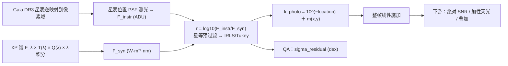

# 测光校准到星等坐标系

## 摘要

单帧图像的像素值是仪器计数，与天体真实亮度之间隔着一串不可测因子的乘积：增益、曝光、有效口径、光学与大气透过率、量子效率。跨帧叠加要求所有帧处在同一测光尺度，而这串因子既拿不到也不需要拆开。方法是对星表引导的星点做 PSF 域测光得 `F_instr`，用 Gaia DR3 XP 采样均值谱 `F_λ` 乘本帧滤镜透过率 `T(λ)` 与量子效率 `Q(λ)` 合成 `F_syn = ∫F_λ·T·Q·λ dλ`，逐星取 `r_i = log10(F_instr,i/F_syn,i)`，经星等预过滤后由 IRLS/Tukey biweight 的稳健位置得 `k_photo = 10^(−location)` 并整帧线性施加。未知量被这一个乘性标度整体吸收，物理单位随之消除。

边界与结论同等重要：载体始终是线性面亮度，星等只在派生量里；稳健尺度常数由定义式独立复现；`λ` 因子由单位与计数物理唯一确定，但不主张已用数据排除备择的权重解释；不设固定星数门槛，拟合不产出标度时报拟合失败而非门槛拦截；精度承载量 `sigma_residual` 有一条可达的假绿通道，属判据待修（§6）。

## 1. 引言

同一颗星在两帧上的计数可差几个数量级，差值来自透明度、曝光与系统组合，而本项目的数据前提是 FITS 头拿不到这些仪器常数。若每颗参考星自带一条绝对定标的低分辨率光谱，"该星在本相机本滤镜下应产生多少信号"就是可正向计算的量，不必再为它建定标场——Gaia DR3 的 XP 采样均值谱正是这样的产品，官方以能量谱辐照度 `W·m⁻²·nm⁻¹` 发布外部定标的逐星平均谱，网格 336–1020 nm、步长 2 nm、343 点 [1][4][6]。

本链的产出因此不是绝对通量刻度，而是**把各帧对齐到同一参考体系**的单标量乘性面：观测链形如 `乘性因子 × 通带积分 + 噪声`，仪器因子与通带归一常数只有乘积可辨识，拆开需要数据中不存在的外部先验，而星等对这种退化天然免疫（§3.3）。故"消除物理单位"的准确含义是**不宣称绝对通量刻度、仪器参数只以未知量形式被吸收**，不是"产品面只写星等"。
## 2. 相关工作与对照

**观测体系路径与本链的差别。** SExtractor 一族确立背景网格、阈值检测与去混叠的像素侧基线 [12]；DAOPHOT 确立星表引导的拥挤场 PSF 拟合测光范式 [10]；HSTphot 把孔径改正固化为 PSF 测光后的必经步骤 [16]；SDSS 成像管线给出星表引导全管线自标定的规模化形态 [17]。这些路径的零点都来自对定标场的观测：换滤镜、换系统、换夜就要重做。本链改用光谱式合成测光——绝对刻度一侧有 CALSPEC/HST-STIS 的可溯源网 [7]，逐星谱一侧由 Gaia 官方定口径：合成测光须按含 `λ` 的平均能量式重算零点，绝对刻度上限约 1% [2][3]。显式登记的差异是：本链模型通带取 `T(λ)·Q(λ)·λ`，不含光学系统透过率与大气消光，也不做绝对归一化。

**稳健统计与工具侧对照。** M 估计框架见 Huber [8]；`1.4826·MAD` 在 Rousseeuw & Croux 中是**既有对照基线**，该文研究对象是 `S_n`/`Q_n`、不是 MAD 有限样本修正因子的来源 [9]，后者另有未经同行评审的预印本出处 [14]（§6.2 用到）。逐源最优提取的信息权重结构只作统计结构对照 [11]，本层不做逐源最优提取。photutils 等工具集在"像素到通量"一段功能重叠，但输出逐源星等表而非施加到全帧的乘性面；引用工具集须钉到所用发行版，其总则性存档标识随时间漂移 [15]。

## 3. 方法

### 3.1 符号与单位

| 符号 | 含义 | 单位 |
|---|---|---|
| `F_instr,i` | 星点仪器通量（PSF 拟合域，已扣独立局部背景） | ADU |
| `F_λ(λ)` | 参考星绝对谱辐照度（Gaia DR3 XP 采样均值谱） | W·m⁻²·nm⁻¹ |
| `T(λ)` / `Q(λ)` | 本帧声明滤镜透过率 / 探测器量子效率 | 1，值域 [0,1] |
| `F_syn,i` | 模型通带内的合成参考通量 | W·m⁻²·nm |
| `G_i` | Gaia G 星等 | mag（**不进入** `F_syn`） |
| `r_i` | `log10(F_instr,i/F_syn,i)` | dex（有量纲比值取对数） |
| `location` | `r` 的稳健位置 | dex(ADU/[F_syn 单位]) |
| `k_photo` | 标定因子 `10^(−location)` | [F_syn 单位]/ADU |
| `m(x,y)` | 帧内低阶乘性空间增益 | 1（对数以 dex 计） |
| `sigma_residual` / `sigma_mag` | 好星残差散度 / `2.5·sigma_residual` | dex / mag |

### 3.2 参考通量的合成

```text
F_syn = ∫ F_λ(λ) · T(λ) · Q(λ) · λ dλ          [W·m⁻²·nm⁻¹ × nm × nm = W·m⁻²·nm]
```

官方 VEGAMAG 平均能量谱通量是 `⟨f_λ⟩ = ∫f_λ·S·λ dλ / ∫S·λ dλ` [2]；本合同取同一被积函数（`S(λ)` ↔ `T(λ)·Q(λ)`）、去掉归一化分母。分母在同一帧内与星无关 ⇒ 逐帧常数 ⇒ 在 `r_i` 里只是 `location` 的平移。由此得到贯穿全文的区分：**绝对归一化不可辨识，通带形状必须正确**。

`λ` 的依据是唯一确定的计量对象：探测器计量光子数，单色光子能量 `E_γ = hc/λ`，故

```text
N_γ = ∫ [F_λ/(hc/λ)]·T·Q dλ   ⇒   hc·N_γ = ∫ F_λ·T·Q·λ dλ     hc = 1.98644586e−16 J·nm
```

`1/(hc)` 与星无关、被零点吸收，定义式只留 `λ`。星等则是这条积分的**输出**（`m = ZP − 2.5·log10 F_syn`）而非输入，绝对谱的幅度已携带亮度（§5(1)）；`λ` 的解释边界见 §6.4。库里另有一条乘进 `10^(−0.4·G)` 的非生产对照通道：它使绝对量纲失去定义，且不是正本口径，生产通道不得用。

### 3.3 稳健位置估计

```text
r_i        = log10(F_instr,i / F_syn,i)                            [dex]
有效域      F_instr,i > 0, F_syn,i > 0, r_i 有限；饱和/质量异常星剔除
预过滤      delta_i = −2.5·log10(F_instr,i) − G_i                  [mag]
           拒绝 i 若 |delta_i − median(delta)| > 3.0                [mag]
初值        location₀ = median(r)；S = MAD(r)/0.6744897501960817    [dex]
IRLS/Tukey  u_i = (r_i − location)/(c·S)，c = 4.685
           w_i = (1 − u_i²)² (|u_i|<1)，否则 0；location ← Σw·r/Σw
           至 |Δlocation| < 1e−6 或 50 步；S = 0 ⇒ location = median(r)，不迭代
输出        k_photo = 10^(−location)
精度        sigma_residual = MAD(r_inliers)/0.6744897501960817，r_inliers = {i|w_i>0}
           sigma_mag = 2.5·sigma_residual；sigma_cal_rel = ln10·sigma_residual
```

3.0 mag 窗等价于通量比 `10^1.2 ≈ 15.85×`，作用是放走错配与污染，**不是**标定质量判据，且对整体乘性标度严格不变。尺度 `S` 在迭代内固定：收益是 `location` 继承 MAD 的 50% 崩溃点，代价是 95% 渐近效率只对已知尺度严格成立，故 `c` 与"尺度是否重估"必须成对变更。**零点平移不变量**是代数恒等：全体 `F_instr` 同乘 `k` 时 `r_i → r_i + log10 k`，位置随之平移、`k_photo` 相应除 `k`、`sigma_residual` 与好星集合不变。

### 3.4 施加面与数据形态

标定对像素只做一件事：逐元素乘（`I_photo = k_photo·m(x,y)·I_cal`）；增益阶数取 0 时 `m ≡ 1`、委托同一条乘法通道；方差按 `x′ = αx ⇒ Var′ = α²Var`、`ivar′ = ivar/α²` 二次变换。施加后的标度类别是"按逐帧因子缩放过的计数面"（量纲 `α·ADU`），产品写盘单位串取版本库冻结的面亮度族 `ADU/sr`——单位描述"量的种类"，逐帧标度另由测光标度与施加标志承载；**星等只在派生与展示时现场换算，不作为数据形态落盘**。`k_photo` 的绝对值无物理意义：反推增益/口径/曝光或为它设绝对数值窗口都属不可接受变化（欠定、不可证伪、把未测量量写入产品）；门只有一个——本帧标定是否可信，跨帧 `k` 不同是正常且正确的。



**图 1** 校准链：从像素到标定面只经过**一条乘性通道**，星等域的量只作判据与元数据，不进入像素算式。

## 4. 数据与实验设计

三类数据相互印证、结论一致才判链路成立。判据另受两条约束支配：**能绿更要能红**（每条配注入缺陷的负例），且**判据的数据源必须经过被检环节**——两臂同源于一个上游产物的样本，其差只能检验两侧实现的一致性，不可能检验该产物自身的约定，按其建的门恒绿（§6.4 的边界判定即来自第二条）。

| 数据类 | 设置 | 回答的问题 | 状态 |
|---|---|---|---|
| 代数合成 | 常数谱×常数 `T`×常数 `Q` 对闭式解；四组 SED × 官方 G 通带与生产相机通带；常数的定义式数值解 | 公式与量纲是否正确 | 已取证 E1、E2、E4 |
| 真实数据（版本库跟踪集内） | 1050 颗真实星对拍表；生产标定入口的一段实跑日志 | 实现是否与外部工具一致；退化分支是否真被走到 | 已取证 E3 样本侧、E5 |
| 真实数据（生产链） | 26211 颗星绝对刻度锚；49 帧端到端逐帧精度；落盘零点复算 | 实拍条件下是否成立 | 待复测（§6.5） |
| 物理仿真 | HST 成品作纯信号 + 完整前向成像（增益、Poisson、天光及散粒、读出、PSF） | 接近真实的物理过程下是否有效 | 待复测（§6.5） |

| 单元 | 设计与判据 | 负例 |
|---|---|---|
| E1 光子计数恒等式与 `λ` 幂次 | 黑体/幂律谱 × 官方 G 通带 × 生产通带（配置库曲线）；`∫F_λTQλdλ` 与 `hc·∫(F_λ/(hc/λ))TQ dλ` 相对差达浮点精度；去 `λ` 者与 `F_syn` 之比落在带内有效波长量级 | `λ` 幂次取 0 或 2 ⇒ 差出一个数量级 |
| E2 色项幅度随通带口径 | 四组不同源 SED（黑体两档跨度、幂律族、巴尔默跳扰动族）；统计量 `Δm_λ = −2.5·log10(∫FRλdλ/∫FRdλ)` 的峰峰，按通带并列 | 通带换成宽波段口径 ⇒ 幅度按倍数上跳 |
| E3 分箱轴的灵敏度 | 自建相关组与解耦组样本（边缘分布逐点相同、仅颜色—星等相关结构不同），注入同一族色项缺陷；等频 6 箱取 median、读箱间互差峰峰，星等轴与颜色轴各读一遍，扫 CMD 斜率与样本量 | 解耦组星等轴读出趋零；n=200 时噪声地板与效应不可分 |
| E4 常数复现 | 误差函数二分求 `Φ⁻¹(3/4)`；`eff = 1/A(ψ,Φ)`、`A = ∫ψ²φ/(∫ψ′φ)²` 数值积分扫 `c` 并反解 `eff = 0.95`；另算 `P(&#124;z&#124;>c)` 判定"用好星子集算 MAD"是否引入截断偏差 | 自检 `ψ(x)=x` 必须给 `eff = 1` |
| E5 精度声明通道 | 库外重写一份等价标量逻辑（中位数、MAD、`S≤0` 分支、IRLS、好星判定、`sigma_residual`），喂构造样本与随机搜索（`n=3…12`，按概率注入重复值） | 构造 `r` 含重复值使离散度取零 ⇒ 现判据必须能红 |

## 5. 结果

**(1) 光子计数口径闭合（E1）。** 定义式与 `hc·N_γ` 相对差 **3.02e−16**；去掉 `λ` 的同一被积式所得能量通量与 `F_syn` 之比为 **649.5**，正落在该通带光子加权有效波长量级——`λ` 的幂次只能取 1。同温度、相差 1 mag 的两颗星，`F_syn` 之比实测 **0.3981071705534978**、理论值 `0.3981071705534972`：亮度已在谱的幅度里。

**(2) `λ` 色项幅度由通带口径决定（E2）。** 四组不同源 SED 上的峰峰（mag）：

| SED 族 | 官方 G 通带 | 生产相机通带 | 斜率 mag/(BP−RP) |
|---|---:|---:|---:|
| 黑体 3000–12000 K | 0.2708 | 0.0145 | −0.0066 |
| 黑体 2500–50000 K | 0.3841 | 0.0212 | −0.0061 |
| 幂律 `λ^α`, `α∈[−4,4]` | 0.4197 | 0.0220 | −0.0062 |
| 黑体 + 巴尔默跳 35% | 0.1900 | 0.0084 | −0.0059 |

生产通带的色项比官方 G 通带（EDR3 通带曲线 [3][5]）小约 **19 倍**；折回真实样本的颜色跨度（BP−RP p5–p95 = 0.833…4.984）后 G 通带降到 **0.0718**（黑体）—**0.1515**（幂律）。两支约定的差也不只是色项：同一积分式下能量谱与光子谱给出的合成星等整体平移约 **7 mag**（G 带 −6.86…−7.13、生产通带 −7.009…−7.023）。故**该争议可判别的量是绝对平移，色项只是它的变化部分**。

**图 2（图位）** 四组 SED × 两种通带口径的色项峰峰对照，叠样本色跨折回后的标定点。

**(3) 积分核一致，但该样本对容器约定不具判别力（E3 样本侧）。** 跟踪集内 1050 颗真实星对拍表（`lib/algorithms/photometry/cpp/test/gate4_dr3sp_gaiaxpy/evidence/gate4_compare_per_star_1050.csv`）上，本仓合成星等与外部工具星等之差 median **+0.000584 mag**、MAD 型散度 **0.001667 mag**。"箱间互差"强依赖分箱口径（等频 6 箱 **0.00648**、等宽 6 箱 **0.02405 mag**），故本文不把该量当单一数字引用。限定必须同时给出：该表两臂的谱都取自外部工具的**绝对浮点谱**、都不经过生产消费的 uint8 容器还原式，因此它检验的是"本仓积分核 vs 外部工具积分核"，对容器单位约定零灵敏度。

**(4) 稳健常数由定义式复现（E4）。** `Φ⁻¹(3/4)` 二分解得 **0.67448975019608182**，与代码常数 **0.6744897501960817** 相对差 **−1.646e−16**（1 ulp），其倒数 **1.4826022185056020** 与登记值逐位相同；Tukey 效率积分给 **`c = 4.685 → 0.95000`**、反解 `eff = 0.95` 得 **c = 4.6851**。附带对定义的一条确认：`P(|z|>4.685) = 2.800e−6`，截断只切约 2.8 ppm ⇒ **用好星子集而非全体算 MAD 不引入截断偏差**。

**(5) 亮度分箱的灵敏度是样本属性（E3）。**

| 样本 | 颜色—星等相关系数 | 星等轴读出 | 颜色轴读出 |
|---|---:|---:|---:|
| 相关组（主序式） | +0.955 | 56.1% | 56.4% |
| 解耦组（逐星打乱配对） | +0.001 | **2.45%** | 56.4% |

CMD 斜率 0→6.0 时星等轴读出单调走 **3.41% → 57.01%**，n=200 时解耦组噪声地板即达 **24.55%**；而**绝对 level 在任何分箱轴、任何相关性下都被完整读出**（解耦组六箱 median 全为 −7.1568…−7.1535）。两面结论：亮度分箱锚对它声明的 level 有完全判别力、对色项型缺陷没有；色轴统计要成为判据，数据源必须是容器解码谱。

**(6) 精度声明存在可达的零离散度通道（E5）。** 最小构型只需三条有效残差中**两条严格相等**：`{0.30, 0.30, 8.00}` 经等价标量逻辑得好星 3、`sigma_residual = 0.000000`、`outlier_rate = 0.000`，并通过唯一消费该量的门（只判有限性与 `≤1.0 dex`）。极端构造里一颗偏 **11.675 dex（29.2 mag）** 的星被计为好星而产品仍报零散度：**偏差上界不受限**。机理是 `MAD(r)=0 ⇒ S=0 ⇒` 全体入选 `⇒ MAD(r_inliers)=0`；20 万次随机搜索中 `n_inliers` 最小值为 **2**，即"样本不足以致不可估计"分支**结构上不可达**——取零不是因为样本不够，而是样本有散度而 MAD 看不见。跟踪集内一段生产入口实跑日志走到同一分支（`eng/tests/validation/release02/fix_p1_photometry_apply/qf_oracle_stderr.txt`：`S = 0.000000`、好星 9 离群 0、`sigma_residual = 0.000000`、`scale = 4.637520e+07`、标定正常返回）。报告级 `status` 只条件于用了几颗星，合同层无 `sigma_residual` 字段；施加文件内 `log10`/`pow` 计数为 **0**、schema 集合内无逐像素星等字段，这两条支撑 §3.4。

## 6. 讨论

### 6.1 星等是派生量，不是产品形态

"校准到星等坐标系"最易读错：被校准的是**坐标系**（零点与散度判据所在的对数量域），载体仍是线性面亮度；`sigma_mag` 与帧级零点是定标面的元数据与 QA。把像素当星等相加会直接破坏加性天光扣除与逆方差加权。

### 6.2 星数不构成拒绝条件，拟合不成立时报拟合失败

本链**不设固定星数门槛**：不存在"星点少到无法测光"的图，任何可解析帧都完成定标并出产品，精度按该帧自身实测散度如实标注、不套用他帧口径。求解前提 `|r_consistent| ≥ 3` 回答"这次拟合有没有产出标度"，不是"星数够不够"的准入判据——它不成立时拟合本就不产出标度，走拟合失败路径上报（无零点、无星等、具名降级原因），而不是另立一道门卡星数。两点连着说清：① 规模上限与极限星等是计算量与选星策略，按亮度截断制造的颜色—星等相关结构正是 §5(5) 灵敏度的来源；② 判据能力边界不等于门槛——MAD 型尺度对 σ 的期望在 `n` 小时系统性偏低，`|r_consistent| ≥ 3` 恰落在偏差最大处，本层不做有限样本修正 ⇒ 低星数帧 `sigma_mag` **下偏** [9][14]。

### 6.3 常数的载体与"可配"的含义

`c = 4.685`、`1e−6`、`50`、`3.0` 是项目冻结值，在实现里为编译期常量与调用点字面量：改配置文件的同名键不改变任何计算，可配性尚未落地。这不影响数值正确性（§5(4)），只影响"改配置能改什么"的读法。

### 6.4 合成通带的解释边界（本文主张的确切范围）

`λ` 的量纲依据成立：它由"参考谱以能量单位发布"的官方声明 [1]、官方式 (5.41) 含 `λ` 的事实 [2] 与换算 `E_γ = hc/λ` 共同**唯一确定**，并由 §5(1) 在数值上闭合。主张到此为止——**本文不主张"已用观测数据排除了备择的权重解释"**。备择解释是：生产消费的第三方再编码容器以逐星线性参数把 uint8 还原为 `F_λ`，该还原式对"能量谱通量 / 光子谱通量"两种约定**同形**，其单位约定不由格式定义担保。排除它需要一条沿**绝对平移**（约 7 mag，§5(2)）取读数的锚，而现成读数担不起：色项的预测口径是官方宽波段，生产窄带小约 19 倍，折回样本色跨后仍不构成量级差；决定性的一条是那份 1050 星对拍表两臂**都绕过容器还原环节**，对该争议零灵敏度，按其建的色轴门恒绿。能担事的锚（生产解码链上的 `median(m_syn − G)`）证据件不在跟踪集内、当前无法重算（§6.5）。故该约定在本文里是**未被判别**，既非"已被排除"，也非"存在问题"。同理，`10^(−0.4·G)` 通道的偏差机理也不作一般化断言：是否等价于"把亮度计入两次"取决于容器逐星量化参数是否载有亮度，该语义在跟踪集内无可复算样本；本文只保留 §3.2 的两条判定，并记录它在生产可达图上调用数为 0、却被一条登记测试固化为对照基准。

### 6.5 证据不在跟踪集 ⇒ 本文不引其数值，登记为待复测

绝对刻度与端到端精度这一组定量结论（生产链绝对刻度锚、落盘零点逐位复算、49 帧逐帧精度、QE 与通带失配的误差量级及其机制检验）其证据件落在版本库排除的临时产物目录下，无法重算、无跟踪副本。本文不引这些数字，整体登记为待复测：① 生产解码链上 `median(m_syn − G)` 的绝对刻度读数（判据：若容器为光子谱则该读数应为约 −7 mag 而非近零），证据入库；② 上述各量复算产物入库；③ 物理仿真链与端到端逐帧精度重跑；④ 按颜色分层抽样的对照，量出选星策略对散度与色项判据的影响；⑤ 星点定位质量门的现行读数（跟踪集内唯一原始读数出自已被降级为诊断的脚本，现行登记门的读数未落档）。

### 6.6 判据待修：零离散度的假绿通道

§5(6) 属**判据待修**，不属方法成就：产品面上 0 与"实测零散度"不可区分、语义上等于"标定完美"，虚报方向偏绿；下游模块认得 0（当退化处理、不发布该帧精度声明），但那是另一模块的内部退化，既不使帧判红，也不在产品面写明"此帧散度不可信"。整改需三件同时到位：表示面给具面值的"不可估计"（哨兵值加兄弟字段；须走变更流程，因"否则取 0"是科学正本自己规定的）；门侧加退化守卫并把 `MAD(r_consistent) = 0` 单独判红；报告侧把 `status` 并入散度可估计条件，并配一条构造 `r` 含重复值的负例使现判据从绿转红。

### 6.7 适用域与未建模项

参考谱有效波长域 336–1020 nm @2 nm [1]，通带必须被该覆盖**完全包含**，网格外置零而**不外推**。模型通带不含光学系统透过率与大气消光，是显式未建模项，跨帧会成为帧间系统差；帧内大尺度响应残差由 `m(x,y)` 承担，该类项的先例建立在专用标定场与多年重复观测上 [13]，其条件本链不具备、不外推。`Q(λ)` 未配置时按 `Q ≡ 1` 并显式告警——含义是"假设理想平坦探测器"，不是"QE 已折进 `T(λ)`"。绝对刻度误差的量级只在窄带登记过，而生产默认通带是宽带：**生产主要场景的绝对刻度误差处于未测量状态**。`sigma_mag` 是逐星定标散度（系综量），不含参考端与逐源测量误差，作单源精度使用会低估。

## 7. 结论

本链把参考星自带的绝对定标低分辨率光谱与本帧通带相乘积分得参考通量，以逐星对数残差的稳健位置估计单一乘性标定因子并整帧线性施加，从而把各帧对齐到锚在同一模型通带 Gaia 合成刻度上的测光星等坐标系：`λ` 因子由单位与计数物理唯一确定，未知仪器参数无需分离即被吸收，稳健尺度常数由定义式独立复现。数据形态全程为线性面亮度；标定不设星数门槛，拟合不产出标度即报失败；反推仪器参数欠定且不可证伪，被排除在判据之外，唯一判据是尺度无关的测光一致性。

本文不主张：产物处于绝对通量刻度；已用数据排除容器单位约定的备择解释；亮度分箱锚具有色项型缺陷的证据资格；未入库证据支撑的精度数字；`sigma_residual` 现在是可信的精度声明。这些不是措辞谨慎，而是进入发布判据前必须补齐的取证缺口（§6.5、§6.6）。

## 参考文献

1. ESA Gaia Data Release 3 Archive Documentation，数据模型 §20.12.4 *The XP sampled mean spectrum*（`flux` 字段单位 `Flux[W m-2 nm-1]`、"Externally-calibrated combined BP and RP flux"、"343 values from 336 to 1020 nm with a step of 2 nm"）。https://gea.esac.esa.int/archive/documentation/GDR3/Gaia_archive/chap_datamodel/sec_dm_spectroscopic_tables/ssec_dm_xp_sampled_mean_spectrum.html
2. ESA Gaia Data Release 3 Archive Documentation，数据处理 §5.4.1 *External calibration → Zero points*（式 (5.41) `⟨f_λ⟩ = ∫f_λ S λ dλ / ∫S λ dλ`；"Thus 1 % is thought to be the current state-of-the art uncertainty on the 'absolute' calibration scales."；星表积分通量零点 "are not suitable for synthetic photometry computations"；Table 5.4 的 VEGAMAG 零点 `G = 25.6874 ± 0.0028`）。https://gea.esac.esa.int/archive/documentation/GDR3/Data_processing/chap_cu5pho/cu5pho_sec_photProc/cu5pho_ssec_photCal.html
3. Riello, M., De Angeli, F., Evans, D. W., et al. 2021, A&A 649, A3（Gaia EDR3 测光内容与验证、G/BP/RP 通带），DOI 10.1051/0004-6361/202039587
4. De Angeli, F., Weiler, M., Montegriffo, P., et al. 2023, A&A 674, A2（BP/RP 低分辨率光谱数据的处理与验证：谱的单位与质量标志），DOI 10.1051/0004-6361/202243680
5. Gaia Collaboration (Brown, A. G. A. 等) 2021, A&A 649, A1（EDR3 内容总览；勘误件 A&A 650, C3），DOI 10.1051/0004-6361/202039657
6. Gaia Collaboration (Vallenari, A.; Brown, A. G. A. 等) 2023, A&A 674, A1（DR3 内容与巡天性质总览），DOI 10.1051/0004-6361/202243940
7. Bohlin, R. C., Hubeny, I. & Rauch, T. 2020, AJ 160, 21（纯氢白矮星 NLTE 模型大气与 HST/STIS 通量定标；只用于绝对通量刻度一侧），DOI 10.3847/1538-3881/ab94b4
8. Huber, P. J. 1964, Ann. Math. Statist. 35, 73（位置参数的稳健估计；M 估计框架），DOI 10.1214/aoms/1177703732
9. Rousseeuw, P. J. & Croux, C. 1993, JASA 88(424), 1273–1283（`S_n`/`Q_n`；`1.4826·MAD` 在该文中是既有对照基线，**不是** MAD 有限样本修正因子的来源），DOI 10.1080/01621459.1993.10476408
10. Stetson, P. B. 1987, PASP 99, 191（DAOPHOT：拥挤场 PSF 拟合测光），DOI 10.1086/131977
11. Horne, K. 1986, PASP 98, 609（最优提取；只作统计结构对照），DOI 10.1086/131801
12. Bertin, E. & Arnouts, S. 1996, A&AS 117, 393（SExtractor：背景网格、阈值检测与去混叠；其 FLUXERR/MAGERR 定义出自 SExtractor 用户手册而非该文正文），DOI 10.1051/aas:1996164
13. Regnault, N., Conley, A., Guy, J., et al. 2009, A&A 506, 999–1042（测光定标中的平场与大尺度响应；其平场建立在专用标定场与多年重复观测之上，不外推到单帧），DOI 10.1051/0004-6361/200912446
14. Akinshin, A. 2022, arXiv:2207.12005（MAD 型尺度估计的有限样本偏差校正因子；单作者预印本，未经同行评审，只作"准确因子另有可核出处"的存在性引用）
15. Bradley, L. 等, *photutils*，版本 v3.0.0（BSD-3-Clause）；其总则性存档 DOI 10.5281/zenodo.596036 随时间漂移，引用须钉到所用发行版
16. Dolphin, A. E. 2000, PASP 112, 1383（HSTphot：PSF 测光与孔径改正），DOI 10.1086/316630
17. Lupton, R. 等 2001, in ADASS X, ASP Conf. Ser. 238, 269–278（SDSS 成像管线；该文预印本页面的期刊字段有误，须按会议卷页引用），arXiv:astro-ph/0101420

<!-- PROGRESS: 章节 8/8 -->
