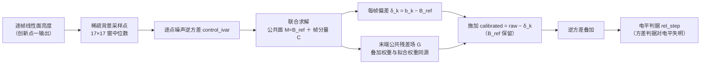

# 加性天光与无缝叠加

## 摘要

多帧马赛克在帧集变化处出现亮度台阶（接缝）。常规做法是逐帧把背景扣到零再叠加：台阶随之消失，但那只是因为携带天光的电平被一起抹掉，产品里既无天光也无检验接缝的分母。本文取另一条路——信号校准到统一测光坐标系之后，真实信号在帧间连续，帧间阶跃只剩可加性去除的天光；于是构造一张由全部帧联合拟合、按采样点噪声逆方差加权、对采样点取最小残差平方的连续参考天光面，每帧只减去它相对该面的偏差（"多退少补"），参考天光保留在产品里。无接缝因此是构造性质而非调参结果：对齐后，任意覆盖子集上的加权电平恒等于公共面。其前提是公共面能表示帧间天光差的空间尺度，其证据是读电平的判据。

## 1. 引言

天光逐帧不同，也不可当常数：暗夜、单次不超过约 28 分钟时，把宽带夜空按常数处理的相对误差区间宽至 [−64%, +48%]，显式模型后残差标准差 5%–10% [1]；避开气辉线的窄窗内一夜约四小时的涨落则只有 0.56% [5]。主流背景估计以"把天光拿掉"为目的（§2），于是接缝被电平归零掩盖——以背景为分母的相对判据在零背景上无界（§5.2）。

本文的三步是：把扣除量限定为每帧相对一张公共参考面的偏差，使"边界阶跃恒为零"成为可写下的恒等式；把该面唯一的表示能力旋钮节点间距的来源写成几何推导而非定标值；给出一条读电平的判据并界定其检测限与缺口。输入承接创新点一的线性面亮度产品（星等是对数量、不可加），权重承接创新点二的绝对信噪比。

## 2. 相关工作与对照

| 对照路线 | 做法与其局限 | 出处 |
|---|---|---|
| 网格/分箱背景估计 | 逐块稳健估计、逐像素相减；空间尺度由多项式阶数或分箱尺寸设定；放大网格降低单格被亮源污染的风险 | [3][4][6][7] |
| 逐像素回归内插 | 同时给出背景与不确定度；线性与 B 样条会**高估**背景、留下负残差 | [8][9] |
| 标定场驱动的扣除 | 背景图逐像素扣天光；标定依赖专用标定场与多年重复观测 | [2] |
| drizzle / Montage / 截尾均值 | 重采样与叠加不破坏光度，但都不改变帧间电平；drizzle 加权均值式须逐一交代 `a`、`w`、`s²` 的幂次约定 | [10][11][12] |
| "扣除后加回公共电平" | 未取到可核的出处与版本，不据以立论 | 未核 |

本链与扣除一支的差别不在估计精度而在**目的**：参考天光面不是要被减掉的东西，而是全帧要被对齐上去的东西。残差天光致系统偏差的先例主要在光谱侧 [13][14]。

## 3. 方法

### 3.1 观测方程

帧 `f` 在第 `k` 个控制点的观测 `y_fk`（面亮度 ADU·sr⁻¹）分解为

```text
y_fk = M_k + C_fk          （纯加性：乘性标度 g_k ≡ 1 不启用）
```

`M_k` 是全帧共享的公共参考电平，即参考天光面在该点的值，**含天光本身**；`C_fk` 是帧的加性偏差；乘性空间响应已由上游吸收。每连通分量取分量内最小帧标识为参考帧（gauge），其分量行恒置零，由此得一条本文反复使用的不变量：**各帧同值的常数公共输入 ⇒ `M = 该值`、`C_f ≡ 0`**。`control_ivar` 是 `control_variance`（(ADU·sr⁻¹)²）的逆，节点间距 `h` 取度。

### 3.2 采样与权重

控制点几何只由覆盖并集几何与目标角间距决定，与信噪比解耦：每个 (控制点, 帧) 取 cell 中心 ±8 的 17×17 窗，剔除无效样本后做只剪亮端的 3σ clipping，位置估计取窗中位数。恒星星点在采样期即被排除——星表否决（阈值 10× 该帧星表信噪比中位数、半径 0.012°）叠加亮端截断；落盘掩膜是同源同参的旁证产物，不是取点的前置步骤（§6.2）。被估量是**变化的背景电平**，故权重取该观测的噪声逆方差而非信噪比平方：

```text
control_variance = k_corr · (π/2) · σ_bg² / N_retained ,   control_ivar = 1 / control_variance
σ_bg             = 1.482602218505602 · median(|v − median(v)|)
```

`N_retained` 是 clipping 后保留数（非总数）。`π/2` 来自 `Var(median) = 1/(4N f(m)²)` 的高斯特例 [15]，条件是独立同分布、近似高斯、样本足够（N≥65 时偏差 <1%）；1.4826 是正态族的尺度一致因子 [16]。`k_corr` 表征 drizzle 输出像素正相关造成的有效样本量折减，定义域 `1 < k_corr`；其冻结值 1.4 的标定域为 300–600″/px，生产帧在 1″/px 量级，属域外取值。

### 3.3 连续面表示与节点间距

参考天光面 `B_ref` 取切平面上张量积三次 B 样条，只存节点系数、按赤经/赤纬现场求值，不物化稠密背景栅格；每帧修正量 `δ_k = b_k − B_ref` 取低阶曲面（默认一次）。**节点间距 `h` 是表示能力的唯一旋钮**，取值写成几何推导而非定标值：

```text
上界 h = ½ · min(重叠带宽度, 指向间距)      下界 max(采样点角间距, 像素角尺度)
上界 < 下界 或 任一几何量缺失 ⇒ 显式失败，不回退常数；配置默认 h = 0 即"未给出"
```

`h` 的量纲是角尺度，换像素尺度时度数不变而像素数按比例变，故以像素数为单位的判据必须随之重算。自适应回路只有这一个旋钮，可辨识性判决落在**未正则化**的列均衡数据信息矩阵上（在加了正则的求解矩阵上设门是恒真门，只作诊断）。

### 3.4 求解与恒等式

求解为 Huber 迭代重加权最小二乘：残差先无量纲标准化 `z = (y − M − C)/max(|uncertainty|, σ_floor)`，核取 `|z| ≤ δ → w = 1`、否则 `w = δ/|z|`（δ = 1.345 为冻结配置值，效率归属见 [17][18]）；控制点内权重归一为份额式（公共精度因子在份额内严格消去），另加弱零锚与图平滑。

无接缝不是迭代"压"出来的，而是对齐目标本身给出的：全部帧拟合到同一张公共面后，末端再以**与拟合同源**的叠加权重算出、并对全帧扣除同一个公共残差场 `G`，于是任意覆盖子集 `S` 上的加权电平

```text
Σ_{f∈S} w_f (y_f − C_f − G) / Σ_{f∈S} w_f  ≡  M
```

恒等于公共面，覆盖子集在帧边界处突变时该均值不动。必要条件有四：参考面由其他帧加权组合给出（排除自身）、迭代带阻尼、拟合与叠加权重同源、末端用叠加权重扣除残差场。默认施加 `calibrated = raw − δ_k`，`B_ref` 保留；施加是纯减法、无乘子，未知帧标识显式失败。

### 3.5 接缝判据

```text
rel_step(e) = median_i [ I(p_i + d·n_e) − I(p_i − d·n_e) ] / bg(e) ,   门 max_e |rel_step(e)| ≤ 1×10⁻²
```

沿真实帧足迹边界的法向取 ±d 差分（半距 d = 2 px），`bg(e)` 为该边界 ±d 采样上的局部电平中位数；只有两侧都在数据内部的边界计入。判据必须能红能绿，有效边界数为零时判红而非判绿。



**图 1 的结论**：电平阶跃在"对齐到同一张公共面"这一步被构造掉，而不是在"扣除天光"这一步被掩盖——扣除之后产品里仍然有天光。

## 4. 数据与实验设计

三类数据相互印证，每类都配非退化判据（真值无效应时必须归零或判红）：**代数合成**（真值已知）检验阶跃归零、常数公共输入下帧分量恒零、基外相干分量的接缝随其幅度线性增长；**物理前向仿真**以真实数据为纯信号模板，电子域取泊松与高斯再经增益、饱和、量化与平场；**真实数据端到端**检验电平判据与视觉无接缝。实验单元标度为 e⁻，与生产的 ADU·sr⁻¹ 不可互引。对照三臂：权重 `control_ivar` / 均匀 / 信噪比平方，施加量 保公共面 / 一起减掉 / 不扣。除归档结果件外，另引一组不依赖产品运行的**独立复算**量。

## 5. 结果

### 5.1 权重必须是逐点噪声逆方差

三种拟合权重、各 20 次实现取中位（e⁻）：

| 拟合权重 | 伪影漏入公共面 | 公共面噪声 RMS |
|---|---|---|
| `control_ivar` | **0.02448** | **1.5325** |
| 均匀权 | 0.06510 | 1.6740 |
| 信噪比平方权 | 0.32029 | 2.0686 |

信噪比平方把"背景亮但噪声稳定"处误判为高可信，反把伪影抬进公共面。

### 5.2 多退少补保背景，减到零是退化判据

台阶取 6 条边界中位、电平取窗中位（e⁻；两列分别来自加性扣除算例与公共面算例）：

| 施加 | 边界台阶中位 | 产品中位电平 |
|---|---|---|
| 不减 | 4.8023 | 302.55 |
| `raw − δ_k`（默认，保 `B_ref`） | **0.38295**（降 12.5 倍） | **299.17**（`B_ref` = 297.33） |
| 把参考天光一起减掉 | 0.27523 | 0.7115 |

退化臂的台阶同样小，正是退化判据的形状：其相对读数最大达 **26.2**，默认臂则落在 1.4×10⁻⁴–2.8×10⁻³。证据面只能是保留公共背景的臂。

### 5.3 前提、表示能力与检测限

乘性前提：构造 1.56 倍帧间乘性差时，上游未做归一则纯加性对齐后台阶为 27.37 e⁻，上游把乘性残差压到 5.89×10⁻⁴ 后为 6.31 e⁻，相差 **4.33 倍**。表示能力：残余接缝随"不可表示且沿向相干"的分量线性增长，斜率 0.7976、Pearson 0.8964，波长 1600→50 px 使台阶中位增大 **5.07 倍**（序列在 400 与 100 px 两点非单调，故线性是趋势而非逐点预测）；`h = 0.0355°` 在 0.98902″/px 上为 129.2 px，可表示尺度 `2h = 258.5 px`。稀疏性：1,048,576 个点上稠密与稀疏的 `max|Δ| = 3.1086×10⁻¹⁵`，体积 14,001 B 对 8,389,129 B。检测限：`Δ/L > 1.0050%`（≈0.0109 星等）经闭式复算逐位复现——纯台阶的半距扫描比值 1.000000、纯梯度 4.000000，即判据量按 `|rel_step| = 4g/bg` 响应梯度。

### 5.4 两种接缝统计量读的不是同一件事

下表输入全部**不含阶跃**，只含相干背景结构（独立复算）：

| 结构夹具（无接缝） | 出厂门 \|rel_step\| | 去趋势＋对照的超出量 | 倍数 |
|---|---|---|---|
| 线性斜坡 g = 2.176830, bg = 1200 | **7.2561×10⁻³**（门限的 72.6%） | **0** | 不可比 |
| 双正弦天光场 λ = 420 / 260 px | 8.8122×10⁻⁴ | 4.593×10⁻⁴ | 1.9 |
| 正弦 λ = 420 px、幅 15% bg | 1.5120×10⁻³ | 3.1489×10⁻⁵ | 48 |
| 双曲正切前锋 t = 150 / 100 px | 4.6988×10⁻³ / 1.2677×10⁻³ | 1.4178×10⁻⁵ / 7.717×10⁻⁷ | 331 / 1.6×10³ |

同一结构上最多差三个数量级：门读未去趋势、未扣对照的原始电平差分，对法向梯度线性响应；另一判据读扣曲率基线再扣对照线之后的超出量。这不是精度差异，而是"门在判什么"的差异。

## 6. 讨论

本节只登记边界与未证部分；§3.1–§3.4 的三项是正面主张：施加为纯减法且未知帧标识显式失败、节点间距由几何导出且缺输入即失败、无接缝只在可表示域内成立。

### 6.1 "多退少补"的准确语义

默认只去除各帧**相对参考平面的差分**，参考天光保留在产品里：代码默认值、配置登记面与科学正本三处一致，并由 manifest 字段可审计。需纠正一处表述——某实现注释把另一种模式描述成"全减、含参考天光，因此背景被剪掉"。按 `y = M + C`，参考帧分量在 gauge 下恒为零、常数公共输入下帧分量处处为零，减去帧分量动不到携带天光的公共面，而 §3.4 的恒等式直接给出该模式叠加产物的电平面等于 `M`。独立复核据此判为**注释与记号口径缺陷而非行为缺陷**（同一符号在不同层级文档里分别被读成"全量"与"帧分量"），本文因此不使用它。风险在误用不在误产：把该模式当"全减退化对照臂"来跑，得到的是另一套仍保背景的加性扣除。

### 6.2 采样次序按语义写

规范文字写"星点掩膜之外取稀疏背景采样点"，实现次序却是观测先装配、掩膜产物其后落盘；源排除实际在采样期内以同参的星表否决加亮端截断完成，落盘掩膜与之同源同参。**语义保证成立、字面顺序相反**，故本文按语义陈述，不写"先做掩膜再取点"这类与实现不符的流程句；风险是两者为两套计算，参数分叉即不一致。

### 6.3 两项判据的可信度问题

**其一，控制点权重在常数输入下不归零，属 fail-open。** 冻结口径要求窗内稳健尺度为零（半数以上像素同值）时 `control_ivar` 必须为 0、方差标为"无尺度信息"，禁止以数值保护量生成有限方差发布；实现却把零尺度钳到一个保护量再平方。独立复算得伪方差 `7.609394×10⁻²⁷`、伪逆方差 `1.314165×10²⁶`（与闭式逐项吻合，且电平从 0 到 5×10⁴ 结果不变），下游只拒非正与非有限故全额放行：同一算例归一后 7 个正常观测各得约 `4×10⁻²⁵`，退化观测得 `1.0000000000`——该控制点的公共面与帧分量被一个不含尺度信息的窗独取。触发域是窗内 ≥50% 像素同值，量化平台、填充像素、掩膜置零可命中，另一模块的尺度估计里还有第二处同样的下限。故本文对权重只主张 §5.1 的"逐点逆方差生效"。

**其二，出厂门与验收主张用的证据不是同一个统计量。** §5.4 显示同一批无接缝结构上门可读到账面 72.6% 的门限，去趋势加对照的判据却读 0。更严重的是**判绿**方向：门的分子有符号，梯度项与台阶代数相加——叠加与该门实测最陡边同量级的反号梯度后，注入 `Δ/L = 1.005%`（门自己声明的确定性下限）读数为 `−2.7799×10⁻³`，仅为门限的 27.8%，判**绿**；1.50% 仍判绿、2.00% 才判红，实际漏检面抬到约 **1.73%**，而登记的漏检面条目里没有"梯度反号相消"这一条。

本文因此只主张：该链路**有**能检出电平阶跃的判据——读电平、能红能绿、有效边界数为零时判红、确定性检测限 `Δ/L > 1.005%`（证据为出厂门自检用例与上述闭式复算）；但其自动读数被法向梯度污染，判读须与去趋势量、半距扫描联合做，门的绿灯不单独构成无接缝证据。电平阶跃不改变方差，故方差类判据对电平接缝原理性失明，只配作粗筛诊断。门限 `1×10⁻²` 的完整事后标定（虚警率、检出概率、临界值注入）所依赖的证据与脚本未随仓库归档、当前无法重算，本文只引其中可闭式复算的那一条。

### 6.4 收敛四态与"停滞"缺证据

四态都在代码里可达，且"停滞"不被当作"收敛"。但取值普查显示：归档结果件里观测到的收敛状态只有"迭代耗尽"与"已收敛"，四处出现的"停滞"值全部属于枚举图例或叙述；被命名为停滞臂的算例实测迭代 300 次即耗尽，不是真停滞；归档数据产生时四态枚举尚未落地；且停滞判据的两个常数写在函数体内、不可由配置驱动，现有夹具无法把任何算例逼进该态——**该态待复测**。另有一处口径不一致：生产走相对容差判据，一条永不调度的旧通道漏设该项而回落绝对判据——按正本观测尺度复算，其阈值仅为最小可表示步长的 `8.557×10⁻⁵` 倍、原理不可达。

## 7. 结论

把"消缝"与"保天光"统一在同一张公共面上是可行的：对齐是构造性的，天光作为真实测量留在产品里。边界同样明确：以乘性残差已被上游吸收到 10⁻⁴ 量级为前提（否则残余台阶放大 4.33 倍）；只在帧间天光差可被参考面表示的域内成立（域外残余接缝约为该分量均方根的 0.80 倍）；只主张"存在能检出电平阶跃的判据"，确定性检测限为电平相对台阶 1.005%，而反号梯度可把 1.005%–1.7% 的真台阶静默放行，故门的绿灯不单独构成无接缝证据，方差类判据不具判据资格；退化输入下的权重发布口径与"停滞"态的实测证据，分别是待整改与待复测项。

## 参考文献

[1] Roellinghoff, G., Spencer, S. T., & Funk, S. 2025, A&A 698, A212, DOI 10.1051/0004-6361/202554532 (arXiv:2505.12895)。用途限定：成像大气切伦科夫望远镜各像素计数率的模型残差（暗夜，单次观测 ≤28 分钟），**非成像帧测光天光亮度**；本文只取"常数控天光的相对误差区间"与"显式模型后的残差量级"两条定性结论。

[2] Regnault, N., Conley, A., Guy, J., et al. 2009, A&A 506, 999–1042, DOI 10.1051/0004-6361/200912446 (arXiv:0908.3808)。其 §4.2 原文支持"天光以背景图逐像素直接扣除"；其平场与背景标定建立在专用标定场与多年重复观测之上，不作为"单帧可标定大尺度响应"的证据。

[3] Bertin, E., & Arnouts, S. 1996, A&AS 117, 393–404, DOI 10.1051/aas:1996164。用途限定：背景网格与稳健估计、阈值检测（§2 背景估计 / §3 检测）。

[4] Bradley, L., Sipőcz, B., Robitaille, T. P., et al., *Photutils*（开源软件，BSD-3-Clause，Zenodo DOI 10.5281/zenodo.596036；本文核对的是其 3.0.0 版本文档）。所核内容逐字：`Background2D` 默认逐块估计器为 `(2.5·中位) − (1.5·均值)`，`(均值 − 中位)/标准差 > 0.3` 时改用中位。该 DOI 是会漂移的概念记录，引用须写明实际所用版本。

[5] Nguyen, H. T., Zemcov, M., Battle, J., et al. 2016, PASP 128, 094504, DOI 10.1088/1538-3873/128/967/094504 (arXiv:1510.07567)。用途限定：1191.3 nm 的 OH 气辉**线间窄窗**内，一夜 07:15–11:15 UTC 实测天光涨落 RMS 为 ±30 nW·m⁻²·sr⁻¹（相对 5330 nW·m⁻²·sr⁻¹ ≈ 0.56%），未见时间不稳定；宽带与更长时间尺度的稳定性该文未测。

[6] Bosch, J., Armstrong, R., Bickerton, S. J., et al. 2018, PASJ 70, S5, DOI 10.1093/pasj/psx080 (arXiv:1705.06766)。其 §4.6 原文支持"多项式阶数设定进入背景估计的特征空间尺度""插值时有效平滑尺度完全由分箱尺寸决定"。

[7] Kelvin, L. S., Hasan, I., & Tyson, J. A. 2023, MNRAS 520, 2484–2516, DOI 10.1093/mnras/stad180 (arXiv:2301.05793)。其 §3.3.2 支持"增大网格尺寸可降低单个网格被源流量严重污染的风险"；该文性质为低表面亮度天空减除的仿真与多软件对比。

[8] Saydjari, A. K., & Finkbeiner, D. P. 2022, ApJ 933, 155, DOI 10.3847/1538-4357/ac6875 (arXiv:2201.07246)。局部逐像素回归内插（与高斯过程回归/Kriging 同类），逐像素同时给出背景预测与不确定度。

[9] Liu, C., & Miller, A. A. 2026, PASP 138, 024503, DOI 10.1088/1538-3873/ae3cc1 (arXiv:2508.15278)。原文支持"线性与 B 样条等插值型方法会高估背景"；本文只引该方向结论，不引其节号级细节。

[10] Fruchter, A. S., & Hook, R. N. 2002, PASP 114, 144–152, DOI 10.1086/338393 (arXiv:astro-ph/9808087v2)。其 §2 式(4)(5)：输出为以累计权重为分母的加权均值，分子含重叠面积分数 `a`、输入权重 `w` 与像素面积/尺度因子 `s²`。

[11] Jacob, J. C., et al. 2009, Int. J. Comput. Sci. Eng. 4(2), 73, DOI 10.1504/IJCSE.2009.026999 (arXiv:1005.4454)。摘要逐字支持"马赛克保持输入图像的天测与光度"。

[12] Gruen, D., Seitz, S., & Bernstein, G. M. 2014, PASP 126, 158–169, DOI 10.1086/675080 (arXiv:1401.4169)。叠加阶段的截尾均值伪影剔除；"截尾均值叠加的点扩展函数是单帧点扩展函数的线性组合""噪声性质优于中值叠加"两条为摘要原文。**该文不做背景建模。**

[13] Wild, V., & Hewett, P. C. 2005, MNRAS 358, 1083–1099, DOI 10.1111/j.1365-2966.2005.08844.x (arXiv:astro-ph/0501460)。适用域：SDSS **纤维光谱**的 OH 天光残线扣除（非成像）。

[14] Soto, K. T., Lilly, S. J., Bacon, R., Richard, J., & Conseil, S. 2016, MNRAS 458, 3210–3220, DOI 10.1093/mnras/stw474 (arXiv:1602.08037)。适用域：积分场光谱的主成分天光减除（非成像）。

[15] Serfling, R. J. 1980, *Approximation Theorems of Mathematical Statistics*, Wiley（ISBN 0-471-02403-1；电子版 DOI 10.1002/9780470316481）。样本中位数渐近方差 `Var(median) = 1/(4N f(m)²)` 及其高斯特例 `πσ²/(2N)`；本文按公式与成立条件（独立同分布、密度在中位处连续且为正）引用，不引其节号。

[16] Rousseeuw, P. J., & Croux, C. 1993, JASA 88(424), 1273–1283, DOI 10.1080/01621459.1993.10476408。该文把 `1.4826·MAD` 作为**既有的**辅助尺度估计使用；其有限样本研究对象是 `S_n`/`Q_n`，不是 MAD 的有限样本校正——本文按此限定引用。

[17] Huber, P. J. 1964, *Robust Estimation of a Location Parameter*, Ann. Math. Statist. 35, 73–101, DOI 10.1214/aoms/1177703732。M 估计与稳健位置估计的原始框架；其前提是独立同分布对称位置模型，本层观测在空间上相关，故只作框架锚。

[18] Holland, P. W., & Welsch, R. E. 1977, *Robust regression using iteratively reweighted least-squares*, Comm. Statist. Theory Methods 6(9), 813–827, DOI 10.1080/03610927708827533。只作迭代重加权最小二乘**实现**的出处；效率常数 1.345 的归属未取到可核正文证据。

<!-- PROGRESS: 章节 8/8 -->
