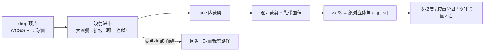

# 全天 HEALPix 精确面积交叠分配

## 摘要

每个全天输出像素都依赖一个几何量：源像素收缩后的足迹（drop）与某 HEALPix 叶的交叠面积。它决定支撑度与权重分母，且须在极点、角点、面缝上同样成立。方法：把 12 个基面的等面积坐标卡当坐标域——每面单位正方形、雅可比恒为 π/3、叶在卡内轴对齐——交叠化为轴对齐裁剪与鞋带求积，面积按绝对立体角累加。

可正面主张的是卡的前提：两支分别求雅可比得恒等 `|J| = π/3`，叶面积基数与第三方逐位对拍，方格与 NESTED 像素一一对应。界线同样清楚：全天求和闭合（`0.0` 至 `1e-15`）是划分恒等式的浮点残差，资格只到完备性与全局标度——保总量错分只让它动 `1e-16`，同一注入的逐叶度量却是 `1e0…3e2`；精度地板在叶的弦表示（逐叶偏 −9.9%…+0.6%，全天求和却恰好闭合）；极点是卡的不可逆点而非面积失效点——回退路径据此存在。

## 1. 引言

绝对信噪比要落到具体像素上才能定权叠加，落点由面积分配决定：一个 drop 跨一至数个叶，逐叶摊到多少面积决定支撑度与权重分母。这一环节在链上，位于测光定标与跨帧信噪比之间——它的输出是后两者的取值域。

"精确"必须限定：叶边界不是大圆弧、卡在极点不可逆、drop 的卡内原像必须折线化，三者性质不同，而求和型守恒量对其中最要命的一类（面积落在哪一叶）原理性失明。

贡献四条：**一**，把卡的前提钉到可复核判据，并给出极点的解析落点；**二**，用保总量错配注入划出求和型守恒与逐叶正确性的界；**三**，把精度地板定位到叶的弦表示；**四**，登记两种写入形态在低支撑处的不等价与非数被静默计入的位置。

## 2. 相关工作与对照

等面积基数与 NESTED 编号出自 HEALPix 定义文献 [1]；"叶边界不是大圆弧"以其自然球面投影专文 [2] 为准（摘要逐字主张该映射等面积且属一族新投影）。定义文献被指名小节全文本轮不可得，其内容不作依据。

drizzle 的输出是以累计权重为分母的加权均值，式(4)(5) 的三因子各有幂次约定，"加权均值"这一概括不含它们 [3]；球面实施属本项目自定义。drop 由任意 WCS（含 SIP）给出 [4]，切平面投影取 TAN、`R_θ = (180°/π)·cot θ` [5]，直边因此成球面大圆弧。面积用球面三角形立体角闭式 [6] 作扇形剖分；裁剪原文只处理平面多边形 [7]；层级面积按叶计数取 `4π/(12·4^order)` [8][9]。

可核对照只有两路：第三方 HEALPix 实现 [10] 与异源球面构造。主流成像软件在切平面网格上重采样，本仓未取到可核证据显示它们在球面等面积层级网格上定义逐叶面积交换，故不以其作逐叶对照。

## 3. 方法

### 3.1 坐标卡与等面积性

记 `z = sin δ`（δ 赤纬，无量纲）、`φ` 赤经 [rad]、`(u,v) ∈ [0,1]²` 基面内坐标、`f` 基面号（0–3 北、4–7 赤道、8–11 南）、`N = N_side`。

**赤道带支**（面 4–7 整方格、面 0–3 的 `u+v ≤ 1`、面 8–11 的 `u+v ≥ 1`）：

```text
z = (2/3)(u+v−1)      φ = (π/4)(u−v+2(f−4))
∂z/∂u = ∂z/∂v = 2/3   ∂φ/∂u = π/4   ∂φ/∂v = −π/4
|J| = |(2/3)(−π/4) − (2/3)(π/4)| = π/3
```

**极帽支**（面 0–3 的 `u+v > 1`，南面同理），令 `s = 2−u−v ∈ (0,1]`：

```text
z = 1 − s²/3          φ = (π/2)f + π(1−v)/(2s)
∂z/∂u = ∂z/∂v = 2s/3  ∂φ/∂u = (π/2)(1−v)/s²   ∂φ/∂v = −(π/2)(1−u)/s²
|J| = (2s/3)(π/2)[(1−u)+(1−v)]/s² = (2s/3)(π/2)(s)/s² = π/3
```

两支各自恒为 `π/3`，与 `u,v,f,N` 无关。`dΩ = |dz dφ|` [sr]，故每面 `π/3`、12 面合计 `4π`；一叶占 `1/N²` 方格，`A_leaf = π/(3N²) ≡ 4π/(12N²)`。**唯一失效点是 `s = 0`（极点本身）**：`φ ∝ 1/s` 发散、方向折叠，卡在该点不可逆；而 `|J|` 不含 `1/s`——这是可逆性失效，不是面积口径失效。

### 3.2 交叠求积



叶侧是精确方格、零近似，近似只在 drop 侧。求积须先平移到包围盒左下角再累加：卡坐标约 0.5 的鞋带项约 0.25，而单叶面积可小到 `1e-12`，`1e-16` 的相消噪声会放大成 `5.4e-5` 相对误差。逐叶面积一律按绝对立体角累加。

### 3.3 下游口径

核权重按 drop 面积归一 `w_jp = a_jp/A_drop,j` ⇒ `Σ_p w_jp = 1`、`Σ_p F_p = Σ_j x_j`，与 `pixfrac` 无关 [3]；面亮度归一分母 `N_p = Σ_j w_jp·A_pixel,j` [sr]；支撑面积 `D_p = Σ_j a_jp` [sr]、支撑度 `= D_p/A_cell`；发布信号 `S_p = F_p/N_p` [ADU·sr⁻¹]、发布因子 `k = D_p/N_p`；方差 `= Σ_j v_j·w_jp²/N_p²`，`k` 的幂次对信号 +1、对方差 +2。

## 4. 数据与实验设计

**三类数据**：解析代数合成已做（等面积与雅可比、方格与像素双射、全格点弦/真曲线面积、矢高分档、错配注入、量化界与最坏值）；物理仿真成像与端到端真实数据**未做**，本链路未达三方一致。

**判据分两族且必须分列。**求和型（`Σ_p a_jp` 对 `A_drop`、叶面积对 `4π`、通量对 `Σ_j x_j`、层级面积对叶计数）只管完备性与全局标度；逐叶型（`max_p |a_jp/a_jp^oracle − 1|`、`Σ_p |a_jp − a_jp^oracle|/(2·A_drop)`）的 oracle 必须异源（真曲线边界加外推或第三方库亚像素偏移），不得与被检路径共用同一折线或弦。幂次类与面积口径类判据也不可互替：叶表示换成弦，幂次比值不变照样判绿。

**负例**：一叶 ×2 其余按比例吸收、索引错位、相邻两叶互换（保总量，只有逐叶型能抓）；漏候选叶（两族都能抓）；关 drop 细分；改错 `π/3`。**对象边界**：卡路径只在设计条款与只读原型中，生产算法命名唯一；本文主张设计前提、原型事实与生产叶表示，不是产品字节。

## 5. 结果

### 5.1 卡的前提成立

| 判据 | 读数 |
|---|---|
| 两支 `\|J\|` | 解析恒等 `= π/3`；全天逐点差分 44652 点，最坏偏离 `5.14e-4` 落在南极点本身 |
| 叶面积基数 | `π/(3N²)` 与第三方 `4π/npix` **逐位相等**（`N = 16…4096`） |
| 方格 ↔ 像素 | `N=16`：3072 格 ↔ 3072 互异像素、格内 9 点同格、跨格 0；`N=64`：49152/49152、跨格 0 |
| 全天闭合 | `12·(π/3) − 4π = 0.0` |

### 5.2 求和型守恒对"面积落在哪一叶"零判别力

| 情形 | 求和型读数 | 逐叶型读数 |
|---|---|---|
| 弦叶全天空求和 | 残差 `0.0`（`N=16,64`） | `−9.905%…+0.612%`（`N=16`）、`−9.964%…+0.543%`（`N=64`）；`\|ε\|>1e-6` 占 100% 与 99.72% |
| 保总量错配注入（三型×四位形，`N=512`） | 变化 `≤4.4e-16` | 逐叶最大相对误差 `1.0…321.3` |
| 漏一个候选叶 | `6.63e-4`（弦）/`2.25e-7`（改进）/`8.81e-15`（参照），归档扫描同表 | 能抓 |
| 极点用朴素折线（原型） | 最坏闭合 `9.0734e-1`（丢约九成）；细分容差 `1e-6→1e-10` 不改善 | 需角点特判 |

**图位 1**：上表四情形各绘两柱（对数尺度）：求和型残差与逐叶最大相对误差；前两情形相差约 15 个数量级，后两情形才判红。

### 5.3 精度地板在叶的弦表示

边界矢高（真曲线到其大圆弦，以 `hp_res` 计，`N=256`）：极冠 `8.094e-2`、缝带 `6.587e-4`、赤道 `1.443e-4`；随机 60000 个叶的**边**有 **99.55%** 超 `1e-6·hp_res` 的冻结预算，即超 2–5 个数量级，且非极点局部现象。

不依赖基面归属的精确构造显示：跨缝位形的逐叶误差对细分段数不敏感（`N=2048` 1→64 段 `3.23e-8 → 4.61e-8`，`N=8192` 为 `2.80e-7 → 2.70e-7`，"近缝不跨缝"对照同量级）——**缝上没有平台**。与细分无关的是叶表示：弦四边形对真曲线面积的偏差，缝上 `−1.17e-4`、极点 `−9.95e-2`、赤道 `+3.87e-9…+3.87e-8`。`N ≥ 256` 与 `9 ≤ N < 256` 都只取四角，故生产 `N` 域 `[16, 2²²]` 内无真曲线边界路径；真曲线细分件在仓却被调用点旁路，其自述与调用点相反。

### 5.4 两种写入形态在低支撑处不等价

一直写形态发布未量化的覆盖面积；另一形态把支撑度量化到 8 位格点 `q = round(255·S)`，分母取 `(q/255)·A_cell`。信号相对偏差的严格界 `|r| ≤ 0.5/q`（`1/(510·S)` 是一阶近似，在 `S→1` 处偏小 `1.67e-5`）；方差偏差约为其 2 倍（严格 `(1+r)²−1`），与 `k` 的 +1/+2 幂次自洽。

| 真支撑 `S` | `q` | 信号相对偏差 |
|---|---|---|
| 1.0 | 255 | 0（`1.9685e-3` 为邻域最坏，`S=254.5/255`） |
| 0.64（`pixfrac=0.8` 典型） | 163 | `+1.2270e-3` |
| 0.05 | 13 | `−1.9231e-2` |
| 0.01 | 3 | `−0.150` |
| `1/510`（全映射最坏） | 1 | **`−0.500`** |
| `0.49/255` | 0 | 按**未覆盖**发布，信号为**非数** |
| 1.30（过覆盖，钳到 1） | 255 | **`+0.300`** `= +(S−1)`，非量化误差 |

全 256 档加全中点共 511 例：`|r|` 最大 `0.500`；量化步长比 32 位存储噪声大 `4.1e3` 倍——表示问题而非浮点问题。两形态连"是否有效"都分叉，而溯源无丢覆盖计数、钳制计数只在未量化一侧触发。一直写形态**不存在** `pixfrac` 偏移：`k` 相消、发布信号 `= S_p`，可结案。

## 6. 讨论

### 6.1 求和型闭合的证据资格

该闭合（`0.0` 至 `1e-15`）**不构成逐格分配正确**的证据：它是恒等式（弦叶铺满球面、算子可加，`Σ_p a_jp ≡ (π/3)·|D∩face|`、`Σ_p A_leaf ≡ 4π`），残差是浮点末位而非几何信息；保总量错配只让它动 `≤4.4e-16`，同一注入的逐叶度量却是 `1e0…3e2`。原型里逐格叶面积更算完即弃、只累加裁剪格计数，"构造闭合"于是拿同一个面积算子与自身相比，属恒真门。它的正当资格是**完备性与全局标度**：抓得住漏候选与量级错，抓不住"面积落在哪一叶"。

### 6.2 逐格正确性：有手段，无门

能抓逐叶分配的独立可执行件在仓内**存在两件**：异源蒙特卡洛参照、点源质心级完成度检验（质心对错分敏感），都被**明文排除于测试注册之外**——前者一次实跑登记 3 条断言为红、容差待裁，后者为免把历史红灯带进基线。三条红灯的原始产物不在仓库内、无法重算，故本文只引这一登记事实、**不引其数字**。唯一的现行逐叶面积断言只取低 `N` 的**单个赤道中心像素**、容差 `1%`/`0.01%`，极区像素只断言顶点数——最坏位形（极点邻叶 −9.9%）恰在盲区。容差还三值并存：`1e-6` 属**求和型**通量闭合，现行**逐叶**门只是同一实现两精度的 `1e-5` 自洽，另一条门取 `1e-7`。

主张因此停在：**总量闭合与完备性已验证；逐格正确性有可复算的对照手段，但尚未纳入机器门，容差待定。**修复因此不是新建判据，而是给已有件定容差、注册、收敛红灯。

### 6.3 精度地板的定位

跨缝位形既不随细分段数变化、也无平台，把误差量级归因于缝上折线并不成立；拿逐叶量级的数去比 `1e-6` 那条**求和型**门，更是度量与门的类型错配。真正的地板是叶的弦表示：矢高超那条弧弦容差 2–5 个数量级且全天空皆然；已知限制条目把同族现象记为"与 `1e-6` 同阶"（`N=512` 为 `1.9e-6`、极点邻叶 `1e-1`），属低估。地板直接进入产品 `support`：分子按弦口径、分母按真叶面积，两者不同源。

### 6.4 低支撑与非数的下游后果

量化偏差在常量面亮度场上产生与位置相关的 `±0.1–0.5%` 散斑（毫星等量级），与"无接缝"目标冲突；`S<1/510` 的像素按未覆盖发布、信号为非数。下游两处接缝度量把非数填 0 后直接进度量且不计数（创新点三的门正走这个读数），一处以中位数替代并如实标记；消费侧采样器逐项跳过非有限值，属 fail-closed。一条真实帧旁证记 `min 0.35948、n_zero 0`，未落入非数档，对应上界 `5.4e-3`；是否触及真实测光取决于是否只用高支撑像素，而溯源无丢覆盖计数，这类像素在证据面上不可见。

### 6.5 适用域与不主张清单

本文读数属几何与算术层，与观测条件、波长、噪声模型无关。均不主张：卡路径已进生产；加速比（设计自述无可复现实测）；逐叶面积精确；"任意输入无需回退"。奇点条款只主张极点被精确定位、检测、有处理方式，而**回退后的逐叶误差上限与实测数**尚缺——"全天正确性由此保证"尚未写成可验收条款。权重分母另有口径冲突：设计条款写 `A_pixel`、正本写 `A_drop`，两者只在等价参数化下对 `S_p` 与方差同值，`Σ_p w_jp = 1` 只在 drop 归一下成立，本文采正本口径。三类数据未齐使本链路证据等级低于前三条创新点；设计现行措辞把本环节列为链外的第四创新点，本文按"链上几何环节（测光定标与绝对信噪比之间）"行文，措辞差异不改。

## 7. 结论

叶侧在卡内不再需要近似：两支各自 `|J| = π/3` 解析成立，叶为轴对齐方格且与 NESTED 像素双射，面积按绝对立体角累加，层级面积与覆盖重数守恒，全天求和残差 `0.0`。极点是卡的不可逆点而非面积口径失效，回退路径据此存在。

边界与主张同等明确：求和型闭合只证完备性与全局标度，不是逐格正确的证据；逐格正确性有异源对照手段，但两件未注册、三条红灯待裁、容差三值并存，主张停在"总量闭合与完备性已验证"。精度地板在叶的弦表示而非缝上的分段数，并经支撑度分子分母不同源进入产品。两写入形态在低支撑处不等价（最坏 −50%、过覆盖 +30%、`S<1/510` 发非数），两处下游把非数当 0 计入接缝度量且不计数；一直写形态无 `pixfrac` 偏移，可结案。

## 参考文献

[1] Górski, K. M., Hivon, E., Banday, A. J., Wandelt, B. D., Hansen, F. K., Reinecke, M., & Bartelmann, M. 2005, ApJ 622, 759–771, DOI 10.1086/427976。用途限定：HEALPix 定义、`N_side = 2^k`、NESTED 编号与等面积基数 `4π/(12N²)`；其被指名小节（"边界非大圆"的归属处）全文本轮不可得，本文不据其立论。

[2] Calabretta, M. R., & Roukema, R. 2007, MNRAS 381, 865–872, DOI 10.1111/j.1365-2966.2007.12297.x, "Mapping on the HEALPix grid"。用途：HEALPix 自然球面投影属一族投影、映射等面积；"像素边界不是大圆弧"这一条**以该文为准**（逐字引句取自其 2004 年单作者预印本 arXiv:astro-ph/0412607，作者表与期刊版不同，故本文以期刊版为准，不声称读过期刊正文）。

[3] Fruchter, A. S., & Hook, R. N. 2002, PASP 114, 144–152, DOI 10.1086/338393（arXiv:astro-ph/9808087**v2**）。用途限定：§2 式(4)(5) 的输出形式（以累计权重为分母的加权均值，分子含面积分数、输入权重与 `s²`）；该文其它节号级定位未取到可核正文，本文不引用。

[4] Greisen, E. W., & Calabretta, M. R. 2002, A&A 395, 1061–1075, DOI 10.1051/0004-6361:20021326（WCS Paper I）。用途：§2.1.1 式(1) 的线性核 `q_i = Σ m_ij(p_j − r_j)`，"参考点可非整数、可在图外"为原句；CD 矩阵在 §2.1.2。

[5] Calabretta, M. R., & Greisen, E. W. 2002, A&A 395, 1077–1122, DOI 10.1051/0004-6361:20021327（WCS Paper II）。用途：§5.1.3 式(54) 的 TAN = gnomonic 径向函数 `R_θ = (180°/π)·cot θ`；参考点与 LONPOLE 规则在 §2.2。

[6] Van Oosterom, A., & Strackee, J. 1983, IEEE Trans. Biomed. Eng. 30, 125, DOI 10.1109/TBME.1983.325207。用途限定：只按其真实内容——三角形立体角闭式——用于球面多边形的扇形三角剖分；不沿用该文献前轮被判"关联错"的任何引用形态。

[7] Sutherland, I. E., & Hodgman, G. W. 1974, Comm. ACM 17, 32, DOI 10.1145/360767.360802。用途限定：平面多边形裁剪的原文；球面逐边裁剪是它的推广，不属原文结论。

[8] Fernique, P., et al. 2015, A&A 578, A114。用途：HiPS 层级与 MOC 覆盖表示（本文只取"按叶计数取面积"的层级约定）。

[9] IVOA HiPS 1.0 与 MOC 1.0 推荐规范（https://www.ivoa.net/documents/HiPS/；https://www.ivoa.net/documents/MOC/）。用途：层级 tile 与覆盖记法。

[10] astropy-healpix 2.0.0（BSD-3-Clause，https://github.com/astropy/astropy-healpix）。用途：异源对拍——像素面积、亚像素偏移、像素归属判定。healpy（GPL-2.0）只作行为对照，不复制进本仓。

<!-- PROGRESS: 章节 8/8 -->
