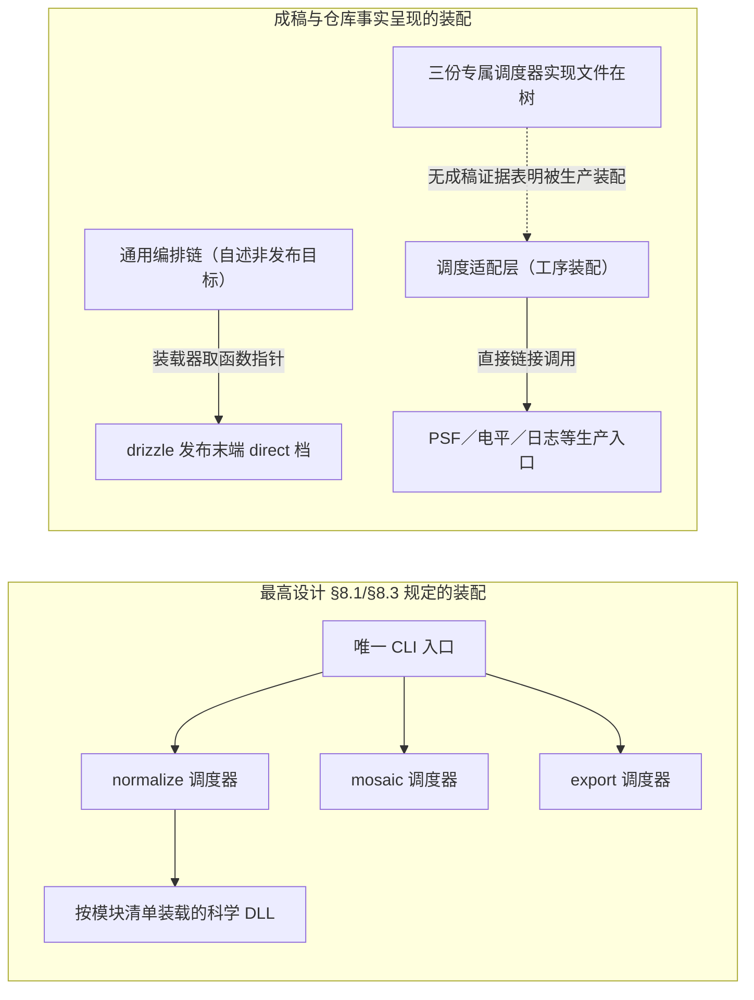

# 架构对齐报告（ACSD 代码面 · 设计与实现接线核对）

被审基线 `c8f64e9a`。判定分五档：`已实现且接线`／`已实现未接线`／`部分实现`／`未实现`／`与设计相反`。
上位依据：`ASTROCS_DESIGN.md` §2（创新点与链路）、§4.2（工序流程）、§8（软件架构：唯一 CLI 入口、阶段独立调度器、命名块管线、顶层结构、模块与 ABI）、§12（验证体系），`ENGINEERING_SPEC.md` 代码与目录规则，`AGENTS.md` §6 硬禁令与 §7 目录落位，工作包标准 04（代码梳理标准）。
结论素材：已落盘通读成稿 `通读-CR-01.md … 通读-CR-35.md`（无 CR-08 批次），每条登记项指回其中一条 finding。

---

## 1 一页结论

最高设计说得很硬：一个 CLI 入口按命令拉起**该阶段自己的**调度器，调度器是阶段内唯一执行者；模块从内存管线读命名块、写新块、消耗旧块；每个可独立调度模块是独立动态库；并行度只由 benchmark profile 决定。拿这批通读成稿对下来，设计与实现之间的不符集中在五类，§2 逐模块登记的 90 行（已实现且接线 8／已实现未接线 17／部分实现 26／未实现 4／与设计相反 35）全部落在这五类里，每行指回一条已成稿的 finding。

**第一类：装配路径不唯一，阶段动作有两个承载者。** 设计只允许"阶段专属调度器"这一条装配路径，实现里通用编排链与调度适配层各驱动一部分阶段动作，两者选的档位与实现并不同。最重的三例：drizzle 的发布末端由通用编排按模块 ID 取函数指针、它实际取的那一档不写合同规定必存的帧级 SNR 键，于是创新点②的帧级权重链在产品面拿不到输入，而模块侧被指为唯一真实入口的另一个装配点根本不在这条链上（通读-CR-09.md CR-09-4、通读-CR-13.md CR-13-01）；noise_snr 的科学加权输出在调度侧无人调用，唯一挂过它的通用编排自述为非发布目标（通读-CR-15.md CR-15-17）；platesolve 的 per-phase 日志交付面被生产路径显式关死（通读-CR-28.md CR-28-3）。

**第二类：实现存在但生产零引用。** 17 行属此档，跨 6 个算法族。最重的三例：psf 的图像／低频／σ 截尾整件原语零调用者，并且是 star_detection 那份生产件的无登记孪生副本；platesolve 的 k-vector 与整条 polygon 支链构建符号零调用、索引类型无构造点，却在合同面标"已验证"，其唯一测试载体从未注册进构建图；coverage 的有界异步队列原语与容量推导生产零实例化，真实 mosaic 读盘仍是同步串行（通读-CR-32.md CR-32-11、通读-CR-27.md CR-27-16、通读-CR-19.md CR-19-06）。条文以"生产"名义点名的完整信息核估计量、天光采样与掩膜函数族同属此类（通读-CR-15.md CR-15-02、通读-CR-23.md CR-23-05）。

**第三类：同一能力多版并存，最重者三套并行。** 背景估计这一件事同时存在未使用的副本、生产中真正被调用的那一份、模块自用的第三套内联实现，三处互不引用也无处登记；一个被合同点名的科学常数在生产者、消费者、测试三处各抄一份且互为逆运算；饱和电平优先级链合同冻结三级、公共头实现两级、调度侧再自行实现一份且标签集合不同（通读-CR-32.md CR-32-11、通读-CR-33.md CR-33-17、通读-CR-17.md CR-17-1）。修单向漂移因此成为常态，"该模块已验证"的主张覆盖面里混着从未被使用的代码。

**第四类：并行与资源预算不由 profile 决定，直接撞 `AGENTS.md §6` 硬禁令。** 测光生产路径全部并行区写死调度策略与块大小，线程数既不设也不读，profile 的取值到不了这里，调它不会改变行为却会被登记为已生效；执行选项里的 IO 并行度与内存预算字段在 `lib` 内零消费者，合同点名排除的那个兜底式正是实现；测试还把"worker 缺省＝CPU 核数"钉成合同期望，反过来锁住合同修正案（通读-CR-04.md CR-04-23、通读-CR-20.md CR-20-16、通读-CR-21.md CR-21-01、CR-21-05）。

**第五类：主张面与登记面跟实现相反。** 这一类既含一物多值，也含以措辞冒充收口：SIP 阶数同一参数四个口径，尺寸非法错误码合同说一个值实现返回另一个值，同一 ABI 错误码承载两类语义且注释对码位占用的自述被同文件证伪；文档注释规定不合法输入一律 fail-closed 禁静默，checksum 不符与头非法三处只打印后继续写产品并返回成功；"参数与旧 writer 逐项一致""模块事务面已收口""每模块独立日志文件""生产通道"四处主张各有实测反证，其中数据合同把生产通道登记成测试专用入口（通读-CR-07.md CR-07-03、CR-07-04、通读-CR-13.md CR-13-02、通读-CR-13.md CR-13-01、通读-CR-09.md CR-09-9、CR-09-2、通读-CR-27.md CR-27-19、CR-27-06）。另有 4 行是设计点名要有而实现面零承载：含源项的总方差面生产者、合同要求的 `run_log` 清单、设计点名的 signal/support 兼容要素、被条文点名的那条断言（通读-CR-15.md CR-15-17、通读-CR-27.md CR-27-19、通读-CR-20.md CR-20-13、通读-CR-29.md CR-29-20）。

两条已裁事项在本报告里只登记现状：独立动态库是**已实现未接线**（交付清单只覆盖少数科学模块，装载链缺最后一跳，且一个 no-op 件以已实现状态占交付位），阶段专属调度器是**未接管**（三份专属实现文件在树，生产阶段动作由通用路径承载，三个会话目录未退役）。两条都不再作为待裁上呈，缺的一跳与判据见 §3 与 §5。

---

## 2 按"设计→实现接线"五档逐模块登记

### 2.1 已实现且接线（8 条）

| 模块或对象 | 档位 | 事实一句话 | 成稿出处 |
|---|---|---|---|
| drizzle · HEALPix 加钻发布末端（direct 档） | 已实现且接线 | normalize 生产经装载器按模块 ID 取 `hp_drizzle_run_hips`，逐跳落到球面 sink 真实写产品 | 通读-CR-09.md CR-09-4 |
| drizzle · 加钻内部主链与降级声明 | 已实现且接线 | 调度适配层的 drizzle 工序是唯一真实入口，PHOTDEGRADE 降级位在引擎侧被消费 | 通读-CR-13.md CR-13-01 |
| noise_snr · 对角近似信息核助手 | 已实现且接线 | 产品唯一入口写死为对角近似路径（完整信息核那一份的接线见 2.2） | 通读-CR-15.md CR-15-02 |
| photometry · 带质量位的测光入口 | 已实现且接线 | 生产节点实际走带质量位的 `_qf` 通道，装配层与产品面在跑 | 通读-CR-02.md CR-02-12 |
| psf · 动态 PSF 批拟合入口 | 已实现且接线 | normalize 生产经调度适配层调用批拟合，交付 `p1_psf.json` 的成功星集合 | 通读-CR-32.md CR-32-2 |
| star_detection · 图像原语族 | 已实现且接线 | 中位／σ 截尾／atrous／局部极大这一份由同模块检测器在生产路径调用 | 通读-CR-32.md CR-32-11 |
| platesolve · IPv 求解主链 | 已实现且接线 | 生产调度路径显式置空日志目录后进求解器，主链在跑 | 通读-CR-28.md CR-28-3 |
| integration/coverage · 内存约束实际承载字段 | 已实现且接线 | 内存闸门由另一字段（`memory_limit_mb` 直连写通道）实际生效 | 通读-CR-20.md CR-20-16 |

### 2.2 已实现未接线（17 条）

| 模块或对象 | 档位 | 事实一句话 | 成稿出处 |
|---|---|---|---|
| noise_snr · 完整信息核 GLS 估计量 | 已实现未接线 | 科学文档以"生产"名义点名的算子在产品路径零调用，两条完整信息核路径不可达 | 通读-CR-15.md CR-15-02 |
| noise_snr · 科学加权填充输出的消费侧 | 已实现未接线 | 填充输出在生产调度侧无调用者，插件条文自记"未挂 variance 块" | 通读-CR-15.md CR-15-17 |
| coverage · 有界异步队列原语与容量推导 | 已实现未接线 | 生产代码零实例化，真实 mosaic 读盘仍是同步串行 | 通读-CR-19.md CR-19-06 |
| coverage · 执行选项的 IO 并行度字段 | 已实现未接线 | 字段在 `lib` 内零消费者，配置被解析、被 JSON 断言，但对任何计算不生效 | 通读-CR-20.md CR-20-16 |
| coverage · 执行选项的内存预算字段 | 已实现未接线 | 预算字段只写不读，"预算→队列容量/写缓冲上限"的推导链无实现承载 | 通读-CR-21.md CR-21-05 |
| upm/coverage · 条文点名的天光采样与星点掩膜函数族 | 已实现未接线 | 本仓接线台账登记为不可达，科学不变量的执行主体另有其人，三份实现各带一套默认值成第二登记面 | 通读-CR-23.md CR-23-05 |
| platesolve · k-vector 与 polygon 支链 | 已实现未接线 | 构建符号零调用点、索引类型在 `lib/` 内无构造点，唯一测试载体从未注册进构建图 | 通读-CR-27.md CR-27-16 |
| platesolve · per-phase 日志注入函数 | 已实现未接线 | 两个 phase 的注入器全仓零调用，生产路径把落点显式关死 | 通读-CR-28.md CR-28-3 |
| psf · 图像／低频／σ 截尾原语整件 | 已实现未接线 | 整文件 17 个原语零调用者，且是 star_detection 那份的无登记孪生副本 | 通读-CR-32.md CR-32-11 |
| psf · 通量独立期望件 | 已实现未接线 | 定义后全仓无调用，实际通量判据内联重算与被测方同一表达式 | 通读-CR-33.md CR-33-22 |
| star_detection · 过渡点趋势承载函数 | 已实现未接线 | 承载该系数的趋势函数在仓内零消费者 | 通读-CR-29.md CR-29-11 |
| drizzle · 写侧测光标度字段对 | 已实现未接线 | 写侧字段是零消费者，缺键兜底值与标定侧判据相反 | 通读-CR-12.md CR-12-17 |
| drizzle · 球面 sink 的事务面四原语 | 已实现未接线 | 自称"模块事务面收口"，实际导出末端直写输出目录、从不触碰这四个原语 | 通读-CR-09.md CR-09-2 |
| drizzle · 携带帧级 SNR 的 phase1 发布档 | 已实现未接线 | 该末端在生产无人调，唯一被编排层取用的是不写帧级 SNR 键的 direct 档 | 通读-CR-09.md CR-09-4 |
| photometry · 独立期望的 SIP 求值件 | 已实现未接线 | 期望件与本批用例内零调用，被测侧的自变量口径差因此不可见 | 通读-CR-03.md CR-03-6-03 |
| noise_snr 测试族 · 占位夹具臂 | 已实现未接线 | 死占位 helper 与夹具三个从不使用的臂并存 | 通读-CR-16.md CR-16-23 |
| photometry · selection function 数值 | 已实现未接线（判定侧） | 四个数值只做正负检查、从不参与判定，角秒量在本链无像素换算点 | 通读-CR-05.md CR-05-15 |

### 2.3 部分实现（26 条）

| 模块或对象 | 档位 | 事实一句话 | 成稿出处 |
|---|---|---|---|
| photometry · 冻结 C ABI 导出的质量位面 | 部分实现 | 头注释自认六个冻结导出在生产不带质量位，且没有任何登记面承认这条通道仍会放行饱和星 | 通读-CR-05.md CR-05-1 |
| photometry · 公共一站式聚合入口 | 部分实现 | 结构上没有质量位参数，用即绕过测光条文的饱和门 | 通读-CR-06.md CR-06-16 |
| photometry · QE／曲线解析失败面 | 部分实现 | 解析失败只写 stderr，接口上没有任何字段让调用方决定是否判红 | 通读-CR-01.md CR-01-10 |
| photometry · 星表查询夹具 | 部分实现 | 桩忽略全部查询条件，生产自适应锥搜的常走分支在整套用例里永不可达 | 通读-CR-02.md CR-02-18 |
| photometry · 退化输出断言 | 部分实现 | 整组共享状态从不复位，断言可被上一次调用的残值满足 | 通读-CR-03.md CR-03-5-01 |
| drizzle · 发布流水线的"校验"步 | 部分实现 | 该步只做自增计数，唯一生产调用点把两个出参都传空，合同点名的 tile 内容校验零执行点 | 通读-CR-09.md CR-09-1 |
| drizzle · 累加器退化回退分支 | 部分实现 | 回退值无条文授权，且该分支在生产累加器下不可达，"不静默"安全网虚设 | 通读-CR-09.md CR-09-10 |
| drizzle · API 面的 WCS 存在性判据 | 部分实现 | 以 CD 对角元与 CDELT/CRVAL 非零充当"有 WCS"判据，反对角合法矩阵与 CRVAL 恰为 0 的合法天区被拒 | 通读-CR-13.md CR-13-03 |
| drizzle · SIP 畸变项读取 | 部分实现 | B 项共用 A 阶，B 阶更高时静默截断 | 通读-CR-13.md CR-13-04 |
| drizzle · 可估计性诊断指标 | 部分实现 | 不可估计以 0.0 表达，无法与真零效率区分，而排障文档以该件为诊断依据 | 通读-CR-13.md CR-13-08 |
| drizzle 测试族 · 档位量化偏移可见性 | 部分实现 | 夹具把支撑面造在量化格点上，已知偏移在产品级门里结构上不可见 | 通读-CR-11.md CR-11-25 |
| drizzle 测试族 · 共用调用入口 | 部分实现 | 六个用例共用同一入口并丢弃被调方返回码与错误串 | 通读-CR-11.md CR-11-32 |
| noise_snr · 跨边界控制点结构体的 ABI 头部 | 部分实现 | 锁了字节布局却无 `struct_size`/`abi_version`，入口也不校验，违最高设计 §8.5 | 通读-CR-17.md CR-17-9 |
| noise_snr 测试族 · 恒真注入锚 | 部分实现 | 多条注入锚恒真、夹具臂从不使用，检查数与代码卫生混在一起 | 通读-CR-16.md CR-16-23 |
| noise_snr 测试族 · 代际说明并存 | 部分实现 | 同一文件头部并存两代夹具说明，注释代参数下判据不成立 | 通读-CR-16.md CR-16-15 |
| coverage 测试面 · 分支可达性断言 | 部分实现 | 两条"分支"是同一状态重复断言，短路分支在门内不可达 | 通读-CR-21.md CR-21-04 |
| upm · 未实现枚举开关的入口校验 | 部分实现 | 三个枚举开关未实现却被零校验静默接受，与同文件"网格常数越界即具名拒绝"的自订纪律相反 | 通读-CR-25.md CR-25-06 |
| upm · 机器可检警告键面 | 部分实现 | 产品 JSON 里没有条文点名的四个警告键，"判红不阻塞"失去可断言的成功态 | 通读-CR-25.md CR-25-11 |
| upm/coverage · 并发度取值口径 | 部分实现 | "并发度为零即 auto"在注释、合同与实现三处各说一种 | 通读-CR-24.md CR-24-08 |
| star_detection · 求解器失败状态对外主张 | 部分实现 | "不外泄未收敛解"的三个失败状态与生产工作区复用路径在仓内零断言 | 通读-CR-29.md CR-29-24 |
| star_detection · 有界返回契约 | 部分实现 | 耗时门在挂死时根本不执行，逐位一致期望又是被测循环的同文件手抄件 | 通读-CR-31.md CR-31-3 |
| star_detection 测试框架 · 通过侧计数 | 部分实现 | 记录了检查数却从不据其判红，零断言组与全通过组在返回码与输出形态上不可区分 | 通读-CR-30.md CR-30-05 |
| star_detection 性能门 · 无并行环境 | 部分实现 | 无 OpenMP 时两个性能门恒真，门名与注释把管不到的方向说成能管 | 通读-CR-30.md CR-30-13 |
| psf · 块像素中心口径门 | 部分实现 | 门不链接、不调用任何 psf 生产者，被核对的前提在门内是手填的 | 通读-CR-33.md CR-33-9 |
| psf · 容差来源登记 | 部分实现 | 七项容差的"来源"是一条无路径 probe，且规定"容差须引用来源"的规则载体文档在跟踪面不存在 | 通读-CR-33.md CR-33-24 |
| psf 测试族 · 注入注册表与断言绑定 | 部分实现 | 注册表与断言实名之间无编译期绑定，"注入名未被消费"不报错 | 通读-CR-34.md CR-34-3 |

### 2.4 未实现（4 条）

| 模块或对象 | 档位 | 事实一句话 | 成稿出处 |
|---|---|---|---|
| noise_snr · 含源项的总方差面生产者 | 未实现 | 本模块只产出背景方差面，正本点名的加权方差面无生产者，而对外接口用"Phase2 科学加权唯一来源"把被禁止的代用写成事实 | 通读-CR-15.md CR-15-17 |
| platesolve · 合同要求的运行日志清单 | 未实现 | "每模块独立日志文件"的交付面在生产为空，合同要求的 `run_log` 清单在跟踪代码里没有任何生产者 | 通读-CR-27.md CR-27-19 |
| coverage · 设计点名的兼容语义要素 | 未实现 | 「同一 signal/support 语义」在本模块零承载，且两个文件的兼容清单不是同一份 | 通读-CR-20.md CR-20-13 |
| star_detection · 被点名的断言条目 | 未实现 | 抬头声明的那条断言在文件里根本不存在，被点名条目在全仓零断言 | 通读-CR-29.md CR-29-20 |

### 2.5 与设计相反（35 条）

| 模块或对象 | 档位 | 事实一句话 | 成稿出处 |
|---|---|---|---|
| photometry · 生产并行装配 | 与设计相反 | 全部并行区写死调度策略与块大小，线程数既不设也不读，测光生产路径无任何 profile 接线（撞 `AGENTS.md §6` 与本模块条文） | 通读-CR-04.md CR-04-23 |
| photometry · 注释宣称的线程数 | 与设计相反 | 头注释称按固定线程数并行加速，实现不固定线程数，而固定线程数本身被硬禁令禁止 | 通读-CR-01.md CR-01-20 |
| photometry · SIP 阶数上界 | 与设计相反 | 同一参数存在四个口径：合同 ≤2、实现与调度器与 drizzle 取 [0,5]、drizzle 头注释另写 0..4 | 通读-CR-07.md CR-07-03 |
| photometry · 尺寸非法错误码 | 与设计相反 | 公共头与返回码合同写一个码，实现返回成功语义，同一"尺寸无效"在两族入口取不同码 | 通读-CR-04.md CR-04-26 |
| photometry · 错误码同源面 | 与设计相反 | 合同自称唯一权威写一个码，被测两入口实际返回另一个码，第三个码从未登记进合同面 | 通读-CR-07.md CR-07-04、CR-07-05 |
| photometry · 屏障断言落点 | 与设计相反 | 屏障断言全部落在生产不可达的冻结入口，生产可达通道的同类路径在整个跟踪测试面零断言 | 通读-CR-07.md CR-07-07 |
| photometry · "已验证"证据宿主 | 与设计相反 | 登记为创新点①已验证证据的宿主是一个零断言产生器，且它调用的两条通道被模块自己的头文件标为非生产通道 | 通读-CR-07.md CR-07-12 |
| noise_snr · 理想信息核报告面 | 与设计相反 | 自称的冻结合同锚在合同与登记面零条目，而它禁止的事正是唯一产品路径做的事，并被消费者门反向锁死 | 通读-CR-15.md CR-15-01 |
| noise_snr · 饱和电平优先级链 | 与设计相反 | 合同冻结三级链＋逐级登记，公共头实现只有两级，调度侧另写一份且标签集合不同并把两个来源折叠 | 通读-CR-17.md CR-17-1 |
| noise_snr · SNR 唯一对账锁 | 与设计相反 | 两行判据互相矛盾导致该锁被整体摘出 ctest，机器基线现在对该门零覆盖 | 通读-CR-18.md CR-18-4 |
| upm · 同一配置字段两入口口径 | 与设计相反 | 求解器打开入口把 14 个科学常数再抄一份当缺键默认，却不跑构建侧那套非法值规整 | 通读-CR-24.md CR-24-01 |
| upm · 同一唯一判据两处置 | 与设计相反 | MA 面 fail-closed 具名拒绝，空间 UPM 面判红后仍返回成功 | 通读-CR-25.md CR-25-13 |
| upm/coverage · 交付调用点次序 | 与设计相反 | 权重预检在交付调用点被放在积分之后，产品 manifest 仍按预检次序自述入口 | 通读-CR-22.md CR-22-04 |
| coverage · 高污染阈承载 | 与设计相反 | 同一阈值两处入口：采样器侧是配置键，此处是硬字面量且不入配置 | 通读-CR-23.md CR-23-04 |
| coverage · 节点上限默认值 | 与设计相反 | 算法侧默认与自身头文件声明的容量漂移，调用方以"注释承认漂移"的方式绕过 | 通读-CR-23.md CR-23-09 |
| coverage · 自报路径与追溯锚 | 与设计相反 | 自报路径与全部下游权威引用停在已迁走的阶段会话目录，追溯链断在字面上 | 通读-CR-21.md CR-21-09 |
| coverage 测试面 · worker 缺省 | 与设计相反 | 测试把"缺省＝CPU 核数"钉成合同期望，而它自己点名的合同说缺省由 benchmark profile 决定，该门反向锁住合同修正案 | 通读-CR-21.md CR-21-01 |
| coverage · IO 并行度兜底式 | 与设计相反 | 合同点名排除的那个兜底式正是实现 | 通读-CR-20.md CR-20-16 |
| platesolve · σ 截尾迭代 | 与设计相反 | 循环外初始化的布尔在循环内不重置，σ 截尾恒只跑一轮，多轮剔除逻辑与迭代上限成死代码 | 通读-CR-27.md CR-27-09 |
| platesolve · 降阶档数承诺 | 与设计相反 | 头承诺四档降阶＋双条件触发，实现只有两档单条件，且承诺的"放松到底档"从不发生 | 通读-CR-28.md CR-28-8 |
| platesolve · 生产通道登记 | 与设计相反 | 数据合同把生产通道登记成测试专用入口，与本文件与签名头的生产声明互斥 | 通读-CR-27.md CR-27-06 |
| platesolve · 日志落点唯一来源 | 与设计相反 | 公共头点名的源码树内 per-phase 落点、设计的"落点唯一来源＝块级输出目录"与实现三处各说一样 | 通读-CR-28.md CR-28-3 |
| psf · 裁窗半径配置 | 与设计相反 | 合同 required 的配置键在该生产入口不被消费，恒取源内固定半径；两生产入口对同一半径取不同路径 | 通读-CR-32.md CR-32-2、通读-CR-33.md CR-33-5 |
| psf · 模块 README 端口表 | 与设计相反 | README 端口表仍写失败星留 NaN 占位，与合同的紧凑语义与"禁留 NaN 占位行"正相反 | 通读-CR-32.md CR-32-4 |
| drizzle · 损坏输入处置 | 与设计相反 | 同文件文档注释规定不合法输入一律 fail-closed 禁静默，校验和不符／头非法／点数越上限三处只打印后继续写产品并返回成功 | 通读-CR-13.md CR-13-01 |
| drizzle · ABI 错误码 | 与设计相反 | 同一码值承载输入拒绝与内部异常两类语义，注释对码位占用的自述被同文件事实直接证伪 | 通读-CR-13.md CR-13-02 |
| drizzle · 节点上限与默认档 | 与设计相反 | 无出处的默认上限与"缺省⇒自动"的裁定和入口校验互斥；测试面与管线面对"生产上限"取值互斥 | 通读-CR-13.md CR-13-11、通读-CR-11.md CR-11-33 |
| drizzle · 两发布末端的等价主张 | 与设计相反 | 自称"参数与旧 writer 逐项一致"，实测在数据标识、能力位与观测元数据三处异值，两末端声明的子产品集不同 | 通读-CR-09.md CR-09-9 |
| drizzle · 登记面与实现相反 | 与设计相反 | 棘轮基线仍记本测试为不可构建，而构建图已接线 | 通读-CR-12.md CR-12-07 |
| star_detection · 可调门登记 | 与设计相反 | 结构体把该参数当可调门登记，实现读的是写死常数 | 通读-CR-29.md CR-29-02 |
| drizzle 测试族 · 并行度来源 | 与设计相反 | 测试把线程数写死，不读 profile，门所跑的并发形态与生产并行度无必然对应 | 通读-CR-12.md CR-12-06 |
| drizzle 测试族 · 期望与冻结合同 | 与设计相反 | 断言把已作废的"零方差即丢弃"语义钉住，与冻结合同和现行引擎双向冲突，对基线恒红 | 通读-CR-11.md CR-11-17 |
| psf 测试族 · 组名清单 | 与设计相反 | 同一清单在三个面上有三份副本且已不一致（注释组数与注册表/构建目标数不同） | 通读-CR-16.md CR-16-19 |
| psf · 科学常数定义点 | 与设计相反 | 一个被合同点名的科学常数在三份互不引用的实现细节里各抄一份，无公共头或登记表导出，脱钩后无门可 catch | 通读-CR-33.md CR-33-17 |
| psf 测试族 · 通过侧计数 | 与设计相反 | 通过侧计数器声明后从未接线，组返回码只由失败数决定，"跑了很多断言"与"一条没跑"语义恒等 | 通读-CR-34.md CR-34-2 |

---

## 3 负责人已裁两条的现状

两条均已裁，本节只登记现状与缺的一跳，不再作为待裁上呈。

### 3.1 裁①：可独立调度模块以独立动态库交付

**裁了什么**：独立动态库是正本形态，最高设计里"或在可执行程序内部实现"那半句按正本删除（走变更流程）；交付形态不允许以链接进来的静态实现充当。

**现在实现到哪一步**

- 两平台产品清单各列 10 个交付单元，其中落在 `modules/` 的只有 6 件：一个一致性 no-op 件、本地星表目录客户端、以及 `astrocs_p1_calibration`／`astrocs_p1_cosmetic`／`astrocs_p1_drizzle`／`astrocs_p1_hips_writer` 四个科学模块件；另有 `providers/astrocs_cpu_baseline` 一个后端件（仓库事实：`eng/cmake/astrocs.product.windows.json.in`、`eng/packaging/astrocs.product.json` 的 `rel_path` 列）。
- `lib/algorithms/` 现有 17 个模块目录，即 13 个算法模块没有任何独立交付单元，其能力以静态方式随可执行程序交付（仓库事实：目录清单与两份产品清单之差）。
- 清单里那个 no-op 件的 `status` 写的是 `IMPLEMENTED`，占用 `modules/` 的交付单元位（仓库事实）——与 `AGENTS.md §6` 禁以 no-op／空骨架冒充交付直接冲突。
- 生产侧取模块符号的形态：一条经通用编排的装载器按模块 ID 取函数指针（通读-CR-09.md CR-09-4 逐跳），另一条由调度适配层直接链接调用同族入口（通读-CR-13.md CR-13-01、通读-CR-32.md CR-32-2）；跨边界结构体的 ABI 头部纪律只覆盖部分对象（通读-CR-17.md CR-17-9）。
- 仓内确实存在的动态装载代码集中在 `lib/infrastructure/acr/**`（CUDA 桥、系统指标）、`lib/algorithms/platesolve/cpp/ipv/src/ipv_select.cpp` 与 `lib/infrastructure/benchmark/backend_host/backend_loader.cpp`，均不在三阶段生产装配面上；`modules/` 这一目录名在 `lib/` 运行时代码里的命中只有 acr 的 CI 脚本（仓库事实）。

**缺哪一跳**：①安装布局把科学模块件放进生产加载器真会扫的目录，并把加载器所需的清单入仓；②为 13 个无交付单元的算法模块补齐独立库目标与装载；③新增一条"装载即必被加载"的门，负例判据是"往 `modules/` 放一份无人扫的库 ⇒ 必红"；④no-op 件从交付单元清单里摘出或改列其一致性用途与状态。**是否存在任何扫 `modules/` 的运行期加载器、产品清单的唯一读者是谁**只能实跑与逐引用面复核定案：`需复测`。

### 3.2 裁②：三个阶段各自专属调度器（定 P0）

**裁了什么**：每阶段实例化自己的调度器与内存管线，互不共享内存、会话或运行时状态；专属调度器是该阶段唯一执行者，通用编排不得替代。

**现在实现到哪一步**

- 三份专属实现的载体文件已在同一命名块下：normalize 的异步工作流件、mosaic 的天球窗口件、export 的子块流式件（`lib/infrastructure/scheduler/src/normalize_workflow.cpp`、`mosaic_window.cpp`、`export_stream.cpp`），公共头在 `lib/include/astrocs/core/`。
- 成稿点到的是另一批承载者在跑生产：调度适配层的 drizzle 工序、PSF 批拟合入口、电平来源链、日志开关（通读-CR-13.md CR-13-01、通读-CR-32.md CR-32-2、通读-CR-17.md CR-17-1、通读-CR-28.md CR-28-3）；通用编排链仍在承载阶段动作，且其自述为非发布目标（通读-CR-15.md CR-15-17、通读-CR-01.md 的编排 Stage1 滤镜映射条目、通读-CR-09.md CR-09-4 的逐跳）。
- 三个阶段的会话目录仍在树内并含源件（仓库事实：`lib/phase1_session`、`lib/phase2_session`、`lib/phase3_session`）。标准 04 §1 要求会话能力并入对应阶段调度器后独立会话目录退役；最高设计 §8.4 又有一句允许该命名，**上位互斥未解**——这属文档面互斥，不构成"专属调度器已接管"的证据。
- 阶段隔离（一次调用只驱动一个阶段、跨阶段仅磁盘交换）由调度命名块内的 Python 核对件静态保证（仓库事实：`lib/infrastructure/scheduler/core/phase_lifecycle.py` 读注册表并对混阶段调用图报错）。它是核对件，不是运行期装配。

**缺哪一跳**：把三阶段各自的调度形态（帧内 DAG＋多帧异步工作流与预取；天球窗口为单元的并行；子块流式与背压）从通用路径搬进对应专属调度器，并在设计里回答通用编排链退役到哪一步；三阶段的调度优化点各自作为验收项，不是只"把对象接上"。报告 B 所述"三个专属调度器中只有导出腿在生产被实例化、另两个生产引用数为 0"在通读成稿面尚无对应 finding，须逐引用面与实跑复核定案：`需复测`。

---

## 4 结构性缺口（跨模块）

以下每一条都是跨模块形态，不属单模块局部问题；括号内为可指回的成稿条目。

**G-1 两条生产装配路径并存，同一能力各有承载者。** 通用编排链按模块 ID 取函数指针驱动阶段动作，调度适配层又以直接链接调用同一族入口，两者选用的档位与实现并不相同——编排层实际取的发布档不写帧级 SNR 键（通读-CR-09.md CR-09-4），而被审的模块侧"唯一真实入口"在适配层（通读-CR-13.md CR-13-01）；科学文档点名的加权输出在调度侧无人调用、唯一挂过的通用编排自述为非发布目标（通读-CR-15.md CR-15-17），电平优先级链也在调度侧另写了一份（通读-CR-17.md CR-17-1）。这是裁②未落地的直接后果，也是所有"接线判定"必须先定的前提。

**G-2 实现存在但零调用者。** 跨 6 个模块族共 17 个对象成稿点名"库里有、生产不引用"（§2.2 全表）：完整信息核算子、被条文点名的采样与掩膜函数族、k-vector 与 polygon 支链、per-phase 日志注入件、整件图像原语、独立期望通量式、有界异步队列原语、执行选项的 IO 与内存预算字段、写侧标度字段对、球面 sink 的事务面四原语。它们各自带一套默认值与文档主张，构成第二登记面（通读-CR-23.md CR-23-05、通读-CR-32.md CR-32-11）。

**G-3 同一能力多版并存，最重者三套并行。** 背景／低频／σ 截尾族同时存在：未使用的副本、生产中真正被调用的那一份、以及模块自己第三套内联实现，三处互不引用、无一处登记（通读-CR-32.md CR-32-11）；一个合同点名的科学常数在生产者、消费者、测试三处各抄一份且互为逆运算（通读-CR-33.md CR-33-17）；14 个求解器常数在第二入口被再抄一份当缺键默认（通读-CR-24.md CR-24-01）；冻结常数以字面量复制在 5 个入口（通读-CR-04.md CR-04-28）；同一"中位数"两套偶数约定、同一"scale"两套定义（通读-CR-05.md CR-05-4、通读-CR-01.md CR-01-22）。

**G-4 以登记面／主张面冒充完成。** 零调用符号与整条支链在合同面标 `VERIFIED`、其唯一测试载体从未注册进构建图（通读-CR-27.md CR-27-16）；未接入的原语以合成程序的 sleep 计时记 `PASS`，同一文档另一节诚实登记"待接入"（通读-CR-19.md CR-19-06）；"模块事务面收口""参数与旧 writer 逐项一致""生产可达的合同门""每模块独立日志文件"四句主张分别被同批事实证伪（通读-CR-09.md CR-09-2、CR-09-9；通读-CR-20.md CR-20-12；通读-CR-27.md CR-27-19）；已验证证据的宿主是一个零断言产生器且调的是被模块自己标为非生产通道的入口（通读-CR-07.md CR-07-12）；交付清单把一致性 no-op 件的 `status` 写成 `IMPLEMENTED`（仓库事实）。

**G-5 并行与资源预算不由 profile 决定，撞 `AGENTS.md §6` 硬禁令。** 测光全部并行区写死调度策略与块大小（通读-CR-04.md CR-04-23）、测试写死线程数（通读-CR-12.md CR-12-06）、注释宣称固定线程数（通读-CR-01.md CR-01-20）、测试把"缺省＝CPU 核数"钉成合同期望并反向锁住合同（通读-CR-21.md CR-21-01）、合同点名排除的兜底式正是实现（通读-CR-20.md CR-20-16）、并发度语义三处各说一种（通读-CR-24.md CR-24-08）、日志器把每行 flush 与全局互斥绑定因而在线性段内构成一次全序列化（通读-CR-27.md CR-27-21）。

**G-6 命名块的生产者—消费者声明与生命周期未闭合（§8.2）。** 加权方差面在模块内根本没有生产者，对外接口却以"科学加权唯一来源"字样把被禁止的代用写成事实（通读-CR-15.md CR-15-17）；帧级 SNR 键不进产品导致下游权重链不闭合、由适配层具名报错（通读-CR-09.md CR-09-4）；权重预检在交付调用点被排到积分之后而 manifest 仍按预检次序自述（通读-CR-22.md CR-22-04）；零方差样本的处置被一条陈旧断言钉成已作废语义（通读-CR-11.md CR-11-17）；归属映射缺键静默落到 index 0 且用的是并行分支里可插入的共享表（通读-CR-25.md CR-25-04）。

**G-7 目录归并与退役未贯穿。** 三个会话目录仍在树内含源件，而标准 04 §1 要求归并后退役、最高设计 §8.4 又允许该命名（上位互斥未解，仓库事实）；已迁走的会话目录名仍活在自报路径与全部下游权威引用里，追溯链断在字面上（通读-CR-21.md CR-21-09）；被条文点名的采样与掩膜实现留在与真载体不同的目录里各自漂移（通读-CR-23.md CR-23-05）。

**G-8 模块清单、合同与实现不同源，一物多值。** SIP 阶数四侧口径（通读-CR-07.md CR-07-03）、节点上限两套互斥（通读-CR-13.md CR-13-11、通读-CR-11.md CR-11-33）、组名清单三副本已不一致（通读-CR-16.md CR-16-19）、同一"尺寸无效"在两族入口取不同码且合同自称唯一权威（通读-CR-04.md CR-04-26、通读-CR-07.md CR-07-04）、算法侧默认与自身头声明漂移并以注释绕过（通读-CR-23.md CR-23-09）、同一唯一判据在两入口取不同处置（通读-CR-25.md CR-25-13）、覆盖深度以总帧数顶替真实深度（通读-CR-20.md CR-20-04）。

**G-9 判据不读真实对象，是"设计→实现"接线的最后一环失效。** 通过侧计数从未接线，"跑了很多断言"与"一条没跑"在返回码上恒等（通读-CR-34.md CR-34-2、通读-CR-30.md CR-30-05）；口径门不链接也不调用任何被测生产者、被核对的前提在门内手填（通读-CR-33.md CR-33-9）；屏障断言全部落在生产不可达入口而生产可达通道零断言（通读-CR-07.md CR-07-07）；被称作"校验"的发布步骤只做自增计数且出参传空（通读-CR-09.md CR-09-1）；性能门在无并行环境恒真（通读-CR-30.md CR-30-13）；注入注册表与断言实名无编译期绑定（通读-CR-34.md CR-34-3）；夹具使生产常走分支永不可达（通读-CR-02.md CR-02-18）；恒真注入锚与死占位件充检查数（通读-CR-16.md CR-16-23）。

**G-10 跨边界 ABI 纪律不闭合（§8.5）。** 同样跨边界的控制点模型无 `struct_size`/`abi_version` 且入口不校验（通读-CR-17.md CR-17-9）；ABI 错误码同码双义且注释对码位占用的自述被同文件证伪（通读-CR-13.md CR-13-02）；probe/fill 协议声明"先查询容量"但结构体无容量入参、第二次调用零越界校验（通读-CR-20.md CR-20-09）；公共头声明与合同、实现三方对不上（通读-CR-27.md CR-27-06）。

---

## 5 整改登记项

每项给"改哪个面＋怎么算改好（可核对判据）＋依赖谁先改"，供实施任务书直接取用。

| 项 | 改哪个面 | 怎么算改好（可核对判据） | 依赖谁先改 |
|---|---|---|---|
| R-1 生产装配单一化（裁②落地） | `lib/infrastructure/scheduler/` 三份专属调度器＋通用编排链＋ CLI 拉起面 | 一次 `normalize`／`mosaic`／`export` 调用分别经各自专属调度器实例驱动；同一阶段动作在通用编排链与适配层不再各有一份承载；负例：把某阶段动作只挂在通用编排链上 ⇒ 门必红 | 无（最先） |
| R-2 交付形态补齐（裁①落地） | 安装布局、两份产品清单、运行期装载器、装载前检查 | `modules/` 下每个交付单元都有一个会扫该目录的运行期装载者；动态库装载前过 CPU 特征／清单／哈希／ABI 固定检查，失败只报错不回退搜索；负例：往 `modules/` 放一份无人扫的库 ⇒ 必红；no-op 件不再以已实现状态占交付单元位 | R-1 |
| R-3 死实现族处置 | §2.2 的 17 个对象所在模块目录与接线台账 | 每对象取 `wired` 或 `removed` 二选一；不允许"零调用"与"已验证"并存；删除或按统一注释块标注退役原因与替代件，并由退役代码检查器核对 | R-1 |
| R-4 唯一实现收敛 | 副本实现所在模块（背景／低频／σ 截尾族、跨模块常数、求解器默认值） | 同一能力全仓一份实现；被合同点名的常数只有一个导出点且被引用；检查器对同名符号跨目录重复出现即红；三套并行的形态在报告面归零 | R-3 |
| R-5 并行与资源预算接 profile | 各模块并行区、执行选项、测试与门的并发设置、日志器写出口 | 生产代码内无线程数／调度策略／块大小／IO worker 兜底式字面量；profile 改值必然改变运行参数并由探针回报实际 worker 数；1/N worker 数值等价门按冻结容差跑真产品路径 | R-1、R-2 |
| R-6 块生命周期与生产者—消费者闭合 | 管线命名块、注册表声明、manifest 自述 | 每个块的生产者／消费者／销毁点在注册表一处声明且与代码读写集合一致；缺块一律显式降级并写 provenance；无生产者的输出不得宣称"唯一来源"；顺序类条款（预检先于积分）由真调用次序与 manifest 同判据核对 | R-3 |
| R-7 目录归并与退役 | 三个会话目录、其构建目标与下游引用锚 | 上位互斥先在文档面解决；会话能力并入对应阶段调度器后目录退役；阶段名不再出现在代码目录与构建目标名（或上位文档明确豁免）；自报路径与全部下游引用指向现路径 | R-1 |
| R-8 一物一值 | 合同 schema、注册表、公共头注释、两族入口实现 | 同一参数的取值在合同／注册表／实现／注释四处同值并有单一一致性门；错误码唯一化且登记；两入口不得对同一判据取不同处置 | R-4 |
| R-9 判据接真实对象 | 测试族夹具、注入注册表、门注册与构建图 | 门一律链接并调用生产入口；通过侧计数非零是硬条件，零断言组判红；夹具不得使生产常走分支不可达；注入名未被消费即红；被条文点名的断言必须存在且可定位 | R-1 |
| R-10 主张与登记面对账 | 合同状态列、模块 README／module.yaml／端口表、产品清单状态枚举 | 每条"已验证／已收口／逐项一致／独立交付"主张都附可执行正例与负例；无证据者改列骨架或未验证或删除；README 端口表与合同语义不再相反 | R-3、R-4 |
| R-11 跨边界 ABI 纪律闭合 | 公共头声明的协议结构与入口校验 | 跨边界结构一律携带版本与尺寸头部字段并在入口校验；协议声明的容量入参真实存在；同码不再承载两类语义 | R-8 |
| R-12 基建族补齐通读 | 异步 IO、基准、可观测性、本地星表客户端、隔离实验、球面浏览器、三个 CLI 薄入口、管线框架、调度器本体 | 每族一份同口径成稿；本报告 §2 的相应行由该成稿填入而非由推断填空 | 与 R-1 并行 |

---

## 6 边界（不装完成）

**覆盖到的成稿序号。** 本报告全部接线结论取自 `通读-CR-01.md … 通读-CR-35.md`；该序列没有 CR-08 批次。`通读-CR-36.md … 通读-CR-44.md` 只有派单头与标注"已读：否"的独占清单，无 finding 成稿，一律不计入。

**收录口径。** 只登记"设计→实现接线"形态：是否被生产装配引用、能力承载在哪个对象、同一能力是否多版并存、主张面与实现面是否相反。纯数值错值、常数溯源与科学口径类 finding 不在 §2 行内（归"经验参数与硬编码清单"与科学整改面），以免同一事实在两份交付件里两判。

**尚无成稿支撑、因此 §2 整行不写的对象。** `lib/algorithms/` 的 calibration、cosmetic、integration、fits_output、resample、rejection、sampling、shared 各模块；`lib/infrastructure/` 的 aio、benchmark、observability、gaia 客户端、acr、hips_browser 六个命名块；三个 CLI 薄入口；管线框架本体（命名块、块生命周期、typed DAG 与注册表）；调度器本体（三份专属实现、执行器、内存预算、探针）；三个会话目录里的会话编排函数（本报告只在 §3.2 陈述"目录仍在树内、其退役与上位互斥未解"这一仓库事实，不据传闻定档）。这些族的行必须在批次通读落盘后才能填入。

**标 `需复测` 的结论（只能实跑或逐引用面复核定案）。**

1. 是否存在任何扫 `modules/` 的运行期加载器，以及产品清单文件的唯一读者是否只是 CI 检查器（裁①"缺哪一跳"的全部后果判定）。
2. 三份专属调度器在生产调用面的实例化与引用数，以及"一次调用只驱动一个阶段"在真装配下是否仍成立（裁②定档）。
3. 会话编排函数的生产调用数、注册状态与注册 ID 正确性。
4. 生产所选发布档在真跑时是否确实缺帧级 SNR 两键，另一发布档的能力位声明与其实际子产品集是否一致（通读-CR-09.md CR-09-4、CR-09-9 自身登记的待实跑项）。
5. `snr_model` 块在生产帧上是否真的携带（通读-CR-13.md CR-13-01 自述缺的正是这一跳，故其定级不上 S1）。
6. 恒红／恒真类门的实际形态：把相关测试注册进构建图后跑一次才能确认（通读-CR-11.md CR-11-17 未注册态、通读-CR-18.md CR-18-4 被摘除态、通读-CR-12.md CR-12-07 登记滞后态）。
7. profile 改值是否真的改变生产并行度（通读-CR-04.md CR-04-23、通读-CR-21.md CR-21-01 只证明代码面无接线路径，运行期效果需实跑）。

**交叉核对件的用法。** 同一批结论的另一种视角用于定位与查漏，凡其转述没有通读 finding 或仓库事实支撑的条目，本报告不收录；本报告里以仓库事实形式出现的清单与目录判定，均来自对基线 `c8f64e9a` 的只读检查（零写、零构建、零门执行）。
