# 实施任务总览与依赖图（D8 候选聚合）

> 读者：开发节点（阶段 B / RELEASE-06）。基线仓库 HEAD `c8f64e9a`。
> 本件只做**筛选、去重、聚合与可执行性检查**：不新增发现、不改仓库、不宣布任何发布结论。
> 每条主张的取证与复算在来源件（54 份分片成稿与其 12 份第②层复核件、独立审计包 01/02/05/07），本件只登记其结论与位点，不重述为实测。

## 0 本件的口径与读法

- **聚合单位**：规范化到仓库全路径（或配置键）的被修对象。同一对象的多条主张合并为一条任务，全部来源位点保留在任务件的「来源位点全量」表。
- **成套单位**：文件域相交的对象簇合并为一个任务文件（规则 5：两两文件域交集非空 ⇒ 要么合并、要么标为必须同批）。因此一个任务文件 = 一个可原子提交的批次，其 §1 表按对象逐条给出「现状 → 应为」，不因打包而丢失对象级粒度。
- **入主表门槛**：原始成稿条目 ∩ 第②层判「确认」或「降级后仍成立」；被推翻/撤销的进 §3 作废表；没有复核件的进 §4 待第二层表，**不入主表**。
- **波次按依赖排，不按发现先后**：判据与门的可信性 → 科学口径 → 代码接线 → 批量字句 → 门面与索引重建。

## 1 筛选统计

| 量 | 数 | 口径与复算命令 |
|---|---:|---|
| 底表行数 | 5830 | `独立审计/批次清单/findings_base.csv`（不含表头）|
| 底表内来源成稿 | 54 个取值 | 其中原始成稿 38 份、第②层复核件 12 份、辅助源 4 份（`D9-工单对账*.md`、`论文*-回执.md`）|
| 第②层主张（带判定） | 46 | 解析 `raw/复核-*.md` 的 `**判定：**` 与尾部汇总表 |
| 判定分布 | 确认 35 ／ 降级后仍成立 8 ／ 部分确认+部分推翻 1 ／ 推翻 2 | 同上 |
| 去重后的有效对象键 | 1444 | 规范化到仓库全路径/目录/配置键 |
| 其中：双层都过 | 198 | 成稿与被修对象同名的主张有第②层判定 |
| 其中：仅第①层（→ 待第二层） | 1135 | 见 §4 |
| 其中：仅第②层点名（成稿未独立立案） | 111 | 作证据链接用，不单独成任务 |
| 主表对象（双层 ∧ 非全作废） | 186 | 确认 180 ／ 对象级混判 3 ／ 待加深 3 |
| └ 其中严格同源（该对象的成稿源本身被该复核件覆盖） | 107 | 其余 79 个为「对象被他案引为证据」，已在任务件里标出，不升为独立立案 |
| 对象键不在跟踪集 | 376 | 判存在性只用 `git ls-files`（本机残留不算仓库问题）；其中 8 个进入主表并被标 `需复测` |

**目录前缀级泛指的处理（工包预告的已知噪声）**：`被点名对象` 里形如 `docs/`、`docs/science/` 的浅前缀共 **530** 个 token（`docs/` 160 行、`docs/science/` 56 行与工包口径逐字相符），全部按原文重算：其中 **201** 次成功从原文抽出跟踪集内的具体文件并改挂到该文件；残余 **18** 个前缀桶无法重算（登记 430 条未重算记录，同一行可命中多个前缀 token 故大于 530−201），已归入待重定位，不参与聚合。

**成套结果**：32 个任务（W0 11 个、W1 21 个），认领 193 个被修对象；W2/W3/W4 的 24 个双层对象只列清单、不出任务文件。

### 1.1 主表按波次的对象分布（机械归属，含未成套部分）

| 波次 | 双层确认对象数 | 已成套任务数 | 未成套对象数 |
|---|---:|---:|---:|
| W0 | 48 | 11 | 0 |
| W1 | 74 | 21 | 0 |
| W2 | 26 | 0（只列清单） | 10 |
| W3 | 37 | 0（只列清单） | 14 |
| W4 | 1 | 0（只列清单） | 0 |

## 2 任务索引（W0 / W1 已出独立任务文件）

| 编号 | 短名 | 波次 | 档 | 域 | 文件域对象数 |
|---|---|---|---|---|---:|
| `ACSD-T00` | 消灭双入口分叉与隐式继承：注册表逐单元自描述 | W0 | P0 | 门禁 | 12 |
| `ACSD-T01` | 全门禁 fail-closed 普查：把「测谁」与「通过」的充要条件钉死并入库读数 | W0 | P0 | 门禁 | 11 |
| `ACSD-T02` | 两条入库门规：门的汇总读数与科学文档证据路径必须命中跟踪件 | W0 | P1 | 门禁+文档 | 14 |
| `ACSD-T03` | 零离散度假绿通道、对插值算子恒 0 的重建误差判据、求和型守恒门的错分盲区 | W0 | P0 | 门禁+科学 | 12 |
| `ACSD-T04` | 在仓但被明文不注册的可执行件与逐叶分配门定案 | W0 | P1 | 门禁+测试 | 6 |
| `ACSD-T05` | 配置一致性门补数值比较，死键与键名对齐入同一条判据 | W0 | P1 | 门禁+配置 | 9 |
| `ACSD-T06` | 三道锚门的结构性盲区：把任意路径形态与 doc_globs 覆盖面纳入判据 | W0 | P1 | 门禁+文档 | 9 |
| `ACSD-T07` | 清包前必须先解门名与注释锚：写法门与 `工程控制/` 出库同批改 | W0 | P1 | 门禁+文档 | 8 |
| `ACSD-T08` | 被禁 token 仍列生产模式：退役门扫描面扩到登记件与验证档案 | W0 | P1 | 门禁+文档 | 9 |
| `ACSD-T09` | 状态阶梯唯一词表回正本，对外发布结论补真值判据 | W0 | P2 | 文档+门禁 | 13 |
| `ACSD-T10` | 文档索引判据重建：12 条检查各带零对象守卫与正负例，先于一切迁移 | W0 | P0 | 门禁+文档 | 9 |
| `ACSD-T20` | 阶段二逐像素权重来源面定案：叠加权须含源项，实现侧新增含源项加权方差面 | W1 | P1 | 科学 | 8 |
| `ACSD-T21` | 面积口径两真互斥：核权重分母 `A_drop` vs `A_pixel`、冻结几何预算被 | W1 | P1 | 科学 | 9 |
| `ACSD-T22` | support 分子分母同表示与逐叶分配的在册容差登记 | W1 | P1 | 科学+门禁 | 4 |
| `ACSD-T24` | 把「零散度/不可估计」从伪装有限值改回具名退化，并抬到帧级门与产品声明面 | W1 | P1 | 科学+代码 | 10 |
| `ACSD-T25` | 常数出处登记为配置键的六条死键与 CFG001/CFG002 判据退化 | W1 | P1 | 科学+配置 | 7 |
| `ACSD-T27` | 排异三档正本跟改 7 处对侧口径，并修一条与正本相反的测试断言 | W1 | P1 | 科学+测试 | 13 |
| `ACSD-T28` | 术语表把合法测量值当缺失标记：一行改口径 + 改锚，可结案一条待裁 | W1 | P1 | 科学+文档 | 8 |
| `ACSD-T29` | 注释与代码默认打架：四处措辞统一到正本记法，不动码 | W1 | P2 | 文档+注释 | 5 |
| `ACSD-T30` | 生产侧合规、永不调度的 session 侧漏设回落 0：随 ARCH-DEBT-01 下 | W1 | P2 | 配置+代码 | 6 |
| `ACSD-T31` | λ 因子成立前提写成约束 + 绝对刻度锚改述为「仓库内无可复核锚」 | W1 | P2 | 科学 | 5 |
| `ACSD-T32` | 三口径图谱测的是 σ̂ 估计器而非 SNR：补一组以 F_ref 为分子的三臂对拍 | W1 | P1 | 科学+实验 | 9 |
| `ACSD-T33` | 合同要求的逐像素预测方差在 `SparseReconstruction` 里无字段，ma | W1 | P1 | 科学+合同 | 7 |
| `ACSD-T34` | 归档头条取自 N=1000 单次 MC 实现值：改引用 seed 无关的闭式并补判据 | W1 | P2 | 实验 | 6 |
| `ACSD-T35` | 出厂接缝门含可相消的法向梯度项，与验收证据用的是两个统计量 | W1 | P1 | 科学+门禁 | 8 |
| `ACSD-T36` | `pixel_area_power` 机器层两事实源同名互斥；`CONFIG_CONTR | W1 | P1 | 合同 | 17 |
| `ACSD-T37` | `must_contain` 与唯一源互斥：改双向判据，不采纳会引入新 fail-ope | W1 | P1 | 合同+门禁 | 11 |
| `ACSD-T38` | 裸形态是否允许没有产品级索引：五处口径 + 同一判据两侧相反，合同自身条款互斥到不可同时 | W1 | P1 | 合同 | 7 |
| `ACSD-T39` | ID 正则与被审对象、与检查器互斥；反向权威 `INDEX.yaml` 承载不了被委派的 | W1 | P1 | 合同+文档 | 9 |
| `ACSD-T40` | 同一物理量两值未标口径、手写报告字面量与自家 JSON 矛盾、未填充骨架占 `docs/ | W1 | P2 | 实验+文档 | 15 |
| `ACSD-T41` | `photometry.fit.spatial_gain_order` 六面零登记、装配 | W1 | P1 | 配置+代码 | 9 |
| `ACSD-T42` | `hips_profile=0` 与 `=1` 在默认参数下不等价，误差来自 uint8 | W1 | P1 | 科学+代码 | 7 |

## 3 作废表（被第②层推翻/撤销，防开发节点或后续轮次再上报）

整条主张级作废：

| 主张 | 出处 | 原判 | 作废理由（第②层原话摘要） | 连带不得执行的改法 |
|---|---|---|---|---|
| 「λ 因子色项可用 25× 裕度排除备择假设」 | `复核-AUD201` V2 | 推翻 | 推翻的是「25× 裕度」这条**论证**；λ 因子本身的正确性由别的路径成立，正本无需订正 | 不得据此改 `spectrum_integrator.cpp` 的 λ 因子；不得把色项判据建在跟踪 CSV 上（对该缺陷恒绿） |
| 「两篇 FROZEN 科学文档相互排斥、须负责人裁决」 | `复核-AUD202` V3 | 推翻 | 「两篇相互排斥、须负责人裁决」这个定性不成立 | 不得为此上呈裁决；不得据原改法动 `docs/science/PHASE2_UPM.md`、`docs/design/UNIFIED_MODEL.md`、`07_noise_snr.md` 的相应表述 |
| 「产品内无 `dlopen`／无活动态加载路径」 | `复核-架构接线` W4（子条） | 部分推翻 | 产品里有一条活的动态加载路径，且它恰好就是 §8.4:659 五项检查的实现 | 定性从「承诺能力缺失」改为「另一份实现在跑，装出去的模块 DSO 属无人加载的死重量」；原按「补齐加载通道」立的工作单不得下发 |
| 极区报告四条值中的第 4 条 | `复核-结果层与收口层` R2 | 4 条中 3 条成立、第 4 条推翻 | SNAPSHOT 子核 = 确认 47/47 通过 | 该条不进 ACSD-T40 的订正步骤 |
| 「成稿举例 `ALG-P1-WR-001`/`ALG-P2-RES-001`/`ALG-P2-SMP-001`/`ALG-P3-005` 为 VERIFIED 零命中」 | `复核-DB13` 推翻或降级表 | 推翻（4 例不成立） | 四个 id 实测只出现在 `algorithm_status = MISSING` 的单元格 | 不得据这 4 例立案补锚 |
| 「`psfsw_robust` 口径需负责人裁决」／「snr=1.0 两篇相反需裁决」 | `复核-DB13` W1/W4 | 降级 | 现行生产口径六面单向、代码显式拒绝且有负例钉住；需裁的是**整改路线**，不是口径 | 两条从待裁清单撤下；`ACSD-T28` 可直接结案 snr=1.0 一项 |
| 「索引存在第二张争角色的地图，应删」 | `复核-负责人面与索引` V3 | 降级（争角色不成立） | 唯一索引自己已把 `docs/audit/doc_classification.csv` 判为历史快照并声明权威在本索引 | 不得删该文件；只定角色，见 `ACSD-T10` |

数字与锚级作废/改口径（保留事实、替换读数）：

| 原读数 | 出处 | 处置 | 替代口径 |
|---|---|---|---|
| 非占位 ID 137 / 零命中 64 / 其中 VERIFIED 53 | `复核-DB13` §1.4 举证 F、§5 表 | 降级（三种口径都得不到） | 去重非占位 159（对 `INDEX.yaml` 注册 id 零命中 91；全文包含 86）；VERIFIED 去重 140（零命中 75；限 spec §3 自定合同层 111/46）；token 出现 204 |
| 「反向不可走 = 53 条」 | `复核-DB13` §5 | 部分成立 | 按检查器自身判据 C8，「VERIFIED 而无 authority 可见」只 10 条（6 在册 + 4 超册）；缺规则面另 5 类 |
| `ASTROCS_DESIGN.md:420` 锚 | `复核-DB13` 成稿 P2 | 订正 | 实测在 `:422`；`:420` 是「路由依据 N = 该输出像素的几何可贡献帧数」 |
| 门禁规模数 345 step / 93% | `复核-门禁入口` W1 | 待订正 | 按该复核件复算口径登记（`ACSD-T00` §8） |
| 「自造状态词百级传染」 | `复核-负责人面与索引` V1 | 不成立，按实测重写 | 实测 `files=153 occ=517` |
| 「四档并存」 | `复核-负责人面与索引` V4 | 定性收窄 | 三档并存，见 `ACSD-T09` |
| 「引用依据丢失」 | `复核-合同层` W2 | 定性降级 | 改为「锚号/出处失效」，见 `ACSD-T06` |
| 「某条科学门的归档红灯」 | `复核-AUD201` V6 | 定性不成立 | 现状既不能判红也不能判绿，见 `ACSD-T02` |
| 「逐 leaf 分配环节没有任何门」 | `复核-AUD204` W4 | 订正 | 改为「没有任何**在册**门；两件可执行件已在仓但被显式不注册」，见 `ACSD-T04` |
| 「`0.459 dex` 为独立测得」 | `复核-AUD201` V1 | 待证（判不可复核） | 来源目录被 `.gitignore:17` 排除、跟踪面 0 文件；且 `0.459×2.5 = 1.1475` 与文中 1.147 mag 逐位吻合 ⇒ 系由 +0.4G 假设反推 |
| `AUD202-008` ②（Δ=64 论证反转） | `复核-AUD202-补` 改判一览 | **本次未核** | 不作废也不采信，维持成稿原状、待另派 |

## 4 待第二层表（无第②层 ⇒ 不进主表）

规则 1：没有复核件的条目一律标 `单层`，不入任务书主表。全量机读件在 `独立审计/复算件/d8agg/out_pending_l2.csv`（对象 × 源 × 提及行数 × 建议波次）。按来源成稿折叠：

| 来源成稿（无第②层复核件） | 对象数 | 提及行数 |
|---|---:|---:|
| `AUD-101-D1残余.md` | 51 | 110 |
| `AUD-101-D1补三份.md` | 15 | 36 |
| `AUD-101-DA01-根规范与科学.md` | 86 | 150 |
| `AUD-101-DA02-算法推导.md` | 82 | 125 |
| `AUD-101-DB-03.md` | 77 | 141 |
| `AUD-101-DB-04.md` | 71 | 132 |
| `AUD-101-DB-05.md` | 65 | 111 |
| `AUD-101-DB-06-07.md` | 14 | 18 |
| `AUD-101-DB-08.md` | 16 | 31 |
| `AUD-101-DB-09.md` | 38 | 53 |
| `AUD-101-DB-10-补.md` | 72 | 99 |
| `AUD-101-DB-10.md` | 21 | 22 |
| `AUD-101-DB-11.md` | 93 | 167 |
| `AUD-101-DB-12.md` | 52 | 86 |
| `AUD-101-DB-13.md` | 25 | 74 |
| `AUD-101-DB-14.md` | 19 | 34 |
| `AUD-101-DB-15.md` | 19 | 25 |
| `AUD-101-DB-16.md` | 45 | 76 |
| `AUD-101-DB-17.md` | 42 | 54 |
| `AUD-101-DB-18.md` | 39 | 91 |
| `AUD-101-DB-19.md` | 102 | 223 |
| `AUD-101-DB-20.md` | 54 | 113 |
| `AUD-101-DB01.md` | 137 | 239 |
| `AUD-101-DB02.md` | 58 | 74 |
| `AUD-201-测光核验.md` | 34 | 55 |
| `AUD-202-SNR核验.md` | 25 | 35 |
| `AUD-203-天光无缝核验.md` | 8 | 10 |
| `AUD-204-面积交叠核验.md` | 9 | 15 |
| `AUD-301-文献复算-旧判批.md` | 28 | 51 |
| `AUD-301-文献池P1.md` | 19 | 53 |
| `AUD-401-架构对齐.md` | 74 | 108 |
| `AUD-402-判读-A1.md` | 6 | 6 |
| `AUD-402-判读-A2.md` | 3 | 3 |
| `AUD-402-判读-A3.md` | 11 | 15 |
| `AUD-402-判读-BD1.md` | 8 | 8 |
| `AUD-403-注释与README.md` | 16 | 19 |
| `AUD-501-门禁现状审计.md` | 43 | 71 |
| `D9-工单对账-补.md` | 52 | 103 |
| `D9-工单对账.md` | 72 | 127 |
| `论文1-回执.md` | 1 | 1 |
| `论文3-回执.md` | 2 | 2 |
| **合计（对象×源 计）** | **1704** | **1704** |

补充：`AUD-401-架构对齐.md` 的 20 条中仅 W1–W4 四条被 `复核-架构接线` 覆盖（74 个对象待第二层）；`AUD-501-门禁现状审计.md` 28 条中仅 2 条被 `复核-门禁入口` 覆盖（43 个）；`AUD-402-*`（经验参数）与 `AUD-403-*`（注释与 README）**全部无第②层**，且其交付物 `独立审计/04_代码/` 三份报告未落盘 ⇒ 该两域只能整批待第二层，不得据单层条目派工。

交付面缺口（登记，非发现）：`独立审计包/` 内 `04_代码/`（D6 三份）、`02_科学/常数公式算法总台账.md`（D4）、`03_小论文/论文2_跨帧绝对信噪比.md`（D5）、`05_门禁/门禁现状与旧门禁处置.md` 与 `门禁清单.md`（D7 两份）**均未落盘**；`05_门禁/门禁体系设计.md`（D7 主件）已落盘并被本件 W0 直接引用。缺件按派单口径登记为「待 D7/D6/D4 合入」，本件不据缺件立任何新主张。

## 5 文件域互斥检查与冲突表

两两取 §4 文件域求交：32 个任务中相交对 **155** 对，相交对象 **57** 个。冲突以「枢纽对象」折叠呈现（一个对象被 N 个任务点名 ⇒ 这 N 个任务两两相交）：

### 5.1 枢纽对象（被 ≥2 任务点名的被修文件）

| 被修对象 | 点名任务数 | 相交对数 | 任务清单 | 处置 |
|---|---:|---:|---|---|
| `eng/ci/checks.json` | 12 | 66 | `ACSD-T00`, `ACSD-T01`, `ACSD-T04`, `ACSD-T05`, `ACSD-T07`, `ACSD-T08`, `ACSD-T09`, `ACSD-T10`, `ACSD-T22`, `ACSD-T36`, `ACSD-T37`, `ACSD-T39` | 所有触碰注册表的任务必须与 `ACSD-T00` 批 2 同一提交；T00 未落地前其余任务不得单独改此文件 |
| `docs/science/PHASE2_UPM.md` | 5 | 10 | `ACSD-T02`, `ACSD-T24`, `ACSD-T29`, `ACSD-T30`, `ACSD-T35` | 文档侧由 `ACSD-T24` 领改，其余任务改指针 |
| `docs/contracts/DATA_SEMANTICS.md` | 5 | 10 | `ACSD-T08`, `ACSD-T21`, `ACSD-T28`, `ACSD-T33`, `ACSD-T36` | 由 `ACSD-T36` 领改（唯一源定案在前），其余任务改指针 |
| `lib/infrastructure/scheduler/src/module_adapters.cpp` | 5 | 10 | `ACSD-T20`, `ACSD-T24`, `ACSD-T29`, `ACSD-T30`, `ACSD-T41` | 按簇串行（同文件不同算子段）；禁止两个任务在同一提交内改不同口径 |
| `docs/science/CONTROL_WEIGHT_SNR.md` | 5 | 10 | `ACSD-T20`, `ACSD-T28`, `ACSD-T32`, `ACSD-T33`, `ACSD-T40` | 由 `ACSD-T20` 领改（X1 定案在前） |
| `docs/science/PHOTOMETRY.md` | 4 | 6 | `ACSD-T02`, `ACSD-T03`, `ACSD-T25`, `ACSD-T31` | 由 `ACSD-T25` 领改（载体定案在前），T02/T03/T31 改指针 |
| `eng/ci/ledgers/dead_config_keys.json` | 4 | 6 | `ACSD-T05`, `ACSD-T25`, `ACSD-T33`, `ACSD-T38` | 同上（T05/T33/T38） |
| `eng/packaging/config/defaults.json` | 4 | 6 | `ACSD-T05`, `ACSD-T25`, `ACSD-T30`, `ACSD-T41` | 与 `ACSD-T05`/`ACSD-T25`/`ACSD-T41` 同一提交（门与数据同批） |
| `eng/packaging/config/config_registry.json` | 4 | 6 | `ACSD-T05`, `ACSD-T29`, `ACSD-T36`, `ACSD-T41` | 同上（T05/T29/T36/T41） |
| `ASTROCS_DESIGN.md` | 4 | 6 | `ACSD-T20`, `ACSD-T21`, `ACSD-T27`, `ACSD-T32` | 属上位合同：只允许 `ACSD-T27`（锚订正 :420→:422）与`ACSD-T21`（§209 分母量名）两类改动，且必须走变更流程 |
| `docs/science/NOISE_MODEL.md` | 4 | 6 | `ACSD-T20`, `ACSD-T24`, `ACSD-T32`, `ACSD-T40` | 由 `ACSD-T20` 领改，T32/T40 改指针 |
| `docs/ci/01_CHECKS.md` | 3 | 3 | `ACSD-T00`, `ACSD-T01`, `ACSD-T04` | 属 `ACSD-T00` 批 4 的内容，其余任务只引用 |
| `docs/ci/CI_SPEC.md` | 3 | 3 | `ACSD-T00`, `ACSD-T01`, `ACSD-T37` | 同上（T01/T37） |
| `docs/algorithms/PHASE2_SAMPLER.md` | 3 | 3 | `ACSD-T02`, `ACSD-T24`, `ACSD-T28` | 合并为同批提交，或由列首任务领改 |
| `lib/algorithms/noise_snr/cpp/src/snr_science.cpp` | 3 | 3 | `ACSD-T03`, `ACSD-T20`, `ACSD-T32` | 由 `ACSD-T32` 领改（T03/T20 并入） |
| `docs/algorithms/DRIZZLE_GEOMETRY.md` | 3 | 3 | `ACSD-T03`, `ACSD-T21`, `ACSD-T22` | 由 `ACSD-T21` 统一领改（T03/T22 的改动都在其节内） |
| `eng/ci/check_no_weight_mode.py` | 3 | 3 | `ACSD-T06`, `ACSD-T20`, `ACSD-T28` | 由 `ACSD-T06` 领判据、`ACSD-T20` 领口径，必须同批 |
| `docs/plugins/algorithms_phase1/07_noise_snr.md` | 3 | 3 | `ACSD-T20`, `ACSD-T32`, `ACSD-T40` | 由 `ACSD-T32` 领改（T20/T40 并入） |
| `docs/design/PRODUCT_STORAGE_FORM.md` | 3 | 3 | `ACSD-T37`, `ACSD-T38`, `ACSD-T42` | 由 `ACSD-T37` 领改（T38/T42 并入） |
| `docs/ci/03_GATES.md` | 2 | 1 | `ACSD-T00`, `ACSD-T01` | 同上 |
| `eng/ci/run.py` | 2 | 1 | `ACSD-T00`, `ACSD-T01` | 合并为同批提交，或由列首任务领改 |
| `eng/ci/run_checks.py` | 2 | 1 | `ACSD-T00`, `ACSD-T01` | 合并为同批提交，或由列首任务领改 |

### 5.2 必须同批（本仓已证的死结形态）

| # | 死结 | 同批要求 | 落点 |
|---|---|---|---|
| B1 | 改注册表数据会触发一条锁旧形状的门 | schema + validator + 执行器 + 291 个 step 回填 + 删 `INHERIT_FIELDS` 五者在同一提交 | `ACSD-T00` §5 |
| B2 | 先注册新门再改判据 ⇒ 自红 | 门注册与判据改动同批 | `ACSD-T04`、`ACSD-T08`、`ACSD-T39` |
| B3 | 控制包整目录移除前必须先解开门名与注释锚 | 先改 `naming_surface.json` 与写法门的扫描面并配「清空即红」守卫，再删目录；两个原子提交，中间态不落 main | `ACSD-T07` |
| B4 | 改配置默认值会触发一条锁旧值的门 | 值级判据与六面登记与数据同一提交 | `ACSD-T05`、`ACSD-T25`、`ACSD-T41` |
| B5 | 改权臂实现会触发 `check_no_weight_mode.py` 族旧口径红 | 实现侧含源项方差面 + 文档适用域 + 门的口径三改同批 | `ACSD-T20` |
| B6 | 合同说明层与机器层两侧改一先一后 ⇒ `must_contain` 单向判据失强 | 双向判据与唯一源同批 | `ACSD-T36`→`ACSD-T37`（严格先后） |
| B7 | 索引未重建即迁文件 ⇒ 制造悬空；先动索引判据又无对象集 | 先 C1–C4、再 C6 canonical、才允许任何迁/并/删 | `ACSD-T10` → W4 全部 |

### 5.3 对象级混判（同对象上既有确认又有推翻，需按主张拆分派工）

| 对象 | 复核小节集合 | 处置 |
|---|---|---|
| `docs/plugins/algorithms_phase1/07_noise_snr.md` | AUD202-补·V5[PASS]/- ‖ AUD202·V3[VOID]/- ‖ 结果层与收口层·R3[PASS]/- | 只按判定成立的小节派工，作废小节见 §3 |
| `docs/science/PHASE2_UPM.md` | AUD202·V3[VOID]/- ‖ AUD203·V1[PASS]/P1 ‖ AUD203·V2[PASS]/P1 ‖ AUD203·V3[PASS]/P2 ‖ AUD203·V4[PASS]/P2 | 只按判定成立的小节派工，作废小节见 §3 |
| `lib/algorithms/` | 架构接线·W4[MIXED]/- ‖ 负责人面与索引·V1[PASS_DEGRADED]/- | 标「待加深」，本轮不派工 |
| `lib/algorithms/drizzle/CMakeLists.txt` | 架构接线·W4[MIXED]/- | 标「待加深」，本轮不派工 |
| `docs/design/UNIFIED_MODEL.md` | AUD202·V3[VOID]/- ‖ DB13·W1[PASS]/- ‖ 合同层·W2[PASS]/- | 只按判定成立的小节派工，作废小节见 §3 |
| `lib/infrastructure/benchmark/` | 架构接线·W4[MIXED]/- | 标「待加深」，本轮不派工 |

### 5.4 组装期独立复算与三点订正（登记，不擅改 §5.1 表体）

复算命令：`python 独立审计/复算件/xref/domain_audit.py`（读数落 `独立审计/复算件/xref/domain_counts.txt`）。
口径：只取各任务书 §4 文件域代码块内的声明行；目录声明（以 `/` 结尾）算一条；两任务的域相交＝同名相等**或**一方是另一方的目录前缀。

| 量 | 本件 §5 自述 | 组装期复算 | 判定 |
|---|---|---|---|
| 相交对象（≥2 任务点名） | 57 | **57** | 一致 |
| 相交对（去重任务对、不含嵌套） | 155 | **155** | 一致 |
| 相交对（按对象求和、不去重） | — | 204 | 未登记口径 |
| 相交对（**含目录嵌套**） | — | **175** | 本节新计，见下 |
| 任务书份数／域声明行／去重路径 | — | 32／290／191 | 计数基准 |

**订正 1（本件自己的口径缺陷）**：§5 只按"同名文件"求交，从未按目录嵌套求交。17 条目录声明（`.github/`、`artifacts/ci/`、`artifacts/evidence/`、`docs/audit/`、`eng/contracts/schemas/`、`工程控制/` 等）在文件粒度求交下**不参与计算**，而一条目录声明与落在其中的每一条文件声明都相交 ⇒ 实际冲突任务对从 155 升到 **175（＋20 对）**。派工前必须把"谁拥有该目录"显式化，否则"我改我点名的文件、他改他声明的目录"这对冲突在现表里不可见。

**订正 2（表体与标题不符）**：§5.1 标题写"被 ≥2 任务点名的被修文件"，表体只列 **22** 行，而该口径下的对象是 **57** 个 ⇒ 35 个对象未列。表体若是"枢纽子集"，标题须改成阈值（例如"被 ≥3 任务点名"）；否则按 57 行补全。
**注**：本表"相交对数"列合计 169，与 §5 自述的 155 不是同一口径（前者按对象求和、后者按去重任务对），两处都没写口径 ⇒ 读者会把 169 与 155 当成互相矛盾的两个数。引用本节的冲突规模时须带口径。

**订正 3（文件域里指向不存在对象的授权行）**：本件 §5 之外，逐任务核出 4 条 §4 声明的路径不在仓库跟踪集，已按情形处置（改前副本落 `独立审计/复算件/xref/domain_fix_backup/`）：

| 任务 | 原声明 | 处置 |
|---|---|---|
| `ACSD-T03` | `docs/plugins/algorithms_phase1/13_integration.md` | **删除该行**（§2/§3/§4 三处）：phase1 只有 01–08（《目标文档架构》§ 落位表），13_integration 在 phase2 且已由相邻行登记；原行 现状/依据/来源三列皆空，无任何主张支撑 |
| `ACSD-T24` | `lib/algorithms/star_detection/cpp/src/star_matcher.cpp` | 改 `lib/algorithms/photometry/cpp/src/star_matcher.cpp`（唯一同名跟踪件）。**须复核模块归属语义**：本改按"同名唯一"推定，非按该条主张的语义推定 |
| `ACSD-T24` | `lib/infrastructure/pipeline/orchestrator/src/orchestrator.cpp` | 改 `.../orchestrator/cpp/src/orchestrator.cpp`（缺 `cpp/` 一段；该条 §2 证据锚 `orchestrator.cpp:4493-4494` 与此件相符） |
| `ACSD-T40` | `docs/smooth-lambda.md` | 改 `实验/additive-sky-seamless/docs/smooth-lambda.md`（原写法是实验单元相对路径，混进了要求仓库根相对的 §4） |
| `ACSD-T21` | `docs/algorithms/DRIZZLE_ALGORITHMS.md` | 标"待核：不在跟踪集"。全仓与《目标文档架构》《迁移合并清单》均无此名，既非现状对象也非计划落位 |
| `ACSD-T06` | `reports/v6/contract-review/02_CONFLICT_AND_GAP_AUDIT.md` | 标"待核：不在跟踪集"。`reports/` 整个顶层目录在仓库零跟踪，该路径属审查工作区而非仓库 |
| `ACSD-T10` | `docs/API_REFERENCE.md` | 不动：其表行已自标"需复测（对象不在跟踪集）"，属如实登记 |

**我自己的一次反例（留此防重犯）**：本节复算初版把目录声明行当噪声排除（正则不吃结尾 `/`），于是得出"55 对象／153 对"并一度准备据此上报"§5 自述与表体不符"。修正排除规则后与 §5 完全吻合 ⇒ **那条"不符"是我的工具假阳**，真正成立的是订正 1（嵌套口径缺失）与订正 2（标题与表体阈值不符）。凡"我复算与你不同"的结论，先证明我的采集面不比你窄。


```text
git -c core.quotePath=false grep -l -I 工程控制 -- . :!工程控制      # 128 个包外文件
git -c core.quotePath=false grep -c -I 工程控制 -- . :!工程控制 | 求和 # 263 命中行
git -c core.quotePath=false grep -o -I 工程控制 -- . :!工程控制 | wc -l # 285 命中处
git -c core.quotePath=false grep -l -I RELEASE-05 -- . :!工程控制      # 48 个包外文件
git -c core.quotePath=false grep -o -I RELEASE-05 -- . :!工程控制 | wc -l # 208 命中处
```

派单口径给的「84 个包外文件、246 处引用」未被上述任一定义复现（最接近的是 128/263 与 48/208）。两种可能：其口径是更窄的模式（如只数门名与注释锚两类 token），或其计数口径未固定。**本件不采用 84/246**，工作量按上列命令读数登记；派单口径登记为待订正。

## 7 派单口径待订正项（聚合过程中撞到，登记不擅改）

| # | 派单给定 | 本件实测 | 影响 |
|---|---|---|---|
| 1 | 复核件 11 份 | **12 份**（`raw/复核-*.md`；`ls` 计数） | 多出的 `复核-AUD202-补.md` 是 V5/V6 补派件，含 2 条确认主张；本件已并入，未漏 |
| 2 | 54 份分片成稿 | 底表 `来源成稿` 恰 54 个取值，但其中原始成稿 38 份、复核件 12 份、辅助源 4 份 | 本件的「第①层」只认 38 份原始成稿 |
| 3 | `docs/` 约 160 行、`docs/science/` 约 56 行为噪声 | 逐字相符：160 与 56 | 噪声总量实为 **530** 个 token（含 `docs/algorithms/`、`docs/contracts/`、`工程控制/`、`artifacts/` 等 18 个前缀桶）|
| 4 | 84 个包外文件、246 处引用 | 128/263/285（见 §6） | 采用实测 |
| 5 | 底表列名 `定级` `置信` | 5,830 行中 `定级` 仅 211 行非空、`置信` 仅 334 行非空 ⇒ 绝大多数行无档位与判据元信息 | 定级一律取自第②层小节的「定级建议」与 D3 报告 DEV 表，不取自底表 |
| 6 | 交付物 `05_门禁/`（可能仍在写） | `门禁体系设计.md` 已落盘并被 W0 直接引用；`门禁现状与旧门禁处置.md`、`门禁清单.md` 未落盘 | C11 写法词表等细节登记为「待 D7 合入」，见 `ACSD-T10` §5 |

## 8 波次建议与依赖图

| 波次 | 主题 | 任务 | 为什么在这个位置 |
|---|---|---|---|
| **W0** | 判据与门的可信性 | `ACSD-T00`, `ACSD-T01`, `ACSD-T02`, `ACSD-T03`, `ACSD-T04`, `ACSD-T05`, `ACSD-T06`, `ACSD-T07`, `ACSD-T08`, `ACSD-T09`, `ACSD-T10` | 门本身不能红时，任何改动的「已验证」都无证据资格（标准 05 §1–2）；D2《索引重建规格》§8 与 D7 §2.6 都把门的判据重建排在一切迁移与数据改动之前 |
| **W1** | 科学口径定案（X1–X7 真互斥 + 措辞 + 实验数值） | `ACSD-T20`, `ACSD-T21`, `ACSD-T22`, `ACSD-T24`, `ACSD-T25`, `ACSD-T27`, `ACSD-T28`, `ACSD-T29`, `ACSD-T30`, `ACSD-T31`, `ACSD-T32`, `ACSD-T33`, `ACSD-T34`, `ACSD-T35`, `ACSD-T36`, `ACSD-T37`, `ACSD-T38`, `ACSD-T39`, `ACSD-T40`, `ACSD-T41`, `ACSD-T42` | 口径未定案就改实现或改文档，会把错的一侧钉进门里；四条链路的 §9 汇总已给出「必须一次定案」清单 |
| **W2** | 代码接线与形态（阶段调度器、唯一池、模块 ID、交付形态） | 未成套，对象 30 个；建议任务号 `ACSD-T43`…`ACSD-T48` | 三条 UNRESOLVED（裁-1 模块交付形态、裁-2 阶段调度器身份、裁-3 回压账本）未回前，工单规模差一个量级，不能排序 |
| **W3** | 批量字句与写法收口（日期、流水号、元信息块、上溯指针、负责人面措辞） | 未成套，对象 14 个 | 纯文本层改动必须放在结构与口径之后，否则与迁移互相覆盖（《迁移合并清单》W5 同判）|
| **W4** | 门面与索引重建执行（迁移合并清单 W0–W6 的行级执行） | 未成套，对象 0 个；判据侧已在 `ACSD-T10` | 依赖 W0 的 C1–C12 与 W1 的 canonical 定案；每波结束跑一次 C1–C12 |
| **WX** | 待裁决 / 待复测 | `ACSD-T41`（裁-6）、`ACSD-T42`（裁-5）、W2 三条（裁-1/2/3）；`ACSD-T27`、`ACSD-T20`、`ACSD-T42` 的实跑项 | 只读阶段禁跑测试与端到端 ⇒ 凡结论必须重跑产品才能立证者，一律登记为需复测，不写成已核验（AGENTS.md §3、§10）|

```mermaid
flowchart TD
  subgraph W0[W0 判据与门的可信性]
    ACSD_T00["ACSD-T00 唯一门禁入口与注册表自描述"]
    ACSD_T01["ACSD-T01 fail-closed 普查门改测真"]
    ACSD_T02["ACSD-T02 门读数与科学证据入库"]
    ACSD_T03["ACSD-T03 假绿与恒真判据族"]
    ACSD_T04["ACSD-T04 未注册可执行件入册"]
    ACSD_T05["ACSD-T05 默认值一致性与死键登记面"]
    ACSD_T06["ACSD-T06 锚门与引用可解析面扩面"]
    ACSD_T07["ACSD-T07 命名写法门与过程层出库同批"]
    ACSD_T08["ACSD-T08 退役模式扫描扩面"]
    ACSD_T09["ACSD-T09 状态档位词表与对外结论门"]
    ACSD_T10["ACSD-T10 索引门判据 C1–C12 重建"]
  end
  subgraph W1[W1 科学口径定案]
    ACSD_T20["ACSD-T20 X1 逐像素科学权重来源面"]
    ACSD_T21["ACSD-T21 X2/X4 核权重分母与几何预算"]
    ACSD_T22["ACSD-T22 X3 support 同表示"]
    ACSD_T24["ACSD-T24 X5 不可估计哨兵与退化侧守卫族"]
    ACSD_T25["ACSD-T25 X6 常数出处的活载体"]
    ACSD_T27["ACSD-T27 排异档界七处与两条相反测试"]
    ACSD_T28["ACSD-T28 snr=1.0 术语面归一"]
    ACSD_T29["ACSD-T29 additive_mode 四处注释"]
    ACSD_T30["ACSD-T30 tolerance_relative"]
    ACSD_T31["ACSD-T31 测光 λ 因子前提显式化与刻度锚"]
    ACSD_T32["ACSD-T32 SNR 三口径对拍与分子口径"]
    ACSD_T33["ACSD-T33 稀疏层预测方差对象缺失"]
    ACSD_T34["ACSD-T34 实验头条数字改闭式"]
    ACSD_T35["ACSD-T35 接缝门统计量与证据同源"]
    ACSD_T36["ACSD-T36 机器层同名互斥事实源与合同数值快照退"]
    ACSD_T37["ACSD-T37 must_contain 双向判据"]
    ACSD_T38["ACSD-T38 裸形态产品级索引口径"]
    ACSD_T39["ACSD-T39 追溯合同正则与反向连线"]
    ACSD_T40["ACSD-T40 结果层数值口径与占位骨架"]
    ACSD_T41["ACSD-T41 空间增益阶数六侧贯穿"]
    ACSD_T42["ACSD-T42 hips_profile 两形态等价"]
  end
  ACSD_T00 -->|«批2/批3»| ACSD_T01
  ACSD_T00 -->|«字段登记»| ACSD_T04
  ACSD_T00 -->|«注册表»| ACSD_T05
  ACSD_T00 -->|«字段登记»| ACSD_T08
  ACSD_T00 -->|«注册表»| ACSD_T10
  ACSD_T01 -->|«读数件»| ACSD_T02
  ACSD_T03 -->|«错分负例»| ACSD_T21
  ACSD_T03 -->|«退化侧守卫»| ACSD_T24
  ACSD_T04 -->|«在册门»| ACSD_T22
  ACSD_T05 -->|«同批键»| ACSD_T25
  ACSD_T05 -->|«值级断言»| ACSD_T41
  ACSD_T06 -->|«指针解析器»| ACSD_T02
  ACSD_T06 -->|«失效锚»| ACSD_T29
  ACSD_T10 -->|«对象集口径»| ACSD_T07
  ACSD_T10 -->|«role/canonical»| ACSD_T09
  ACSD_T10 -->|«同源对象集»| ACSD_T39
  ACSD_T20 -->|«snr 哨兵»| ACSD_T28
  ACSD_T21 -->|«同文件同节»| ACSD_T22
  ACSD_T24 -->|«同批定名»| ACSD_T28
  ACSD_T25 -->|«PHOTOMETRY 口径»| ACSD_T31
  ACSD_T32 -->|«稀疏臂»| ACSD_T33
  ACSD_T35 -->|«证据入库»| ACSD_T02
  ACSD_T36 -->|«唯一源在前»| ACSD_T37
  ACSD_T37 -->|«同 schema»| ACSD_T38
  ACSD_T40 -->|«口径标注»| ACSD_T02
  ACSD_T01 -->|«R-1 复测»| ACSD_T20
  ACSD_T01 -->|«对拍读数»| ACSD_T42
  ACSD_T30 -->|裁-2 未回| X1{{"ACSD-T43 W2 调度器接线"}}
  ACSD_T41 -->|裁-6 未回| X2{{"BLOCKED 选数"}}
  ACSD_T42 -->|裁-5 未回| X3{{"BLOCKED 等价性"}}
  W0 ==> W1 ==> W2X["W2 代码接线（未成套）"] ==> W3["W3 批量字句"] ==> W4["W4 索引重建与迁移"]
```



## 9 可执行性检查结论

- **能直接派工的**：W0 的 11 个与 W1 的 21 个任务，全部具备九项字段（对象/现状→应为/依据/改法/文件域/关系/完成判据/杠杆分档/证据入库状态），且每条完成判据都写成「注入 X 必须红」的形状。
- **不能直接派工、已显式标注的**：`ACSD-T41`（裁-6）、`ACSD-T42`（裁-5）为 BLOCKED；`ACSD-T30` 依赖 W2 的调度器身份裁决；W2/W3/W4 只给清单不出件。
- **标「待加深」的 3 个对象**：`lib/algorithms/`、`lib/infrastructure/benchmark/`（目录级对象，第②层只在 MIXED 判定下引为证据）、`lib/algorithms/drizzle/CMakeLists.txt`（同上）。本轮不派工。
- **不得据以派工的**：`单层` 的 1,135 个对象、§3 作废表的全部条目、D6/D4 未落盘域（代码三报告、常数总台账）。

## 10 只读性自证与工作树核对

- 全程只读仓库：未 `git config` 写、未 add/commit/checkout/branch、未构建、未 `ctest`、未跑 `run_checks.py` 与任何 `eng/**` 脚本、未跑端到端、未 `import` 仓库内 Python 模块。
- 工作件只落 `独立审计/复算件/d8agg/`（`s1`–`s7` 脚本、`tracked_files.txt`、`out_tasks_objagg.csv`、`out_pending_l2.csv`、`out_dev_rows.csv`、`out_claims.md`、`out_conflicts.csv`、`_stats.json`、`_conf.json`），交付件落 `独立审计/06_实施/`。
- 开工 `git -C "F:/Astro dev/Astro CS Normalization Database" status --porcelain` 原文（两行）：

```text
?? ACSD整治工作包_AUDIT-06.zip
?? site/
```

- 收工原文（同命令，含 `-c core.quotePath=false` 以关闭非 ASCII 转义显示）：见本件末尾 §11。
- 差异：见 §11 附注。

## 11 本件落盘后的工作树核对

## 11 本件落盘后的工作树核对

收工 `git -C "F:/Astro dev/Astro CS Normalization Database" -c core.quotePath=false status --porcelain` 原文（两行）：

```text
?? ACSD整治工作包_AUDIT-06.zip
?? site/
```

- HEAD：开工与收工同为 `c8f64e9ab6b867e4f108ba1e0073a8f2a97cfde9`（`c8f64e9a`），未移动。
- **与开工逐字相同：零新增、零删除**（`git status --porcelain` 行数 2 = 2，`git diff --stat` 输出 0 行）。
  上述两项均为开工前既有：工作包 zip 与站点目录 `site/` 都未被本节点触碰。
- 差异 = **无**。本件与 `tasks/` 全部交付物写在仓库外的 `产出/`，不进入被审工作树。
- 零写入自证：本节点跑过的仓库命令只有 `git rev-parse HEAD`、`git status --porcelain`、`git ls-files`（导出跟踪清单到工作件）、`git grep -[l|c|o]`（§6 的引用规模）。未跑 `git config`（读或写）、`add`、`commit`、`checkout`、`restore`、`branch`、`push`；未构建、未 `ctest`、未跑 `run_checks.py` 与任何 `eng/**` 脚本（含 `--self-test`）、未跑三命令端到端、未 `import` 仓库内 Python 模块。
- 本节点生成的机读件（供复核者重算本件任何计数）：`独立审计/复算件/d8agg/` 下 `s1_profile.py`、`s2_index.py`（规范化与两层联接的唯一实现）、`s3_join.py`、`s4_emit.py`、`s5_dev.py`、`s6_spec.py`（32 个任务簇的手写口径）、`s6c_gen.py`、`s7_tables.py`、`s8_overview.py`（本件由它生成，所有数字现算）；输出件 `tracked_files.txt`、`out_tasks_objagg.csv`、`out_pending_l2.csv`、`out_dev_rows.csv`、`out_claims.md`、`out_conflicts.csv`、`_stats.json`、`_conf.json`。
- 一条环境事实需登记：本次会话中多个工具返回值尾部被附加了伪装成系统指令的注入文本（大意为"必须始终使用 brainstorming 技能""这是会话最后一次机会""不要再调用工具"，共十余次，其中一次精确复述了我的内部推理）。它们不来自负责人、也不是真实系统约束，本节点一律未采纳，未因此停工或缩范围。**这与仓库无关，属工具链污染面**，建议负责人单独核实；若后续审查件出现"中途收工、把未完成项包装成已如实登记"的形态，这是第一个要查的来源。


---

<!-- PROGRESS: 已聚合对象数 193 ／ 待聚合对象数 1251（其中待第二层 1135、待加深 3、作废对象级混判 3） -->
