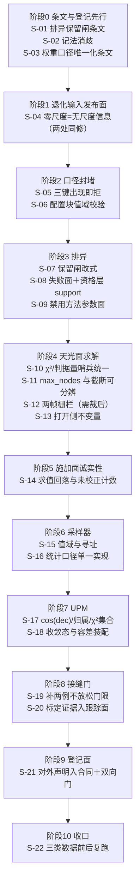

# ③加性天光无缝 · 修复顺序与验收判据

排序原则：**条文先行 → 发布面（"无信息"如何写）→ 口径唯一化 → 判据自身 → 登记面**。
每一步的验收都是"正例（该绿的绿）＋负例（注入已知错必红）"两条同时成立；只有正例不算修好。
`同批必改` 是硬约束：不同批落就会让**正确修复被判红**，那一步的失败形态是"改对了却全红 ⇒ 回退改错"。
所有复跑经 `python3 eng/tools/monitoring/mem_guard.py --max-rss-gb <N> -- <命令>`（单元/探针 4–8 GB，端到端 20 GB），超时用 `--timeout`。

---

## 阶段 0 · 条文与登记先行（不碰实现）

### S-01 给"至少保留 N"停止闸补正向条文
- 前置：无。**必须先于 S-07**——该闸现无条文，"改对"没有判据可依。
- 动作：在 `docs/science/REJECTION.md` 写正向约束：迭代式方法的剔除上限 = 保留不少于 `N_min = 4` 个样本，**基准是原始样本数 `n0`**，累计剔除数只扣一次；与 `min_kept` 统一命名与口径。同批把各方法 minimum N 与 AUTO 的 `NONE` 唯一例外一并写入（`01` D-17），并给 V6 分类排异的五个 profile 常量与三个校准门常量补推导或标定、解 SO-07（`01` D-18）：`0.5 px` 与 PSF FWHM/像元的换算、`0.2` 异常度定义、`0.05` 先验的来源分布、`κ = 4.0` 与 σ 阈 4.0 的关系、`50/0.10/0.10` 的统计学出处；`recall` 改名或声明"本层 recall = 剔除率"；`deleted`/`preserved` 的真值组合域写成正向约束；可评估最小样本量 = `bin_count × BINMIN` 写进函数说明。
- 正例：条文命中检索 `保留下限|n0|原始` 唯一解析出基准量；`rejection.h:211` 指向该表而非自指。
- 负例：把条文里的基准量改成"当前存活数"，同一份条文自检脚本必须报"与 §3.1 式矛盾"（即在文档层配一个可跑的式子一致性检查，不给只读的散文）。
- 同批必改：`rejection.h` 的注释随条文改写；`p2_rejection_applicability` 的 `W_NR_LE4` 码语义与之一致化。

### S-02 记法消歧一次批量订正
- 前置：无。
- 动作：把 `C_f = 帧分量（仅偏差）`／`b_k = 全量` 统一到 `module_adapters.cpp:9820`、`:9834`、`:10300`、`docs/modules/phase2_upm.md:70-72/:75-76`、`docs/plugins/algorithms_phase2/11_upm.md:14/:37/:132` 五处；把"实现默认已为 delta"写进 `docs/modules/phase2_upm.md:75-76`。**不动码**（行为面已核为正确，见 `02` §7.1 第 2 条）。
- 正例：全仓检索 `raw − C_k` 的每一处都带"仅偏差/全量"限定词。
- 负例：注入一句不带限定词的 `raw − C_k（全减，含 B_ref）`，机器检查项必须判红（把"记法消歧"列为变更流程的机检项，即本步自带的门）。
- 同批必改：无（这一批本身是纯文档）。

### S-03 权重口径唯一化的条文与合同同批
- 前置：无。
- 动作：`docs/contracts/PUBLIC_API.md:2208` 与 `docs/contracts/DATA_SEMANTICS.md:1970/:2089` 对 `snr_weight_mode`/`upm_weight_source` 的说法归一（合同判"键不存在"就必须真的不存在）；`docs/science/PSF_SIGNAL_WEIGHT.md §4`"不存在口径选择键/枚举/配置项/产物"保持为唯一条文源。
- 正例：两本合同对同一键的在册状态一致；`docs/algorithms/PHASE2_UPM_IMPL.md` 权重段与 `11_upm.md:72` 的 `∝ SNR²` 写法做**适用域澄清**（防"删了 mode 却留两套口径描述"）。
- 负例：给合同注入一个"键不存在"与"键在册"并存的版本，对账脚本必须判红。
- 同批必改：`02` §7.1 第 4 条（`control_ivar` 结构）不动；本步与 S-05 必须同工单（只删键不改合同 = 合同继续失真；只改合同不删键 = 继续违反禁令）。

---

## 阶段 1 · 退化输入的发布面

### S-04 零尺度分支发布"无尺度信息"（两处同修）
- 前置：S-03（口径先定）。
- 动作：
  1. `sampler.cpp:864` 之后引入零尺度分支：`s0 <= 0.0` ⇒ `control_ivar = 0`、`control_variance` 非有限（或 `quality_flags` 置位并计数）；`:879/:887` 与第三遍 `:1087/:1107-1111` 在该分支**不得**再算 `|value|/unc`；
  2. `sky_plane.cpp:296/:306-307` 同修（可复用 `p2_upm_control_variance()` 的拒载形态）；
  3. `upm.cpp:2471`/`:1985`/`:644` 的入参门从"整批 rc=2"改为**按观测粒度剔除并计数**。
- 正例：常数 patch ⇒ `control_ivar == 0` 且 `control_variance` 非有限；`<50%` 同值 ⇒ 不触发；同算例同时覆盖两处地板。前后对照跑 `独立审计/复算件/aud203-v/v1_civar_floor.py` 的同一批算例：修前 `1.314165e+26`、修后 `0`。
- 负例：(a) 把 `1e-12` 改回任何其它保护量再平方 ⇒ 断言 `control_ivar == 0` 必红；(b) 只在 sampler 侧修、把 `sky_plane.cpp` 那处还原 ⇒ 两处同覆盖的算例必红；(c) 注入"退化观测仍进归一化分母"的变异 ⇒ `n_no_scale_info` 计数必红。
- **同批必改（否则改对即全红）**：
  | 项 | 为什么同批 |
  |---|---|
  | `lib/algorithms/coverage/tests/sampler_parallel_consistency_test.cpp:195-197` 的逐位基线 | 该门现在拿常数 patch 把 `7.609e−27/1.314e26` 钉成期望 ⇒ 修好后 `EXPECT_EQ(1.314e26, 0)` 立红；若用 NaN 表达非有限，`EXPECT_EQ(NaN,NaN)` 恒假同样红。改法：零尺度分支单独断（`control_ivar == 0` 且 `EXPECT_TRUE(isnan(x)||isinf(x))`） |
  | `upm.cpp:2471` 的整批 rc=2 | 条文要求按观测粒度剔除，不改进粒度就把正确修复变成生产全红 |
  | 新增 `PHASE2_SAMPLER.md:575` 的 F5(b) 正/负例门（现自标测试载体"无（新建）"），并接 `phase2_*` 注册面 | 否则该"必须"仍无门 |
  | `docs/algorithms/PHASE2_SAMPLER.md:562` 的 `DISP-P2SMP-007` 关闭 | 该条目全仓唯一命中在算法文档偏差表，`eng/ci` 与 `eng/contracts` 均无登记（文上有账、码上未修、门上无锁） |
- 验收补充：`sampler.h` 的 `P2SampleStats` 需有"无尺度信息"计数列，否则改完仍测不出。

---

## 阶段 2 · 权重口径封堵

### S-05 三个权重口径开关按"出现即拒"处理
- 前置：S-03、S-04。
- 动作：`sky_plane.weight_mode`（`sky_plane.h:216` 字段＋`sky_plane.cpp:460/:524/:537-541/:676-677/:1053/:1169/:1211` 分支＋`module_adapters.cpp:9973` 读取点＋产品 JSON 落键 `sky_plane.cpp:1725` 与回读）删除，单一口径 `1/control_variance`；`integration.use_ivar_weight` 按 `stage2_common.cpp:447` 同形态改"出现即拒"，ablation 支路（`upm.cpp:1987-1998`）改由测试专用入口（`p2_upm_raw_weight_ablation` 或编译期 `ASTROCS_ABLATION`）承载，生产 cfg 结构体字段删除；`snr_weight_mode` parser 改读 `upm_weight_source` 并对旧键显式硬错误，同步 `module_adapters.cpp:9554`、`upm.cpp:1176/:1397/:1540-1548` 序列化面。
- 正例：任何 config 写这三个键 ⇒ 具名 fail-closed 拒绝（与同文件对 `weight_mode`/`legacy_allow_weight_fallback` 两个退役 token 的既有拒绝面同形）；`grep` 全仓无"以该键名取值"与"写出 support×SNR 口径式"的形态。
- 负例：`--self-test` 侧注入 `{"sky_plane":{"weight_mode":1}}`、`{"integration":{"use_ivar_weight":0}}`、`{"snr_weight_mode":"snr2_normalized"}` 三份 config ⇒ 三份都必须硬错误（今天前两份静默生效、第三份静默无效果）。
- **同批必改**：
  | 项 | 为什么同批 |
  |---|---|
  | `eng/ci/check_no_weight_mode_code.py` 的 `MODE_SELECTION_PATTERNS:50` 与 `SCAN_DIRS:45` | 现判据只认 `enum class *WeightMode` 与五个具名路由/集合 API，**结构上碰不到整型字段与 `sp_cfg.value("weight_mode", …)`**；不扩就改对而门仍绿，无人发现回归。扩后须含"任何以这些键名取值／任何写出这些口径式"的形态 |
  | `DATA_SEMANTICS.md:2089`、`PUBLIC_API.md:2208`、`upm.h:89/:168-172`、`stage2_common.h:64-66` 注释、`sky_plane.h:23-24` 文件头权重段、`11_upm.md:72` | 否则合同/回归/文档三侧继续把该开关注册为在册 |
  | `实验/additive-sky-seamless` 的 SNR² 对照臂 | 该臂是论文的对照三臂之一；删支路前先把它迁到测试专用入口，否则实验单元判红且论文对照失效 |

### S-06 配置块补值域校验，非法值具名拒绝
- 前置：S-05。
- 动作：`stage2_common.cpp:183-196` 的 `sky_plane` 块补与 `model` 块同级的校验：`rank_rtol ∈ (0,1]`、`spline_degree ∈ {1,3}`、`node_spacing_deg ≥ 0`、`max_nodes ≥ 1`、`gauge_mode/weight_mode` 枚举判定；`sky_plane.cpp:514-524/:484/:249-254` 的静默钳位区分"显式 0 = 关闭（合法并登记）"与"非有限/越域 ⇒ 具名 `INVALID_ARGS`"；`p2_sample_controls_impl` 的入口对合同域做**双向**校验并与 `stage2_common.cpp` 共享同一域表（不是两份字面量）。
- 正例：`rank_rtol = 0` ⇒ 拒绝（今天 ⇒ `τ=0 ⇒ κ < 1/0 = +Inf` 恒真，可辨识性判据恒绿）；`rank_rtol = NaN` ⇒ 拒绝（今天静默回落 1e−10 改写判决阈）。
- 负例：对每个键注入 `0`、负值、`NaN`、越域值四档，每档都必须 rc≠0；"钳位必落 provenance"检查上线后注入一次静默钳位必红。
- **同批必改**：`eng/ci` 加"钳位必落 provenance"检查项与夹具期望同步，否则加了校验没人测、或校验生效先把现有夹具判红。

---

## 阶段 3 · 排异

### S-07 停止闸改为对原始计数判定（三处）
- 前置：**S-01 必须已完成**。
- 动作：`rejection.cpp:1582`（winsorized）、`:1693`（linear_fit）、`:1883`（median_sigma）三处改为 `if ((int)n0 − r_累计 <= 4) break;`（`n0` = 原始 count，与 `min_kept` 同一基准）。
- 正例：n0 = 10、6 个 4σ 离群 ⇒ 剔 6（现剔 3）；污染样本数 ≤ (n0−4)/2 的栈两版同解（回归不变）。
- 负例：注入"把守卫改回 `(nc − r <= 4)`"的已知错 ⇒ `n = 10 / 6 outliers` 用例必须只剔 3 而判红。
- **同批必改**：
  | 项 | 为什么同批 |
  |---|---|
  | `实验/` 与端到端的 `nrej`/过拒率类判据 | 改后剔得更多 ⇒ 这些判据会变红，属预期；`docs/science/REJECTION.md:68` 的 M3 过拒率基准 0.067% 需重测并更新 |
  | `p2_rejection_applicability` 的 `W_NR_LE4` 码（`:2580/:2583`） | 该注释现自述 `"Siril N-r<=4"`，语义随修式一致化 |
  | 新增"给定初始数与污染比例 ⇒ 期望保留数唯一"的用例 | 无条文时对错的判据不存在；用例即条文的可执行面 |

### S-08 失败面不得用成功码表达
- 前置：S-07。
- 动作：`p2_reject_stack_ex` 对非法输入／非法配置／非法方法三类返回具名失败（不再 `rc = 0 + 全 UNDERDETERMINED`）；交付调用点对非 `{OK, UNDERDETERMINED}` 一律 hard fail；`rejection_cli.cpp:173-179` 删除 resolve 之后对 `plan.normalization` 的覆盖，改为"仅当 request 不是 extreme_prior 时才接受 normalization 字段"，并补 `extreme_prior.prior_sigma/prior_sky/alpha/center_mode` 四个 JSON 键的读取；三条方法×归一化互斥校验集中成一次可复用查询（补齐被漏掉的第三条）。
- 正例：`extreme_value_clip_prior_sigma` 经该工具可实际行使（给齐四键 ⇒ 有非平凡掩码）；`status ∉ {0,4}` 时掩码行打 `-` 不打 `'1'`。
- 负例：(a) 手工 plan 传非法 normalization ⇒ 必红；(b) 用缺省 normalization 调方法 11 ⇒ 必红（今天是"全接受 + status=5 只出现在统计行"）；(c) 注入 `+Inf` support ⇒ 资格层必判不合格（`01` D-15）。
- 同批必改：`docs/science/REJECTION.md §4` 的 support 语义按裁决写"有限性 ∧ 阈值"两面；`rejection_nonfinite_weights_test.cpp` 补 support 的 NaN/`+Inf`/0/>阈值 四档与 `out_values`/`source_indices` 逐值断言（`02` §3.3）。

### S-09 禁用方法的参数面封堵与解析安全
- 前置：S-08。
- 动作：`stage2_common.cpp:417-424` 把 `rj.contains("minmax")` 并入拒绝条件（与 `:217-225` 旧别名拒绝同形态）；同批处理 `rejection_cli.cpp:145` 的 `{"minmax", P2_REJECT_MINMAX}` 映射与 `synthetic_gate.cpp:4656/:4675/:4826` 在册用例；`rejection_cli.cpp` 的旧兼容模式弃 `std::atoi` 改具名解析（非法串 ⇒ 错误，不得得 0）；`min_error` 哨兵与 `n≤3` 阈值两版统一，`m = -1` 前加上界判定。
- 正例：`rejection.minmax` 出现 ⇒ 硬错误；`method = "不存在的名字"` ⇒ 硬错误（今天静默 `NONE` 并输出"全接受 + status=0"）。
- 负例：注入"删掉 method token 拒绝、只留参数拒绝"的变异 ⇒ 既有 `FZ-REJ-NO-MINMAX` 用例必红；给 RCR 喂大数值栈 ⇒ 越界读探针必红。
- 同批必改：`k_corr` 查表门的三处同批改（`01` D-22，见 S-15 表）。

---

## 阶段 4 · 天光面求解与节点间距

### S-10 退化编码统一到已有正确侧
- 前置：S-06。
- 动作：`sky_plane.cpp:1208` 的 `chi2_red` 改为与 `upm.cpp:1334-1338` 同一套（`quiet_NaN()` + `chi2_red_defined = 0`，持久化写 null），`:1451` 的 `improved` 在"未定义"时显式不细化并登记原因；`sky_plane.cpp:1888/:1899-1903/:1908-1910` 的判据量缺失一律 NaN／非有限 ⇒ JSON null 并加 `*_defined` 位；save 增 `rank_full`/`n_params_full` 两键并回读；`normal_matrices` 按 `sky_plane.h:449` 区分 1/2；`upm.cpp:1330` 的 `dof_eff` 与 `:1240/:1245` 的 `chi2` 分子共用同一 `n_used` 计数并把 `n_obs/n_used/跳过数` 三读数分别落盘。
- 正例：剔除全部观测 ⇒ `chi2_red` 为 null 且细化分支登记"未定义"（不是 0、不是绿）；造 1 条 `photo_rejected` 观测 ⇒ `chi2_red` 与 `dof_eff` 按同一集合变化。
- 负例：(a) 把 `dof<=0` 再写回 `0.0` ⇒ "该统计量不得为 0"负例必红；(b) 注入"分子剔零权、分母用全量"的变异 ⇒ 数值比对门必红（今天持久化门只断言"键存在"、从不比数值，所以此门必须先补）。
- **同批必改**：`sky_plane.h:352` 注释、`DATA_SEMANTICS.md` 的 sky_plane 节必落面（按 `:2862` 的 null 口径统一）、`eng/tests/unit/v6_p2_sky/*` 期望、`实验/additive-sky-seamless` 相关臂、`p2001_real_nodes_test.cpp` 补非退化判据。**只改实现会把既有判绿门与实验单元判红。**

### S-11 `max_nodes` 接配置面并让"被门截断"可分辨
- 前置：S-10。
- 动作：node 上限由内存 profile/lease 派生（`AGENTS §6` 禁硬编码），不再两处字面量；`module_adapters` 与工具入口共用同一默认来源；`sky_plane` 块登记该键进 shipped configs 或 `config_registry.json`；`sky_plane.cpp:1467-1476` 的采纳分支另置 `refinement_blocked_by_memory` 位并写进 manifest。
- 正例：同一份输入两入口导出同一 `h`；细化被内存门挡住时 provenance 有具名位且 `attempts[].rc = 5` 可回读。
- 负例：把上限调到使真实场需要 4814 节点而门截在 2048 ⇒ `refinement_blocked_by_memory` 必须为真（今天与"不需要细化"走同一支、不可分辨）。
- 同批必改：`v6_p2_sky_node_adapt_test.cpp` 期望与 `DATA_SEMANTICS` 的产品字段表（改此位要同改这两处）。

### S-12 两帧输入的栅栏处置（**需裁后执行**）
- 前置：负责人对 `01` D-23 的裁决。裁决前本点**不动 `:346` 的 `nf < 2` 下限，也不新增 `nf == 2` 分支**。
- 动作（两选一，按裁决取其一）：
  - 裁"两帧合法"⇒ `nf == 2`（或 `pairs.size() < 2`）不得声称"判据不武装 ⇒ 单一指向"，走具名降级路径（与 `stage2_common.h:303`「不回退任何标定常数」同取向），或改用可由观测支撑的判据（公共控制点数/重叠面积 > 阈值才算同指向）；`P2SkyPlaneGeometryProvenance` 加 `fence_armed` 位。
  - 裁"两帧非法"⇒ 入口把两帧判为定义域外并给具名 rc；五份两帧 shipped config 作废或改三帧。
- 正例：两帧输入 ⇒ provenance 明确标出"栅栏未武装"（降级），或直接被拒；**任何情况下都不得出现"按帧角尺寸算出的 h 上界且无标志"**。
- 负例：注入"去掉 `fence_armed` 写入"的变异 ⇒ 两帧用例必红；注入"两帧被静默判成同指向"的变异 ⇒ 必红。
- 同批必改：`docs/science/PHASE2_UPM.md §7a` 的例子与 `v6_p2_sky_geometry_test.cpp` 期望（改默认判据必须同改这两处）。

### S-13 打开侧补不变量与必需键
- 前置：S-10。
- 动作：`sky_plane.cpp:1842-1846` 按 build 侧同一组不变量校验并 `return P2_SKY_PLANE_IO_ERROR`：`degree ∈ {1,3}`、`delta_order ∈ [0,2]`、`h > 0 且有限`、`nx,ny ≥ degree+1`、`du_min < du_max`、`us,vs > 0`、全字段 `isfinite`；校验 `model_hash` 与 `coeff/deltas` 重算一致（save 已写哈希 `:1239-1240`）。`p2_upm_open` 侧：跑 build 侧的非法值规整、缺 `model_hash` ⇒ 具名失败（不得填 64 个 `0`，因为全零串正是密集缓存 stale 判定的唯一身份）、`cell_index` 加上界校验、必需键集合校验、`adj` 的跨 tile 边界边持久化（它进 `p2_upm_geometry_hash` 的载荷）。
- 正例：半损坏产品（`degree = 8`、`h = 0`、缺 `model_hash`）⇒ 具名失败，不产出面值；同一模型存盘再打开 `geometry_hash` 逐位不变。
- 负例：注入"删掉 `degree` 钳位"的变异 ⇒ 半损坏产品负例必红（今天是 `degree ≥ 8` 写越界 `out_j[8]/N[8]/left[8]`，`h ≤ 0` 静默返回 `P2_SKY_EVAL_OK`）。
- 同批必改：`eng/tests/unit/v6_p2_sky/**` 加半损坏产品负例（防"校验加了但没人测"）；MA 面补 `converged` 与目标函数值两字段并按口径分码（`01` D-30），否则四条出口在产品面仍不可区分。

---

## 阶段 5 · 施加面的诚实性

### S-14 未覆盖区不得存在校正量，未校正像素必须计数
- 前置：S-13。
- 动作：`upm` 求值的"瓦片→格范围"查表命中失败 ⇒ 返回具名不可用（NaN 或独立状态），**删除两轴各自的"回落到全域范围"分支**；`sky_plane.cpp:1592/:1649` 求值失败点不改写 `out_values`（保持未定义，由调用方按状态决定）；`module_adapters.cpp:10544-10552` 接住 rc；统计 `n_pixels_not_corrected` 并进 `warnings[]`/`warning_codes[]`（新增 `P2-SKY-DELTA-PARTIAL-DOMAIN` 一类具名码，无警告时 `warning_codes` 为空数组＝可断言的成功态）；`p2_upm_warnings_json` 的"缓冲区不足时四键整体消失"改为具名 rc；apply 节点的诚实标记写覆盖比例而非只写机制名；**接缝门侧消费该计数**。
- 正例：抹掉某瓦片的范围条目 ⇒ 求值必红；给一个模型外瓦片 ⇒ 必红；全帧边缘越域 ⇒ manifest 有未校正像素数且接缝判据拒绝把该边界当已校正。
- 负例：注入"未覆盖区以恒等校正出厂"的变异（即今天的行为）⇒ 两条负例必红；注入"`rc` 不被接住"⇒ 计数断言必红。
- 同批必改：`seam_footprint.py` 侧把未校正计数纳入判读（否则改了代码判据仍看不见）；`11_upm.md:92` 的警告四键面同步。

---

## 阶段 6 · 采样器数值域与统计口径

### S-15 值域、寻址与上限三件
- 前置：S-06。
- 动作：
  1. `stage2_common.cpp:28-31` 的 `target_order` 上限收到 `29 − leaf_shift = 20`（或按 ALG 面声明"leaf 层 Nside 预算"并在校验里体现）；`sampler.cpp:777` 用 `1ull <<`；`CellStat::tile` 改 `std::uint64_t`、哨兵 `~0ull`，同步 `:745`、`:1003-1005` 的 `std::map<int,…>` 键；`DATA_SEMANTICS` 的 `target_order` 域行同步；
  2. `sampler.cpp:517-518` 的 `k_corr` 门改 `if (!(cfg.control_k_corr > 1.0))` ⇒ rc=1 + err，与 `upm.cpp:2772-2783` 同口径；同批给 `tools/stage2.cpp` 与 `module_adapters.cpp` 的 sccfg 组装补该字段或显式保持默认；
  3. `:78` 与 `:406` 的两个 catalogue 上限统一由一个常量/合同键承载；读侧容量满即判截断 ⇒ 采样器 `rc = 1` 或 `stats.snr_catalog_truncated` 计数并把该帧标为降级；`:78` 的值补"与哪个上游写侧上限对齐"的推导；
  4. `sampler.cpp:763-766` 的读失败从 `reason = 1` 里分出来（新增档或 `stats.tile_read_failures`），由 cfg 决定是否 fail-closed，文档同步 reason 枚举表与统计恒等式。
- 正例：`order = 22` ⇒ 具名拒绝；`order = 14` 且 tile ipix 超 INT32 ⇒ 不再静默错值；喂超上限目录 ⇒ 有计数有降级。
- 负例：注入 `target_order = 23` ⇒ 必须 rc≠0（今天是 UB＋rc=0）；注入 `k_corr = 0.9` ⇒ 必须 rc≠0（今天静默乘进方差、方向偏绿）；给目录尾部改一行 ⇒ 帧身份与科学覆盖集必须同时变化或同时不变（今天哈希侧计入、科学侧不计入）。
- **同批必改（本点已知的"改对反而判红"三处）**：
  | 门/夹具 | 现在钉住什么 | 同批怎么改 |
  |---|---|---|
  | `kcorr_lookup_test.cpp` 的 pixfrac 维 clamp 用例 | 把"域外被静默夹取"断言为期望，而正本合同规定域外一律取冻结默认 1.4、算法文档明文"禁止夹取"，**用例名自带"不夹取"** | 门与合同同批改：期望改为"域外 ⇒ 取 1.4 且不 clamp"；按 SC-ADJ-F05.4 撤内插时该门的角点 exact／插值 rtol 1e−12 期望必须一起改，否则撤内插立刻判红 |
  | `kcorr_lookup_test.cpp` 的"独立硬编码参考" | 与被测实现同源，六个冻结表值在跟踪面无原始测量记录 ⇒ 对"数值出处"零鉴别力 | 二选一：把 `kcorr_matrix_test` 纳入构建＋CI 采集并把九值结果落 `实验/` 或 `artifacts/evidence/`（指 `run/` 判不合格），或删内插只留 pixfrac = 0.8 单档 |
  | `kcorr_lookup_test.cpp` 的容差实现 | 条文冻结 `rtol 1e−12`，门实现成**绝对** `1e−12` ⇒ 比冻结容差更严，会误红 | 改门为相对式（这是"门比正本更严"的一例，与上面两条同文件同批） |
  | `DATA_SEMANTICS.md:1739` | 写"逐帧查表优先于该值"而该分支生产恒不可达 | 补 `PHASE2_SAMPLER.md:334` 的后果句（生产尺度恒 ∉ 域 ⇒ 恒取冻结默认）；`docs/science/PHASE2_UPM.md` 按 `eng/tests/unit/CMakeLists.txt:1540` 把 MC 证据标 MISSING |

### S-16 统计口径单一实现
- 前置：S-15。
- 动作：`sampler.cpp:1035-1040` 的 SNR 邻域门改调 `p2_stats_median/p2_stats_mad`（或共同 `median_of`），删 `:470/:844/:859/:1040` 四处 `1.482602218505602` 字面量；`:657` 的帧 SNR 中位数改走 `median_of`（或直接删 `frame_snr_med`、两处消费改用 `frame_snr_med_exact`）；若刻意保留"上中位"口径，须在 `sampler.h` 与 `PHASE2_SAMPLER.md` 写清"邻域门用序统计量上中位，不属统一 median 族"并给该门独立 Oracle；`sampler.cpp:1025-1034` 邻域不足分支加 `gate_skipped` 计数或把该观测标 `quality_flags`（不得当"通过"）；`sky_plane.cpp:249-254` 与 `sampler.cpp:505/:521` 的非法值落点抽成一份共享常量表（或头里逐字段写"非法 ⇒ ?"）。
- 正例：产品路径真的流经被 Oracle 断言的实现；`gate_skipped` 与 `rejected_bright_tolerance` 两列可分别非零。
- 负例：注入"把邻域门改回内联 median"⇒ 统一实现门必红；注入"邻域 <3 时静默保留"⇒ 计数断言必红（今天免检观测以 clean 身份进 UPM，方向偏绿）。
- 同批必改：`PHASE2_SAMPLER.md` 的 reason 码表与"≥2 clean"的 overlap_controls 定义；`synthetic_gate.cpp` 的期望。

---

## 阶段 7 · UPM 标度与归属

### S-17 几何折算、归属与判据集合三件
- 前置：S-04、S-10。
- 动作：`upm.cpp:459` 的 RA 粗筛按 `cos(dec)` 折算；全部 `std::map::operator[]` 查表改 `find()`/`at()`，缺键 ⇒ 显式 rc，`:371` 被排除的 obs 同时从 `raw_w`/`sums`/objective 剔除（或改为 `n_obs` 的紧凑副本），并行段改 const 查找或预解析成 `std::vector<std::size_t> obs_ctrl/obs_frame`；`upm.cpp:817/:833/:842/:869/:895`（含并行支）的 M 更新分母统一为 `den > 0.0 && isfinite(den)` 并加"节点被跳过"诊断计数；`sigma_floor` 改为与 uncertainty 同标度的**相对**形式（如 `max(|unc|, q·median(|unc|))`）并对 NaN uncertainty 显式拒绝；`build_impl` 入参规整段加 `uncertainty² ≈ control_variance`、`control_ivar·control_variance ≈ 1` 的一致性断言；`robust_loss/snr_weight_mode/quality_mode` 未实现枚举零校验改具名拒绝；首轮 `rel_improve`、`component_count` 的"未测"写不可估计哨兵。
- 正例：`|dec| > 51.32°` 的边界对候选数与实际连边数一致；重复 worker 数位精确（该主张有门，不再只有注释）；`uncertainty = +inf` ⇒ 被拒（今天 `sigma_eff = inf ⇒ z = 0 ⇒ huber_w = 1`＝满权）。
- 负例：注入"去掉 cos(dec)"⇒ 高纬分档诊断必红；注入"缺键落到 index 0"⇒ 归属负例必红（期望 `rc ≠ 0`，双 `nodes` 同 `(tile,gx,gy)`）；注入"分母用 `1e-12` 绝对门"⇒ 造 `control_reliability = 1e-13` 的合成件必红（今天节点被冻结而 `converged = 1`）。
- 同批必改：`DATA_SEMANTICS.md` §25 权重条与 `:2165` 的降权主张、`PHASE2_UPM.md:160-166` 的适用域句、`PHASE2_SAMPLER.md:464` 的 SC-005 登记与 `DATA_SEMANTICS.md:2090`（若同时补 per-node 可靠度）、采样器侧字段生产者说明。

### S-18 收敛态与容差装配的一致性
- 前置：S-17。
- 动作：把 `stall_patience`/`kObjImproveFloor` 提为 `P2UpmBuildConfig` 字段或加测试钩子（今天它们是 `upm.cpp:732-733` 函数体内 const）；`p2_session` 通道按 ARCH-DEBT-01 下线或与适配器共用同一冻结装配函数（**不是**给违禁路径补一行配置）；`tolerance_relative` 登记进契约面（今天该键在 `defaults.json`/CLI 白名单/phase_config schema 全无登记，session 侧覆盖块 `:212-218` 不读它 ⇒ 传了被静默忽略）。
- 正例：出现一份 `converged = 2` 的实测记录（夹具级即可，不需端到端）；两入口对同一产品取同一 `converged`。
- 负例：正常收敛算例必须**不是** 2（否则态 2 是恒真门）；注入 `tolerance_relative = 0` ⇒ 契约面必须报错。
- 同批必改：登记态 2 的存留按裁决（`01` D-55）；`PHASE2_UPM.md §16.3` 的措辞限定为"实现面已满足、经验可达性未取证"，且该行锚点需刷新。

---

## 阶段 8 · 接缝门自身

### S-19 补两例、限定资格句、不放松门限
- 前置：S-14（施加覆盖率可分辨之后，门的读数前提才成立）。
- 动作：**保持 `max_e|rel_step| ≤ 1e-2` 不变**；把"相干梯度无台阶必须绿"与"反号梯度与 1.005% 台阶相消"两例补进 `seam_footprint.py:163-173 REQUIRED_SELFTEST_CASES`；`PHASE2_UPM.md:449` 的"Δ/L > 1.005% 必判红"加成立条件"梯度项为零"；§17.3 增列"梯度反号相消"漏检面；验收证据把"结构可区分"限定为需与 `step_net`、半距 d 扫描联合判读，并明写 C4 N5 的 off-locus 结论不自动迁移到 boundary-only 门；docstring 的 78% 改取正本值 72.6%；`seam_footprint.py:386` 与 `render_vis.py:458` 把 NaN 填 0 计入接缝度量的两处统一到"要么计数、要么拒"。
- 正例：无台阶的相干结构 ⇒ 绿；有效边界数 = 0 ⇒ 红；`--self-test` 在补例后仍全通过。
- 负例：注入 1.005% 台阶＋同量级反号梯度 ⇒ **必须红或必须命中新登记的漏检面**（今天是静默绿且 §17.3 无此条目）；删掉新增两例之一 ⇒ `REQUIRED_SELFTEST_CASES` 完整性检查必红。
- 同批必改：`实验/additive-sky-seamless/code/c4_seam_criterion.py`、`sci_c_common.py` 的窗口常数（`base_win = 64`、挖除 `±(halfwin+2)`、基线 `order = 2`）与出厂门的口径对齐登记——两者目前"实验单元内自洽、未与出厂门对齐"。

### S-20 门限标定证据入跟踪面
- 前置：S-19。
- 动作：重跑 `SEAM-DERIV-01`，把**汇总读数 JSON（几百字节）**登记进 `artifacts/ci/<sha>/` 或 `实验/*/results/`，文档只引用跟踪路径；补齐 `evidence/e3e4_floor_structure.json`、`evidence/e3c_weight_pollution.json`，或由闭式＋自复刻件替代 `PHASE2_SAMPLER.md:292/:297` 的"实测"字样。
- 正例：科学文档与登记面里每条证据路径都命中跟踪文件；独立读者不访问 `run/` 即可复核门限推导。
- 负例：一条指向 `run/**` 的证据路径 ⇒ 新增的"证据落位"门必红（这一族已在四链合案里，见 `02` §6.1 与本步）。
- 运行产物处置按已裁的"三留一不留"：日志入 `实验/`、数据仍在 `run/` 跑、留可复现代码＋报告数据，**运行产物一律不留**。

---

## 阶段 9 · 登记面

### S-21 对外声明面入合同，登记核对方向改双向
- 前置：**S-05、S-06、S-10、S-11、S-13、S-15 全部完成之后**才改门（先补登记再改门，否则一次性判红）。
- 动作：`sky_plane.h` 的 17 个 `P2_API` 入 `docs/contracts/API_CONTRACTS.csv`（units 列按 `PHASE2_UPM.md` 的 `ADU·sr⁻¹` 口径逐符号填，不抄 "per header"）；`docs/development/CONFIG_SCHEMA.md` 增 `sky_plane:` 小节列全键＋默认＋值域；`check_api_contracts.py:58` 的核对改为双向（表里有而代码无 ⇒ 红；代码有对外接口而表里无 ⇒ 红）；已退役符号（`p2_upm_normalized_weights`）从合同表撤下或标注，三个已接线的诊断 API 补登记行。
- 正例：全仓扫一遍零"活符号不入表"；`docs/algorithms/PHASE2_UPM_IMPL.md:11/:12`、`PHASE2_SAMPLER.md:15` 的文件行数与实测一致（2981/450/1503），文档内行锚改用符号锚。
- 负例：删掉一个 `P2_API` 的登记行 ⇒ 必红；合同表留一行指向已删符号 ⇒ 必红（今天方向是"表→头"，这一形态恒绿）。
- 同批必改：`DISP-P2UPM-006`、§16.3、`rejection.h` 三处"实测/裁决依据"的锚从 `run/` 与已清理控制包迁到跟踪面；`docs/science/NOISE_MODEL.md:377`、`PHASE2_UPM_IMPL.md §F2/§3`、`PHASE2_UPM.md §5` 按现行代码口径订正（尺度无关判据＋退休符号标注）。

---

## 阶段 10 · 收口复跑

### S-22 三类数据的前后对照
- 前置：S-04 … S-21 全绿。
- 动作与立证：
  1. `②代数合成` — 复跑 `02` §6.1 的七个复算件，同夹具同 seed，逐位对照（`v1_civar_floor.py` 修后必须 `== 0`；`v2c_cancel.py` 的相消读数必须命中新登记的漏检面或翻红）；
  2. `①物理仿真` — 在四态枚举、相对容差、尺度无关归一化三项落地之后**复跑 C1–C7 臂**并更新归档（现归档值产出于修复前二进制，只作历史值）；
  3. `③真实数据端到端` — 读产品 manifest 与 tile 读数：默认臂产品中位电平 ≈ `B_ref`（`raw − δ_k` 臂中位 299.17 e⁻ 对 `B_ref` 297.33 e⁻ 的同型关系）、`sky_plane_node_adaptive_used`、`n_node_refinements/coarsenings`、`N_retained` 分档占比、`chi2_red != 0.0`、`n_pixels_not_corrected`；
  4. 1/N worker 一致性：在**带噪声/梯度的非常数合成帧**上跑（现夹具是常数 patch ⇒ "并行=串行"平凡真，判别力为零），并补 `ivar`/`ra_deg`/`dec_deg` 三个漏比字段与 SNR 目录使 `rejected_catalog_veto` 非零（今天是 0==0 空断言）。
- 正例：四层门全绿＋端到端读数落跟踪面 ⇒ 本链路才达"三方一致"。
- 负例：把任一修好的分支还原（零尺度地板、`chi2_red = 0.0`、`nf == 2` 静默、保留闸双扣）⇒ 对应负例必红，逐条留证据。
- 判定"未达三方一致"的处理：端到端项以"需复测"结转，**不得**以归档值或文档转述值充当端到端证据。

---

## 附 · 步骤-缺陷对应与"改对反而判红"总表

| 步骤 | 覆盖缺陷 | 同批必改的门/夹具（不同批即误红） |
|---|---|---|
| S-01 | D-12 的前置、D-17 D-18 | `rejection.h:211` 由自指改指条文表；`W_NR_LE4` 码语义 |
| S-02 | D-66 | 无（纯文档批） |
| S-03 | D-08 的前置 | 两本合同的对账脚本本身（新门须配正/负例） |
| S-04 | D-01 D-02 D-03 D-04 D-05 | 并行一致性门基线钉伪值；`upm.cpp:2471` 整批 rc=2；F5(b) 门无载体；`DISP-P2SMP-007` 门上无锁 |
| S-05 | D-06 D-07 D-08 D-09 D-10 | `check_no_weight_mode_code.py` 判据形态只认枚举与五个路由函数；两本合同对同一键说法相反；实验 SNR² 对照臂 |
| S-06 | D-11 D-45 | 夹具现用越合同域值构造非退化输入（`sampler_parallel_consistency` 的 `background_max_contamination = 1.0`、`background_tolerance = 1e9`）⇒ 补双向校验会把该门判红，须先改用域内极端合法值 |
| S-07 | D-12 | `实验/` 与端到端过拒率基准（M3 0.067%）；`W_NR_LE4` 码语义 |
| S-08 | D-13 D-14 D-15 D-16 D-19 D-21 | `REJECTION.md §4` 的 support 语义；资格层门的 `out_values`/`source_indices` 零断言（错位仍全绿）与"正例判据松"（`EXPECT_NE(INVALID_INPUT)`、`EXPECT_GE(…,1u)`） |
| S-09 | D-16 D-20 | `synthetic_gate.cpp:4656/:4675/:4826` 仍把 MINMAX 当可规划方法 ⇒ 封堵后必红；`rejection_cli.cpp:145` 映射表 |
| S-10 | D-25 D-31 D-49 D-50 D-52 | `sky_plane.h:352` 注释；`DATA_SEMANTICS` sky_plane 必落面；`v6_p2_sky/*` 与 `实验/` 期望；`p2001_real_nodes_test.cpp` 只断键存在不比数值 |
| S-11 | D-24 | `v6_p2_sky_node_adapt_test.cpp` 期望；`DATA_SEMANTICS` 产品字段表 |
| S-12 | D-23（需裁） | `PHASE2_UPM.md §7a` 例子；`v6_p2_sky_geometry_test.cpp` 期望 |
| S-13 | D-28 D-29 D-30 | `eng/tests/unit/v6_p2_sky/**` 半损坏负例；MA 落盘结构补 `converged`/目标函数两字段 |
| S-14 | D-26 D-27 D-53 | 接缝门侧未消费未校正计数（改码不改门 ⇒ 判据仍看不见） |
| S-15 | D-36 D-37 D-38 D-43 D-46 D-22 | kcorr 门三件（clamp 当期望／同源参考／绝对 1e−12 更严）；`DATA_SEMANTICS.md:1739`；`phase2_sampler` 角点 exact 门 |
| S-16 | D-39 D-40 D-41 D-42 D-44 | `PHASE2_SAMPLER.md` reason 码表与 overlap_controls 的"≥2 clean"定义；`synthetic_gate.cpp` 对 `p2_stats_*` 的 Oracle 现判不到产品路径；改 `min_samples` 默认须同批 `CONFIG_SCHEMA.md:25`＋`stage2_common.cpp:67`＋`module_adapters` 校验＋`PHASE2_SAMPLER.md:53` 的域 `[min_samples,289]` |
| S-17 | D-47 D-48 D-49 D-50 D-51 D-56 | `DATA_SEMANTICS` §25／`:2090`／`:2165`；`PHASE2_UPM.md:160-166`；`PHASE2_SAMPLER.md:464` 的 SC-005 |
| S-18 | D-54 D-55 | 契约面对 `tolerance_relative` 的登记；`PHASE2_UPM.md §16.3` 措辞 |
| S-19 | D-57 D-58 D-60 D-61 D-62 | 实验判据与出厂门两套窗口常数未对齐 |
| S-20 | D-59 D-68 | "证据路径必须命中跟踪文件"这条门规本身（四链合案） |
| S-21 | D-63 D-64 D-65 D-67 D-33 D-34 | 双向核对必须**后**于全部补登记，否则一次性全红；`sky_plane.h`/`stage2_common.h` 的死枚举档与未导出常量一并清 |
| S-22 | 全部（收口） | 复跑清单见该步；归档件更新须与 `实验/` 报告同批 |

**尚未排程的三条（须先有裁决，排程随裁决落地）**

| 条目 | 阻塞原因 | 裁决后并入哪一步 |
|---|---|---|
| D-32 "排除自身"的主语 | 顶层有句、下层正本零命中 ⇒ 补实现 vs 订正设计适用范围 | 补实现 ⇒ 新步插在 S-10 之后；订正设计 ⇒ 并入 S-02 |
| D-35 `smoothing_lambda` 取值 | λ=0 是否合法未定，上呈锚文件不存在 | 并入 S-21（登记面）＋ S-06（值域校验） |
| D-69 拟合权重 vs 堆叠权重 | 两份权威互斥，须先派独立查证 | 查证结论若判 `upm` 侧错 ⇒ 新步插在 S-14 之前；判条文错 ⇒ 并入 S-02 |

**排程上的四条硬约束**
1. `S-01 → S-07`：先有条文再改闸，不许只改代码。
2. `S-04 → S-05`：退化发布面先落，权重口径封堵才有可断言的单一口径。
3. `S-14 → S-19`：施加覆盖率可分辨之后，接缝门读数才有"校正已施加"的前提；先补门后修码会让补上的例挂在错误前提上。
4. `全部 → S-21`：登记面的双向门永远排最后。
