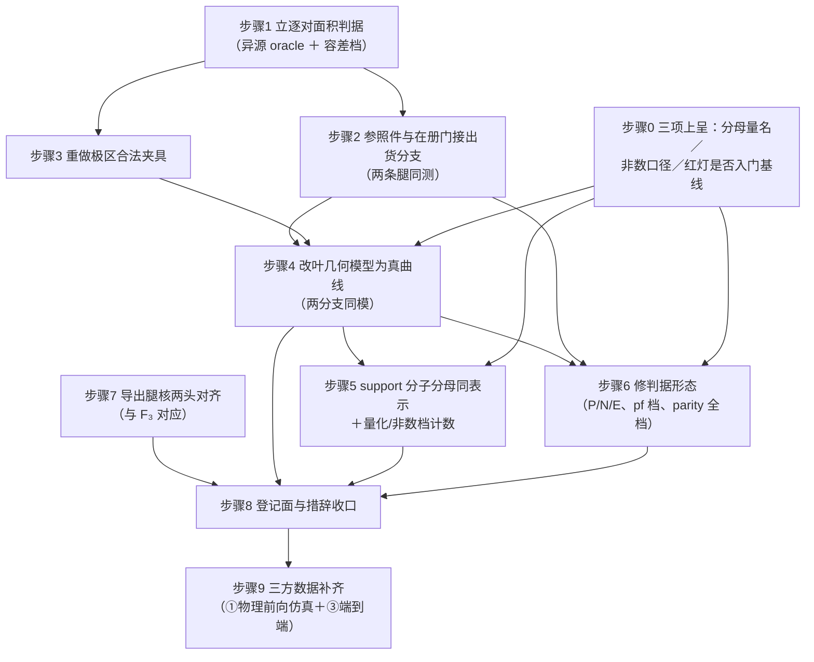

# 修复顺序与验收判据

顺序是**依赖驱动的**，不是建议。核心判断：**在没有能红的逐对判据之前，任何几何改动都无法自证** ⇒
判据与参照面先修，模型改动后进，口径与措辞最后收。

---

## 0 "精确面积"主张目前的失效结构：三处独立、叠加成立

三处失效**互相独立**（修掉任意一处，另外两处仍使主张不成立），必须一次收敛：

| 处 | 内容 | 位点 | 缺陷编号 |
|---|---|---|---|
| **F₁ 模型选择** | 生产把 leaf 表示为 4 角大圆弧四边形；含极像元的模型面积／真实面积 → 闭式 `2√2/π`，误差 **−9.9684%，不随分辨率收缩**；同一函数另分支返回真值 ⇒ 两条闭合恒等式在极点互斥；真曲线细分例程在仓但被调用点旁路 | `spherical_overlap.cpp:1283-1294` vs `:1239-1242`；`:1372-1375`；`:506-617` | 缺-1／缺-2／缺-3 |
| **F₂ 参照件不测出货分支** | 独立蒙特卡洛参照件与在册兄弟门都调 `compute_overlap_area`（自适应细分那条腿），生产走 `compute_overlap_area_g_ctx_cached` 的 `nside ≥ 256 ⇒ boundary4`；真实板尺几乎恒落 `≥ 256` ⇒ **独立参照核对的从来不是出货分支的几何**，且没有任何参照件比较这两条腿 | `reference_overlap.cpp:485`；`spherical_overlap.cpp:1459-1476` | 缺-8 |
| **F₃ 核两头不成立** | 被选中的重采样核不做面积交叠（四角权重不含中心像元坐标与 `q11` 坐标）；声明"精确面积交叠"的核**零实现**却被登记为生产科学默认；生产选路只按字符串匹配、从不查 registry | `p3_resample.cpp:409-418`；`p3_rsmp_kernel_registry.cpp:205/:226`；`p3_v6_export.cpp:236-239` | 缺-9 |

叠加上另有两处使"改动无法自证"的判据面塌陷（不是第三/第四处失效，是同一结论的判据侧）：
`DISP-009` 门的 P 判据**代数上不含几何信息**（缺-14）、在册交叠门 14 组约 76 条断言里**逐格只有一条**（缺-12）、
唯一逐对独立原语零调用者（缺-10）。

⇒ **一次收敛的最小集 = 立逐对判据 → 参照件接出货分支 → 改模型 → 核两头对齐 → 口径与措辞收口。**

---

## 1 依赖图



**顺序不可颠倒的理由**

- 步骤 4 在步骤 1/2/3 之前做 ⇒ 改完没有能红的判据，等于用同一个面积算子与自身比对（恒真），
  且逐叶基准若按现值冻结会**改对反而判红**（见 §3）。
- 步骤 5 在步骤 4 之前做 ⇒ 分母换成"该叶所用表示的面积"会把模型误差合法化。
- 步骤 6 在步骤 1 之前做 ⇒ 会照抄已被独立复核判为无效的处方（见 §2 步骤 6 的"勿照此改"）。
- 步骤 7 与步骤 4 **可并行**（不同文件域），但步骤 7 的"定口径"子步必须先于其实现子步。

---

## 2 整改步骤

### 步骤 0 —— 先取得三项裁决（不阻塞步骤 1/2/3）

| 待裁项 | 为什么不能由门单方面定 | 保守默认（未裁之前照此做） |
|---|---|---|
| 核权重分母的量名（`A_drop` vs `A_pixel`，即"通量守恒"指 `sumFlux` 还是"发布 signal 面"） | 两种写法对 `S_p`/`variance` 等价、对 `Σ_p w_jp` 相差 `pf²` ⇒ 争的是**哪个量守恒** | 按代码与 FROZEN 正本 `a_jp/A_drop,j` 实现，把三处上位文档订正为 `/A_drop,j`；主张里必须带量名 |
| 非数样本两套互斥口径（样本级掩膜＋重归一 vs 经 `F_p` 直接传播不掩膜） | 同一输入给出不同产品字节，三面上位文档各说一种且行锚互不相同 | 按"掩膜＋重归一＋计数"（夹具现侧）实现；同时把三处登记面标为待裁，不据任一侧判红 |
| 那 3 条红灯是否注册进门基线 | 属门禁基线取舍 | 不注册、但**撤销**以注释形式保留失败读数的做法；对外主张同步摘掉"经独立 MC 验证" |

**正例**：三项均有书面裁决或"按保守默认执行"的登记。
**负例**：任一项被以某条门的期望值隐式定案 ⇒ 该门本身即被判据形态不合格。

### 步骤 1 —— 立逐对面积判据（所有后续改动的自证工具）

- **打**：缺-10、缺-11 的判据侧。
- **动作**
  1. 把 `p1drz_geom.hpp:209-241 geom_overlap_area` 接成断言，或直接把异源球面精确构造当 oracle：

     ```text
     |a_jp^prod − a_jp^oracle| ≤ tol · A_leaf                （逐对）
     max_p |a_jp^prod / a_jp^oracle − 1|                     （逐叶最大相对偏差）
     Σ_p |a_jp^prod − a_jp^oracle| / (2·A_drop)              （总变差距离型）
     ```
  2. **容差档先定后接**：oracle 用平面 gnomonic 型原语时能力上限 ≈ `1e−5` 相对 @ nside=512
     （预算 `+3ρ²/2`，见 `02` §3.5）⇒ 合同/科学文档现登记的 `rtol 1e−9` 用它**不可能满足**；
     要么把 oracle 升级为不同算法的精确球面裁剪（半空间交顶点枚举＋Van Oosterom／l'Huilier 双式互校），
     要么按变更流程改档。**二者择一，显式写进登记面。**
  3. oracle 与被检路径**不得**共用同一折线或同一弦（异源）。
  4. 把"一叶 ×2 其余按比例吸收／索引整体错位／相邻两叶互换"三型保总量注入登记为**必红**负例夹具。
  5. 把求和型门的度量范围在 `DRIZZLE_GEOMETRY.md §9` 与 `docs/science/DRIZZLE.md` 明写为"完备性与全局标度，不含逐叶正确性"。
- **正例（怎么算修好）**：基线绿；三型保总量注入各判红；逐叶最大相对偏差在**极冠与 face 角点邻域在取样域内**时进冻结预算。
- **负例（注入已知错必红）**
  - 人为把生产侧少裁 1 格 / 少 1 个候选 ⇒ 必红。
  - 把某 `(j,p)` 对的 `a_jp` 乘 `0.9003`（即含极像元的真实模型偏差量）⇒ **必红**（这条是关键：它证明新判据看得见缺-1）。
  - 把 oracle 换成与被检路径同源的折线 ⇒ 该门必须被静态检查判为"oracle 未异源"（配 `--self-test`）。
- **同批禁止**：不得为让新门变绿而放宽 `reference_overlap` 现有的 `3.0e−20 / 4.1e−13 / 1e−6` 三档（那是顺测试改判据）。
- **取证**：缺-10、缺-11；`02` §3.7。

### 步骤 2 —— 把参照件与在册门接到出货分支

- **打**：F₂／缺-8。
- **动作**
  1. `reference_overlap.cpp` 补一组经 `compute_overlap_area_g_ctx_cached`（`nside ≥ 256`，含 `TargetGeomCache`）的对照用例。
  2. 新增一条**两条腿一致性**核对：同一批 drop/像素同时跑 `compute_overlap_area`（自适应细分腿）与
     `..._g_ctx_cached`（`boundary4` 腿），断言差在**已登记的**容差内。
  3. 把"独立参照覆盖出货分支"写成可判真伪的断言（不是注释）。
  4. **同批改**已注册兄弟件 `test_spherical_overlap.cpp`（`tests/CMakeLists.txt:133`），否则只改参照件仍留主盲区。
- **正例**：出货分支（`nside ≥ 256`）在参照件执行摘要里出现非零用例数；两腿差值被报出并判档。
- **负例**：把生产入口的 `nside` 档从 512 改成 128（即换腿）而不同步改参照 ⇒ **必红**（证明判据真的在选腿，而不是恒测一条）。
- **取证**：缺-8。

### 步骤 3 —— 重做极区夹具并补齐取样域

- **打**：缺-13、缺-11 的取样侧。
- **动作**
  1. 极区 drop 顶点直接按球面坐标给（`radec_to_vec(ra_i, dec_i)`），或退到 `dec = 89.5°` 且 `size ≤ 0.5°`；
     **禁止** `makeRectDrop` 的 flat-sky `ΔRA = size/cos(dec)` 用在 `|dec| > 89°`。
  2. 期望值用解析 `Δλ_eff · Δsin δ`；取消"因 RA wrap 放宽到 10%"这类无推导容差。
  3. 守卫改为 `half_ra > 90° ⇒ 显式失败`（禁止静默降级为只判 `>0 ∧ finite`）。
  4. 现有逐叶面积断言从"低 nside 单个赤道中心像素"扩到**极冠／face 角点邻域**，容差收到与冻结预算同量级。
  5. 先修独立原语在极点的奇异（`g_normalize` 零守卫＋可辨错误码；`asin` `±1` 夹紧；`|dec| > 90°−ε` 显式声明不适用），
     并把 `oracle_flux_closure` 的 `total_in` 改成"发现非有限即判红"（不得静默剔除）。
  6. 补一条穷举断言：每 `ipix` 的 `pix2radec` 中心须落在 `get_healpix_boundary4` 四角张成的球面多边形内
     （12 base × 冠界/触点像元）——中心来自 `healpix_core`、角点来自 `xyf2ang_replica`，**不同源**，该断言此前无人做。
  7. 补 `CRVAL2 = ±90° / ±89.9°` 档，以及"极冠回退"取样：`ix0+iy0+2·delta_1 < nside ≤ ix0+iy0+2·delta_2` 带上的具体位形。
- **正例**：极区用例对"漏乘 `cos(dec)` 因子""RA wrap 处理错"两类已知错**各自能红**。
- **负例**：注入"极区边按大圆弧处理"（即回到现模型）⇒ 极区逐叶断言必红；把 `half_ra` 造到 > 90° ⇒ 必具名失败而非通过。
- **取证**：缺-13、缺-31、缺-23。

### 步骤 4 —— 改叶几何模型为真曲线，使两分支同模

- **打**：F₁／缺-1、缺-2、缺-3。
- **动作**
  1. 面积口径改用真曲线边界：`(x,y)` 单位方格的边在 `(φ,z)` 平面是直线段；把 `subdivide_healpix_edge`
     从调用点的 `nb=4 / samples=1` 接回，**或**至少对 12 个 base 的触点（含极点）与冠界像元强制走细分路径。
     目标是让 `:1239-1242`（完全覆盖）与 `:1283-1294`（部分覆盖）**返回同一个几何**。
  2. **同批登记代价**（不得只写"启用细分"）：从极冠边偏差 `0.0809·hp_res` 起算、逐层 ÷4，降到自身阈值 `1e−6·hp_res`
     需 `d > log(8.09e4)/log(4) = 8.15` 层，而 `HP_ADAPTIVE_MAX_DEPTH = 8` ⇒ **极点邻边触底截断，残差 `1.234e−6·hp_res`
     （超阈 23%）、每边 256 段 = 1024 顶点/像元**。共享边两侧采样必须一致。
     保证不了就把该像元走回退路径，并给出回退后的**逐叶误差上限**（该上限目前缺证据 ⇒ 见步骤 9）。
  3. 订正 `:313` 与 `:558-562` 的几何预算表述与"统一使用自适应边细分"的注释（注释与调用点必须一致）。
  4. **同批**改 KNOWN_LIMITATIONS #45：标度改 `max 亏缺 = 0.104369/N²`；现登记的 `0.5/N²`（N=512 ⇒ 1.905e−6）偏 4.8 倍；
     其举出的第三点 `3.990e−11 @ N=262144` 违背自身 `N⁻²` 律 ⇒ 一并复核；并合并 #139 的"与 1e-6 同阶"低估表述。
  5. 若仍主张 chart 路线（`ASTROCS_DESIGN §2.4`）：§2.4 首行加"落地状态：未进生产；生产 = 球面裁剪路径"
     （状态词唯一口径 = §12.5，IMPLEMENTED 只由验收签发），并把"创新边界"五条改为对该原型的**条件式**主张；
     订正 `chart_native.h:7` 的单位、`:114-115` 的触底接受与 `ok=False ⇒ dev=0.0`；
     或真把 chart 路径接进 `compute_overlap_area_*` 并补逐位对照门。**二者择一。**
- **正例**
  - 含极像元的 `|a_jp / A_true − 1|` 从 `9.968e−2` 降到登记容差内，且**随 nside 收缩**（这条与不收缩形成直接对照）。
  - 两分支互斥消解：同一含极叶，"完全覆盖"与"部分覆盖"两条返回值之差 < 登记容差。
  - 两条闭合恒等式 `(I) Σ_p a_jp = A_drop,j` 与 `(II) Σ_j a_jp = A_leaf,p` 在含极像元上**同时**成立。
- **负例（注入已知错必红）**
  - 把细分深度上限从 8 改到 4（人为制造更差的触底截断）⇒ 逐叶判据必红，且代价剖面报出触底像元数 > 0。
  - 把 `:1239-1242` 的返回值从 `π/(3n²)` 改成同一次四边形积分（即两分支"看起来一致"但都是错的模型）⇒
    **步骤 1 的逐叶判据必须仍判红**（这条负例专门防"用一致性冒充正确性"）。
  - 关掉极冠/角点回退 ⇒ 极区用例必红。
- **取证**：缺-1、缺-2、缺-3、缺-21；`02` §1.2／§1.3／§2。

### 步骤 5 —— `support` 分子分母同表示 ＋ 量化与非数档的计数

- **打**：缺-4、缺-5。
- **动作**
  1. `a_cell` 与 `sumArea` 同口径：面积改真曲线（随步骤 4），**或** support 分母改"该叶所用表示的面积"并显式登记。
  2. 加逐叶面积口径对账门 `max_p |Σ_j a_jp − A_repr(p)| / A_repr(p) < tol`。
  3. 两类越界按 **profile 分支各自**新增计数点（profile=1 需新计数点，因为它已在 sink 内预先 clamp）。
  4. `profile=1` 若保留字节等价使命：provenance 必须写 `signal_precision_limit = 0.5/q`，并把 u8 位深语义登记进 `DATA_SEMANTICS §11`。
  5. 科学链路消费面（Phase2 权重、孔径通量）改读 `profile=0` 或读未量化的 `.hiss`。
  6. `support < 0.5/255` 记 `n_coverage_underflow`，不得静默写成"无覆盖"；NaN 档必须被 provenance 计数。
  7. 下游 NaN 处置统一：`render_vis.py:458` 与 `seam_footprint.py:386` 要么**计数**要么**拒**，不得填 0 后直接进度量。
- **正例**：满覆盖含极叶的 `support` 发布值 ≈ 1.0（不再是 0.899）；`0.5/q` 界在 `q ∈ {0..255}` 全档＋中点上被断言带界。
- **负例**
  - 把 `a_cell` 换成弦表示面积而分子仍走真曲线（反向错配）⇒ 对账门必红。
  - 注入 `D_p = (q+0.5)·a_cell/255`（格点中点）⇒ 现 tol `1e−5` 的 parity 项必红（预测 `q=1` 档 0.5、`q=64` 档 7.8e−3）。
  - 注入 `ASTROCS_DRZ_SB_FAULT=legacy_dp_normalization`（漏乘 `k`）⇒ 在册负例目标 `drizzle_pf_sb_gate_legacy_injection` 必红（`WILL_FAIL TRUE`）。
  - 造一个 `S < 1/510` 的像素 ⇒ 必须出现具名 `n_coverage_underflow` 计数，不得只在产品面留 NaN。
- **取证**：缺-4、缺-5；`02` §3.5。

### 步骤 6 —— 修判据形态

- **打**：缺-14、缺-15、缺-16、缺-17、缺-18、缺-19、缺-20、缺-12。
- **动作与判据**

| 子步 | 动作 | 正例 | 注入已知错必红 |
|---|---|---|---|
| 6a **DISP-009 P 判据** | 把逐对 `a_jp` 直接接进断言（步骤 1 的形态），或让分母不再等于分子的同一权（分子用独立 mask/权重，或判 `Σ_p w_jp = 1` 与 `Σ_j a_jp = A_drop,j` 的逐对闭合） | 基线绿 | 把含极叶 `a_jp` 乘 0.9003 ⇒ 必红。**这是判别力恢复的唯一检验** |
| 6b **N 判据** | 真跑一遍错误分母：`s_wrong_p = acc.sumFlux / acc.sumArea`（引擎已同时累加 `sumArea = Σ_j a_jp`），判 `\|s_wrong/B0 − 1\| ≥ 1e−3` | 分辨力变成被测量 | 把 `sumArea` 累加式删掉 ⇒ N 必红（现形态下 N 与被测无关，删什么都不红） |
| 6c **E 判据** | 改成把生产的 `drop_area`/`pixel_area` 读出来与 oracle 比（真跨实现）；头注"与生产 Van Oosterom 不同式"改为"同为 Van Oosterom，差别仅在求和顺序/取绝对值位置"；`1e−3` 出处唯一化 | 跨实现比对成立 | 把 `A_test` 换成不同模的注入 ⇒ 必红（防修完后退化成自比） |
| 6d **pf 档** | units 的 A-const-sb 增加一档 `pixfrac = 0.8`（期望仍 `S_p = B0`）；传给 oracle 的 pixfrac 字面量改随档；正向判据至少覆盖一个"两式必分叉"档 | 两口径在 pf<1 下被区分 | 把分母换成 `D_p` ⇒ **必须判红**（现在 pf=1 档下它永远分不出来） |
| 6e **parity 全档** | `drizzle_pf_sb_gate` 的 parity 项按 `q ∈ {0..255}` 全档＋格点中点取样，断言改带界 `\|sig0/sig1 − 1\| ≤ 0.5/q + ε`（或去量化后收到 1e−7）；补 `sumNorm ≤ 0` 回退与 `S < 1/510` 两档正负例 | 全档带界 | 把 `lround` 改 `floor`/`ceil` ⇒ 在 `q = 163` 档必红（现 `q = 64` 档是浮点巧合，测不到） |
| 6f **回退旗标** | `oracle_edge_crossing_test.cpp` 对 fast 靶点补 `CHECK(!fb)` **或**分桶统计并断言"至少 N 个真相交 case 在 `fb == false`（真走快速枚举）下 `in_cand` 成立"；face 内与边/角/极冠分开计数 | 快速分支真被检验 | 把 `box_touches_polar` 判定改成恒真（强制全部回退）⇒ 必红；**保留回退 case 的覆盖，不得因判绿而删靶点** |
| 6g **主张限定** | `oracle_independent_test.cpp:17` 的措辞改精确为"fast ⊇ **采样可检**真集（边/sliver 见 ORA-101）"，两 Oracle 覆盖范围交叉引用 | 主张不超出证据 | 把真值采样密度降到 1 点/像素 ⇒ 该件自测必须报"盲区扩大"，不得照绿 |
| 6h **容差唯一化** | 在 `DRIZZLE_GEOMETRY §9`（或 `GATES_AND_TOLERANCES`）登记该守恒的**唯一**容差与来源（弦近似误差 `α²/8` 型推导），再三面同批改数（1e−6 / 5e−6 / 1e−4）；门表 `1e−6` 与可执行门 `1e−7/1e−6` 两档并存对齐 | 单值单源 | 只改测试不改条文 ⇒ 一致性门必红 |
| 6i **幂次与面积口径分列** | 方差侧按独立口径（逐叶方差累积与解析式对照）单列判据；明写"幂次判据与面积口径判据不可互相顶替" | 两类判据各自可红 | 把 variance 的 `k` 幂次写成 +1 ⇒ 幂次门红；把 leaf 换成弦四边形 ⇒ **面积口径门红**（现只红前者，后者恒绿） |
| 6j **注释形式保留失败读数** | 禁止"已知不绿就挪出基线、同时仍自称科学门"：要么补正（写装载、修三条失败、注册回来），要么如实降档为"未验收件"并从所有对外主张里摘掉；棘轮按自身条款收紧（过期豁免会掩盖将来的新增红） | 每个件的可执行状态与主张一致 | 把一个已注册件从构建图删掉 ⇒ 必报新增红 |

> ### ⚠ 勿照此改（两处原报告开的修法已被独立复核判为无效）
>
> **1. 6a：不要用"把 `x_j` 改用与生产不同模的面积"来恢复 P 判据的判别力。**
> 由 (■) `min_j δ_j ≤ S_p/B0 − 1 ≤ max_j δ_j`，`δ_j` 只依赖像素 `j` 的两个面积之比、**与 `a_jp` 无关** ⇒
> 换成任何 `δ_j ≠ 0` 的夹具都只把残差从 `0` 抬到 `max|δ_j|`。实测例：把夹具改走切平面式 ⇒ 残差约 **`5.3e−7`**
> （θ = `ang0` ≈ `1.0286e−3` rad，`A_sph/A_planar − 1 = 5.288498e−7`），**仍比容差 `1e−3` 低约 1800 倍 ⇒ 门照样不判红。**
> 唯一有效方向是**改判据形态为逐对断言**（把 `geom_overlap_area` 接上，或让分子分母不再共享同一权）。
>
> **2. 步骤 5 的 3)：不要用 `support_clamped_pixels` 计数器区分表示误差与真数值越界。**
> profile=1 已在 sink 内预先 clamp（`astro_sphere_sink.cpp:522-526`），writer 看到的 `sup` 恒 ≤1
> （`aio_hips_writer.cpp:1327-1332`）⇒ **该通道取不到数**；层级侧 `moc_area_sr` 与 `Σ covered_area` 之差全天空恰为 0 ⇒ 恒过对账。
> 正确做法是按 profile 分支**各自新增**计数点。

- **取证**：缺-14～缺-20；`复核-V-CR36.md` §2.4／§2.6。

### 步骤 7 —— 导出腿核两头对齐（对应 F₃，可与步骤 4 并行）

- **打**：缺-9、缺-38、缺-39、缺-33 的导出侧。
- **动作**（**顺序不可颠倒：先定口径，再改式，否则会把正确实现判红**）
  1. **定口径**：条文明确 export 的球面 bilinear 到底是"面积重叠"还是"四象限最近中心的线性距离"。
     - 若要面积精确：实现 `q11` 坐标参与权重（一般四边形面积坐标／或直接做输出像素足迹与输入 leaf 的多边形裁剪重叠），
       并把 `bilinear_area_overlap_exact` **真正接进生产选路**；
     - 若维持现算子：`ALG-P3-003 G4` 的"面积重叠分数(投影线性化)"必须改名为"轴对齐合成矩形双线性（UnitSum）"，
       且 `PHASE3_RESAMPLE.md:188` 的双线性出处条目相应改。
  2. **选路必须查 registry**：`NeighborhoodSet` 携带生成它的 `kernel_id`，`build_*_normalized`/`admit` 核对不一致即 REJECT；
     给 `production_science_default` 接真实判据（非默认核用于生产 ⇒ REJECT），或删该字段。
     `error_bound_present` 在真无界时改 false，让 `validate_registration` 判红。
  3. **`validate_registration` 增加数值复核**：`err_over_bound == max_interp_err/analytic_bound`（自洽）
     且 `err_over_bound < 1.0`（界成立），且 `oracle_id` 指向**跟踪面存在**的 Oracle 件/测试名；
     把六个硬编码常数从源码搬到 Oracle 结果件（`实验/` 或 `artifacts/evidence/`，**不得指 `run/`**），源码只留 id 引用。
  4. **同批**改 `:409/:411` 两句与代码不符的注释；同批改 `p3_rsmp.h:264` 平面版
     `make_bilinear_4quad_neighborhood`（"重叠面积记为 `w·Ω'_i` 使 `R_ij = w_ij`" —— 把非面积量**定义**成面积量），
     否则两实现同名同 id 不同式。
  5. 误差界条目换成本核的真实界（`(h²/8)(max|Fxx|+max|Fyy|)` 是张量积网格的界，对斜四边形适用性无人证明）。
  6. 拒判据要读**产品实际内容**并按合同的**开放集**做前缀／别名匹配（现 19 项精确全等表由注入旋钮填充 ⇒ fail-open）。
  7. `apply_operator` 按 `DATA-002 §2a` 做"样本级剔除＋合格集重归一＋计数"（照旁边已合规的 `p3_resample.cpp:420-434` 做），
     把 `n_rejected_nonfinite` 带到结果面与 provenance；钉死 COVERAGE 与 NaN 的一致语义。
- **正例**：请求 `bilinear_area_overlap_exact` 时，要么真产出面积重叠核、要么 REJECT；provenance 的 `kernel_id` 与实际构造一致。
- **负例**
  - 把 `ExportInputs::kernel_id` 设为 `"bilinear_area_overlap_exact"` 而实现仍是 4 象限双线性 ⇒ **必 RED**（现白拿"误差为 0"）。
  - 给 registry 一个不存在的 `oracle_id` ⇒ 注册必 REJECT。
  - 把 `analytic_bound` 改成 `0.03` 使 `err_over_bound > 1` ⇒ 注册必红。
  - 在真实交付字段里放一个合同禁用别名的**非全等**写法（如带后缀）⇒ fail-closed 门必红（现只拒精确全等串）。
  - 一颗 NaN 输入 ⇒ 对应输出必须带计数且 COVERAGE 不得仍为 1。
- **取证**：缺-9、缺-38、缺-39。

### 步骤 8 —— 登记面与措辞收口

按 `02` 逐条对齐；**每一条都要能回答"这件事的规范依据是哪一份文档的哪一条"**。

| 收口项 | 动作 |
|---|---|
| 三处上位文档的分母 | `DATA_SEMANTICS.md:47`、`DRIZZLE_GEOMETRY.md:337-346`、`ASTROCS_DESIGN.md:209` 订正为 `/A_drop,j`（随步骤 0 的量名裁决） |
| `k` 的表达式 | `astro_sphere_sink.h:39` 由 `= pixfrac²` 改 `= pixfrac²·(1+⟨δ⟩)`，并点名旧 `flux_conservation_factor = pf²` 已作废 |
| 主张限定句 | §2.4 与 `08_drizzle.md:53` 补"核归一的构造性质，不构成面积分配正确性证据；分配正确性由逐叶判据把门" |
| 对外精度界 | 删无承载者，保留一条并写明量纲＋适用域（例："对严格含于开半球且**非含极点**像元，球面面积相对误差 ≤ 1e−10"），挂跟踪面标定件 |
| 公共头 leaf 语义 | 重写 `h:148-168` 为真语义（自适应细分＋深度/阈＋`nside≥256` 免细分＋极区边**非**大圆弧），并标出"含极点像元的 4 角模型偏差"适用域；删/实化 `samples_per_edge` 与 `h:157` 的顶点数承诺 |
| `wcs_epsilon` | 头改 `max(src_scale_rad*1e-12, 1e-11)`，删"机器精度"、改述为 `\|asin(n·p_mid)\| < ε`，深度上界 12；`git grep -n "机器精度" docs lib` 清查以之为据的容差档 |
| 退化语义 | 合同与实现取同一侧（`0.0` 或 `NaN` 二选一）；若保留 NaN 则调用方守卫改 `if (!(pixel_area > 1e-20)) return;`，并同批配**几何** NaN 注入用例（现 FIX-DRZ-E 只注像素值 NaN） |
| 死分支/歧义返回值 | 删 `cpp:261-267` 两条恒假防御分支（或改 NAN 判定为"先试取补"并同批改 `DRIZZLE_GEOMETRY.md:202`）；`sutherland_hodgman_spherical_fixed` 的溢出改 `−1` 并在 `:1283-1295` 显式 fail-closed；`geom:224-225` 的 `−1.0` 与"无交叠 0.0"分离 |
| 缓冲系数 | 1.25 / 1.15 二选一并改齐 `cpp:42`、`cpp:1680`、`DRIZZLE.md:101`；注释与 `h` 统一为"以 `HP_CIRCUMRADIUS_FACTOR` 为准"的**引用式**写法（不重抄数字）；极冠回退判据改用**最终** delta（×系数之后）再判 `±2*delta`；`scan_face_distortion`/`scan_circumradius` 做成跟踪面可复跑标定件，或降级为"解析界 1.127 ⇒ 取 ≥1.15"的纯推导口径 |
| 凭据注释 | `cpp:644-648` 换成按同式算出的正确界（含 `|z| = 2/3` 最坏档），并显式写"对含极点像元此近似为**一阶**误差，不适用"；同批改 `cpp:574` 的常数（tan vs sin）；`cpp:1001-1005` 改可复算界 `\|planar/sph − 1\| ≤ θ²/2` 并注明单向；`cpp:1871-1874` 改述为"置于文件末以免 `git grep`/行锚文档漂移" |
| 成本口径 | `ASTROCS_DESIGN:207` 改写为"逐候选叶的面积累加只需比较与乘加；逐 drop 的映射与弧细分成本随位置变化，极点角点路径单列"；删除或坐实 `:1363` 的双写 |
| 面积因子禁抄值 | `hp_drizzle_api.h:114`、`drizzle/README.md:93`、`orchestrator.cpp:180-181` 改公式值 `211076.28514206142` 或写公式；`test_nside_pixfrac.cpp` A 段改按实际常数推导 |
| `pixfrac` 三侧 | 登记册声明值改 0.8、删"默认 1.0 已入 defaults.json"这句伪断言并改成可判真伪的表述（"出厂值＝`defaults.json` 的 `drizzle.pixfrac`"）；实现侧结构体默认改从配置注入；ABI 头改「`(0,1]`；生产默认 0.8」；测试面补一条"三侧同值"核对 |
| 单位标注 | `a_jp`/`A_pixel` 单位改 `[sr]`；`px_power` 字段改名或补语义；两份单位规范化实现合一 |
| 能力位 | 在 `DRIZZLE_GEOMETRY` 反向章节登记"均匀假设"的适用域与误差预算、capability 注释加条文锚；或内核改精确后撤 `0x10` |
| 反向合格性判据 | 兜底值与结构体默认都改到保守侧（非数）；该键进合同面并登记值域；判据从"有限"改成"有限**且**被触过" |
| 行锚 | `:40/:192/:196-216/:1639-1653` 四处改为 symbol/片段锚（与 `anchor_contract` 同构）；若要保留行锚则给 `anchor_contract` 增 `line`/`range` 字段并在锚漂时判红（配自检） |
| 文献锚 | Górski 只保留为 HEALPix 定义/等面积基数出处，"边界非大圆"改以本仓全格点实测为据；`SCIENTIFIC_REFERENCES.md` 登记"§5.3 归属待核"；C&R 按期刊版引并在保留 arXiv 号时标"2004 单人预印本"；VOS 由本链路作者复核适用性后才升为锚，复核前只写"实现采用扇形三角剖分（代码事实）" |
| 双轨正本 | **先定哪份是正本**再订正：不在生产的那份要么删除、要么显式登记为"参考实现，不参与验收"，否则任何一次订正只会修对一份 |

- **正例**：`02` §4 的 40 条"不要动"逐条**未被本次任何提交改动**（用检索式复跑验证）。
- **负例**：把 `02` §4.1 条 1（球面面积实现的量级论证）当缺陷改回去 ⇒ 单位/量级一致性门必红。
- **取证**：缺-21～缺-40。

### 步骤 9 —— 三类数据补齐（把主张升到可验收）

**当前状态**：只由"② 代数合成（两路异源实现）＋一手文献的书目/摘要层＋只读代码事实"支撑；
① 物理仿真与 ③ 真实数据端到端未做 ⇒ **未达三方一致**。

| 缺口 | 缺哪条证据 | 最小复算动作 | 立证判据 |
|---|---|---|---|
| R1 生产面积与真曲线的逐叶对拍 | 生产 `compute_overlap_area_*`（nb=4 弦）与异源逐叶 oracle 的直接对拍 | 构建后跑逐叶判据（oracle 用球面精确构造） | 逐叶最大偏差进冻结预算，且极冠/face 角点邻域**在取样域内** |
| R3 边细分启用后的代价 | 收敛层数/耗时/残差 | 跑 `p1drz_*` 相关档＋操作计数剖面（`api.cpp:1091-1133` 的 `operation_counts.json`） | 代价与残差**实测**，非预测 |
| R6 真实产品 support 分布 | 多少像素 `S < 1/510`、多少在 `0.5/q > 1e−3` 档 | 端到端跑完读 `.hiss`/tile 统计（当前阶段禁止） | 分布直方图入库 |
| R8 三处文献 pinpoint | Górski §4/§5.3 原句、C&R 正文、VOS 适用性 | 由可取全文的节点录下节标题与原句；VOS 由本链路作者复核 | 见 `02` §6 |
| 回退后的逐叶误差上限 | 奇点条款目前只主张"极点被精确定位、检测、有处理方式" | 逐叶判据在极区档的实测上界 | "全天正确性由此保证"才**可以**写成可验收条款 |
| ① 物理仿真成像 | 归档 `results/p4_hst*.out`、`p8_hstgrid.out` 的分配对象复核（球面精确构造显示"该面无源、无 SNR 分子"类夹具会消掉水平信息） | 按真实分配对象重跑 | 读数入库且可复算 |

- **负例（本步自身的退化检查）**：用"该面无源"的夹具跑出的 ① 类读数必须**不被接受**为立证（该夹具会消掉水平信息）。

---

## 3 三处"改对反而判红"的死结（必须连门一起改，否则开发节点会卡住）

| 死结 | 现值 | 为什么会卡 | 拆法 |
|---|---|---|---|
| 逐叶基准按现模型面积冻结 | 凡以 `π/(3n²)` 为 leaf 面积的登记面/合同 | 步骤 4 改好后极点像元的 `a_jp` 会**变大**约 10% ⇒ 逐叶基准立刻判红 | 步骤 4 与基准值**同一次提交**改；先跑步骤 1 的逐对判据拿到新基线 |
| 并行一致性门把伪值钉成逐位基线 | `kArea = 1.0e-8f` 一类夹具量与"归约顺序无关"逐位判等 | 把零尺度/回退分支改对反而判红 | 门基线与实现在同一提交内改；夹具取值不得落在算子退化点 |
| 门与合同相反、连用例名都在反对它 | `reference_overlap` 的 1e−6 与兄弟件的 5e−6 与文件头 1e−6 三档 | 改正实现会先把这条门判红 | **门与合同同批改**（步骤 6h）；不得只改测试、不得只改条文留两档旧数 |
| 为让参照件变绿而放宽其容差 | `3.0e−20 / 4.1e−13 / 1e−6` | 那是顺测试改判据 | 逐条归因（参考错还是被测错），或正式撤销对外精度主张并登记"无逐对独立门" |
| 双轨共用同一套几何例程 | 十项常数对照七项已不一致 | 任何一次订正只修对一份，另一份继续错并被链接进测试、被当成"已覆盖" | **先定正本**（删除或登记为"参考实现，不参与验收"），再订正 |

---

## 4 提交前自证清单

1. 构建 + 全量相关测试 + 机器门全过（由被授权节点执行；本件不代跑）。
2. 步骤 1 的**关键负例**（含极叶乘 `0.9003` 必红）在提交里可复跑，且证据在跟踪面（**不得只落 `run/`**）。
3. `02` §4"不要动"40 条逐条以检索式复跑，确认**一条都没被改动**。
4. `02` §4.3"已撤销的说法"14 条，本次提交里**没有任何一条以旧措辞复活**。
5. 每条判据都配"注入已知错必红"负例，其中至少一条落在**它自己的豁免/回退分支**上
   （`sumNorm ≤ 0 ⇒ k = 1.0` 回退档、`S < 1/510` 档、极冠回退档三处目前无件覆盖）。
6. 求和型门与错分负例**同堂**：只保留求和型门的提交不算完成。
7. 凡"5 位一致／恒 0.0000／逐位相同"的读数，先做"换一组不同源输入能否报出非零"的退化自测，再进正式文档。
8. 主张措辞不超过证据：`未主张` 清单（卡路径已进生产／加速比／逐叶面积精确／任意输入无需回退）保持不主张。
9. 三项上呈已取回裁决或有明确的保守默认登记（步骤 0）。
10. 若改 `reference_overlap`：未放宽其任何一档容差，且三条红灯逐条归因记录在案。
