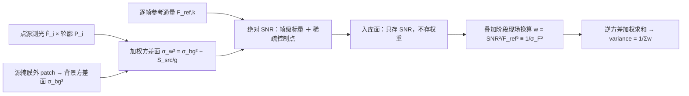

## 3. 方法

### 3.1 参考分解、两个方差面与单位

像素测量值 `I = O + N_e/g + N_read`、`N_e = N_src + N_sky + N_dark`（`I`、`O` 为 ADU，`N_*` 为电子，`g` 为 e⁻/ADU；文献的倒数约定 `g' = 1/g`，混用使源项差 `g²`）。散粒方差正比电平而与来源无关 ⇒ 源项与天光项**同构、只有定义域不同**，须两张面承载（同 ADU²、取值互不代用）：

```text
背景方差面  σ_bg²(x,y) = Var[N_local] + S_sky(x,y)/g   （空背景随机分量）
加权方差面  σ_w² (x,y) = σ_bg²(x,y) + S_src(x,y)/g     （该像素总方差）
逐像素 SNR  SNR(x,y)   = S_src(x,y) / σ_w(x,y)         （分子只有源）
```

`S_src = Σ_i F̂_i·P_i`（测光通量 × 生产轮廓），天光电平与观测电平一律归分母；**缓变的是方差图、不是噪声实现**，据此把方差降为逐帧标量不属本口径。通量型口径下逐源与帧级共用 `σ_F⁻² = Σ_i P_i²/σ_i²`、`σ_i² = σ_sky,i² + (RN/g)² + F·P_i/g`——**量纲检验**：`σ_sky²`、`(RN/g)²`、`F·P_i/g`（计数转方差的因子恰为 `1/g`）同为 ADU² ⇒ `σ_F` 为 ADU、`SNR` 无量纲。其中 `(RN/g)²` 仅当 `σ_sky` 声明为散粒口径时才加：该入参二选一显式声明（散粒-only／已含读噪的经验总 rms），错配即 fail-closed。`gain ≤ 0` 时含 `1/g` 的源项无法求值，退化为天空受限口径 `σ_F² = σ_sky²/ΣP²`：该臂给**上界**（须具名登记）。

### 3.2 入库面、参考通量与现场换算

每帧入库两个**相互独立**、同定义同参考通量的对象：帧级标量（写文件头，分子恒为该帧 `F_ref`）与稀疏绝对 SNR 控制点层（默认产出，表达帧内变化）。`F_ref,k = 10^(−0.4·(m_ref − ZP_k))`、`m_ref = 6.0` 随本帧零点而变；该星等档多在线性区外，用途只是**参考电平**。配对性只要求同帧内同源；方向性单向（`frame_snr := median_p(SNR_c)`），反向乘回把帧级偏差乘进每个控制点且不可逆。叠加时由控制点重建稠密 `SNR(x,y)` 并现场换算 `w = SNR²/F_ref² ≡ 1/σ_F²` [ADU⁻²]，无口径分支。拟合权与堆叠权有别：带杠杆 `h` 的拟合值方差为 `σ²h`，不能按 `1/σ²` 堆叠。



**图 1** 产品承载未加权绝对 SNR、权重是消费端派生量——一图立住"权重不入库"这条边界。

### 3.3 最优权的分母是谁的方差

对同一目标的 `n` 个独立观测做线性无偏估计 `μ̂ = Σw_ix_i/Σw_i`，则 `Var(μ̂) = Σw_i²v_i/(Σw_i)² ≥ 1/Σ(1/v_i)`，由 Cauchy–Schwarz **唯一取等条件是 `w_i ∝ 1/v_i`，而 `v_i` 必须是第 i 个样本自身的总方差**。本链的样本是落进该天球像素的校准后像素值，`v_i = σ_bg² + S_src/g`；`1/σ_bg²` 与之相等只在掩膜外像素（`S_src ≡ 0`）与背景受限（`S_src/g ≪ σ_bg²`）两情形。故"以背景逆方差定权"的正确陈述只能是**背景受限域的最优权**，无条件写成定义就是拿带适用域的近似当定义。另一侧同向：天光建模的样本只取掩膜外，其 `v_i = σ_bg²` 严格成立，用背景逆方差作权是对的。正本两处把自己的对象称作"逐像素科学权重"的句子缺的正是这个限定语，属**措辞订正面**，不是两篇权威互斥。
