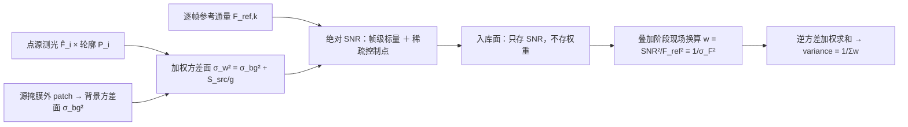

# 跨帧绝对信噪比

## 摘要

叠加与测光共用一个分母：某像素在某帧上"真实源信号相对真实噪声有多强"，须与天光无关、跨帧可比。传统口径把天光计入信号，亮背景帧虚高，权重被错给天空最亮的地方。本链入库的是**参考通量除以其自身误差** `SNR = F_ref/σ_F`，`σ_F⁻² = Σ_i P_i²/σ_i²`，`σ_i²` 含空背景随机分量与**源自身的散粒项**：天光只进分母，固定 `F_ref` 时天光升高使 SNR 单调趋零，读噪只计一次。权重不入库，叠加阶段现场换算 `w = SNR²/F_ref² ≡ 1/σ_F²`，该恒等式经独立复算在机器精度成立（最大相对偏差 3.01e-16）。口径与判据一侧成立（§5）；生产消费一侧目前退化——权重实际取自不含源项的背景逆方差面，"按信噪比最优叠加"还不是生产行为，故主张收窄为**口径与判据已确立、生产接线待修**（§6）。

## 1. 引言

上游把每帧校准到统一测光星等坐标系（见《测光校准到星等坐标系》），帧间乘性差异被单一标度吸收；本文给出另一半——**每个观测的精度**：叠加权重、深度声明与误差棒共同的来源。三个困难决定做法：单帧只有均值与方差两个可观测量，分离天光与源不成立，本链只做**归因**；天光既抬电平又抬噪声，混进分子即失去可比资格；产品被反复、异目标消费，权重属消费事件而非帧。

## 2. 相关工作与对照

**权重分母含源项**在文献与实现两侧都显式。一维光谱最优抽取给出"信号/自身误差"结构与 `A_NEA = 1/ΣP²` [3]；其逐像素方差式文本面本轮无可核版本 ⇒ 只作**结构对照**。多帧一侧，逐帧匹配滤波后按信息量加权的点源最优检测 [1] 在正文式 (3) 把方差写成"与位置无关的背景项"加"源与轮廓的卷积项"；共加图 [2] 的标题自带限定语：背景主导噪声极限下最优。逐像素总误差的公开实现把背景误差命名为 background-only，再逐像素加源项 `σ_tot = √(σ_bkg² + I/g_eff)` [4]。

**权重在消费端算、不入库**亦是成熟约定：共加软件的权重是逐像素通道、逐帧标量只是归一化因子 [5]；某闭源套件区分功率比信噪比与权重两量、权重不写进图像 [6]（本链采一次方通量型口径以保证换算严格；功率比形式已是 SNR² 量级）。三条限定随引用同读：σ 取自天光已扣、源已剔除的像元 [7]；控制点重建同时给预测方差 [8]；重采样使输出像素相关 [9]、组合需显式处理 [10]。本链的差别不在精度而在**参考电平**：上述实现都不要求同一逐帧 `F_ref` 的配对性。

## 3. 方法

### 3.1 参考分解、两个方差面与单位

像素测量值 `I = O + N_e/g + N_read`、`N_e = N_src + N_sky + N_dark`（`I`、`O` 为 ADU，`N_*` 为电子，`g` 为 e⁻/ADU；文献的倒数约定 `g' = 1/g`，混用使源项差 `g²`）。散粒方差正比电平而与来源无关 ⇒ 源项与天光项**同构、只有定义域不同**，须两张面承载（同 ADU²、取值互不代用）：

```text
背景方差面  σ_bg²(x,y) = Var[N_local] + S_sky(x,y)/g   （空背景随机分量）
加权方差面  σ_w² (x,y) = σ_bg²(x,y) + S_src(x,y)/g     （该像素总方差）
逐像素 SNR  SNR(x,y)   = S_src(x,y) / σ_w(x,y)         （分子只有源）
```

`S_src = Σ_i F̂_i·P_i`（测光通量 × 生产轮廓），天光电平与观测电平一律归分母；**缓变的是方差图、不是噪声实现**，据此把方差降为逐帧标量不属本口径。通量型口径下逐源与帧级共用 `σ_F⁻² = Σ_i P_i²/σ_i²`、`σ_i² = σ_sky,i² + (RN/g)² + F·P_i/g`——**量纲检验**：`σ_sky²`、`(RN/g)²`、`F·P_i/g`（计数转方差的因子恰为 `1/g`）同为 ADU² ⇒ `σ_F` 为 ADU、`SNR` 无量纲。其中 `(RN/g)²` 仅当 `σ_sky` 声明为散粒口径时才加：该入参二选一显式声明（散粒-only／已含读噪的经验总 rms），错配即 fail-closed。`gain ≤ 0` 时含 `1/g` 的源项无法求值，退化为天空受限口径 `σ_F² = σ_sky²/ΣP²`：该臂给**上界**（须具名登记）。

### 3.2 入库面、参考通量与现场换算

每帧入库两个**相互独立**、同定义同参考通量的对象：帧级标量（写文件头，分子恒为该帧 `F_ref`）与稀疏绝对 SNR 控制点层（默认产出，表达帧内变化）。`F_ref,k = 10^(−0.4·(m_ref − ZP_k))`、`m_ref = 6.0` 随本帧零点而变；该星等档多在线性区外，用途只是**参考电平**。配对性只要求同帧内同源；方向性单向（`frame_snr := median_p(SNR_c)`），反向乘回把帧级偏差乘进每个控制点且不可逆。叠加时由控制点重建稠密 `SNR(x,y)` 并现场换算 `w = SNR²/F_ref² ≡ 1/σ_F²` [ADU⁻²]，无口径分支。拟合权与堆叠权有别：带杠杆 `h` 的拟合值方差为 `σ²h`，不能按 `1/σ²` 堆叠。



**图 1** 产品承载未加权绝对 SNR、权重是消费端派生量——一图立住"权重不入库"这条边界。

### 3.3 最优权的分母是谁的方差

对同一目标的 `n` 个独立观测做线性无偏估计 `μ̂ = Σw_ix_i/Σw_i`，则 `Var(μ̂) = Σw_i²v_i/(Σw_i)² ≥ 1/Σ(1/v_i)`，由 Cauchy–Schwarz **唯一取等条件是 `w_i ∝ 1/v_i`，而 `v_i` 必须是第 i 个样本自身的总方差**。本链的样本是落进该天球像素的校准后像素值，`v_i = σ_bg² + S_src/g`；`1/σ_bg²` 与之相等只在掩膜外像素（`S_src ≡ 0`）与背景受限（`S_src/g ≪ σ_bg²`）两情形。故"以背景逆方差定权"的正确陈述只能是**背景受限域的最优权**，无条件写成定义就是拿带适用域的近似当定义。另一侧同向：天光建模的样本只取掩膜外，其 `v_i = σ_bg²` 严格成立，用背景逆方差作权是对的。正本两处把自己的对象称作"逐像素科学权重"的句子缺的正是这个限定语，属**措辞订正面**，不是两篇权威互斥。

## 4. 数据与实验设计

三类数据相互印证：纯解析代数合成（恒等式与量纲对拍、绝对/相对表示的电平偏差、零结构负例）、物理前向仿真（电子域 Poisson＋读噪＋增益＋天光散粒，固定 seed 的 4000 次实现、两组异源参数）、真实数据（输入与产品不入库，不引其数字，§6.6）。两条纪律贯穿全链：**判据必须能红**；**判据所测对象必须就是所主张的对象**（同式镜像的 oracle 只测自洽性、测不到口径）。数值来自归档结果件与两份不依赖生产代码的复算；本轮未运行构建、测试与端到端。

| 判据 | 注入什么偏差它会红 | 实测反应 | 结论 |
|---|---|---|---|
| 天光单调性 | 冻住 `σ_sky` 不随天光变 | 比值 1.000000、斜率 1.0e-17（真效应 −0.4931/−0.49996） | 有判别力 |
| 读噪只计一次 | 经验总 rms 再加 `(RN/g)²` | 双计臂在读噪主导处判红（&#124;z&#124; 最大 16.4）；自造双计 z = 13.37 | 有判别力 |

## 5. 结果

**(1) 定义式闭合。** 独立前向仿真给 `σ_F` 定义式对经验散度 z = +0.35 与 −1.75（定义式 46.0332/16.8812 对 MC 45.8528/17.2179）；归档扫描 max|z| = 2.06（天光）/2.68（噪声项），全在 3σ 内。

**(2) 天光只进分母的后果。** 固定真实源通量、天光由 0 扫到 10⁶ e⁻/px：本链趋零，斜率 −0.4879（亮源）/−0.4972（暗源）、端点比 2.11%/1.07%；同批仿真上"信号含天光"的口径**上升**三个数量级，不扣局部背景的整帧口径再高一截。差别不在精度，在分子里装了什么。

| 口径（同一批仿真帧） | 亮源 B=10⁶/B=0 | 暗源 B=10⁶/B=0 | 斜率 |
|---|---|---|---|
| 本链（天光仅在分母） | **0.0211** | **0.0107** | −0.4879 / −0.4972 |
| 信号含天光的传统口径 | ×3.42e3 | ×1.03e5 | 单调递增（判红） |
| 整帧电平（未扣局部背景） | ×8.04e3 | ×2.41e5 | 单调递增（判红） |

**(3) 读噪无重复计入。** 两条可达臂（散粒口径加 `(RN/g)²`／经验总 rms 不加）上读噪都只计一次；双计代价是闭式量：基准点（F=1000 e⁻、B=100 e⁻/px、RN=10 e⁻、g=1.3、D=0.5）使 `σ_F` 高估 **+14.5009%**、最坏点（RN=50 e⁻）**+38.2524%**，在读噪主导处判红、在天光主导处消失（<1%）——可被门抓住的系统误差，而非恒定偏移。

**(4) 逆方差才是最优功率。** 恒等式相对偏差 2.22e-16（归档门）/3.01e-16（本轮复算），前提是分子取 `F_ref`；等权与"按 SNR 加权"都劣于逆方差，`Q/W` 信息量形式与解析相符到 +1.2%。

| 组合方式 | 组合方差（4000 次实现） | 解析预测 | 相对逆方差 |
|---|---|---|---|
| 逆方差 `w = 1/σ_F²` | 1213.08 | 1207.06 | 1.00 |
| 等权 | 8263.45 | 8149.74 | 6.81 |
| 按 SNR 加权 `w ∝ SNR` | 1732.58 | 1712.57 | 1.43 |

**(5) 配对与表示。** 锚定权重相对逐源电平 oracle 权重的散度比值在 `|m − m_ref| ≤ 4` mag 内偏离 ≤0.6%、6 mag 处 3.6%；定义端与换算端不同源时效率损失随零点散度增长，散度 0 时**严格归零**、1.0 mag 时 30.18%。解析真值已知的场景上，把稠密 SNR 表示为"帧级标量 × 相对场"在结构污染下偏 −44.1%/−45.5%，绝对表示偏 −1.0%/−0.6%，撤掉结构后两表示之差收到 0.037%。

## 6. 讨论

### 6.1 生产消费端目前退化：主张为何收窄

两条可达臂都不给含源项的逐像素最优权：逐像素臂把背景逆方差面直接当权，而该面按构造只取掩膜外像元、源通量不在其表达式里；帧级臂的分子口径正确，但稀疏层在源码里就地标注未接入生产数据面 ⇒ 复合因子恒为 1、一帧一个数。前者是现行缺陷（背景权冒充科学权、据此写误差棒），后者是**已声明的降级**（具名标记不可用），与业界帧权同型、不算口径错误。

过权倍数属构造性对照、**非实跑读数**：`R = w_used/w_opt = 1 + S_src/(g·σ_bg²)`，取自建 Moffat4（σ_px = 1.4863 px、FWHM = 3.5 px ⇒ 峰值占比 0.2159）、σ_bg = 5 ADU、g = 1.3，`S_src` = 10³/10⁴/10⁵/10⁶ ADU 给 **×7.6/×67/×665/×6.6e3**，并对背景尺度一次方敏感（同一 `S_src` = 10⁴：σ_bg = 1 ADU 处 ×1662、20 ADU 处 ×5.2）。误差面更硬：产品按 `variance = 1/Σw` 出误差棒，真值是 `Σw²σ_true²/(Σw)²`，同一算例之比在 `S_src` = 10³/10⁴/10⁶ 处为 1.8/4.3、9.3/34.2、831/3323 ⇒ **交付误差棒偏小 1–3 个数量级**。故主张收窄为"口径与判据已确立、生产接线待修"；接入稀疏层也不解决源项缺失，除非控制点按含源项的 σ 求值。

### 6.2 稀疏控制点：对象缺位与潜伏的口径错配

合同冻结的控制点值是 `F_ref/σ_F,c`（不存相对因子、不得乘除帧级 SNR），生产在册的逐源 SNR 是**另一个对象**（消费者是相对质量场），稀疏层**无生产者**。风险潜伏在消费算子：它仍按"实际 SNR = 帧级 × 帧内相对因子"复合（分解已作废），且自检与 Oracle 夹具的控制值取中位归一的相对形态、与合同判红样本同形。接入而不改算子，权重会被乘上 `frame_snr²`（帧间相对权被压平）与 `(F_i/F_ref)²`（权成为正比通量平方）。

### 6.3 "重建误差"无证据资格；预测方差未实现

该量是控制点处的复现残差，而算子被约束为必须在节点精确复现 ⇒ 对三个插值算子逐位恒 0：18 组不同源输入（常数、线性、二次、分辨与欠采样正弦、跨六个数量级随机场）残差全为 0.000e+00，而同一重建相对解析真值的误差达 3e-2 至 1.7e1；把真值故意偏置 0.3 dex，残差仍为 0；唯一能报非零的形态（求值栅格错位）在上游已被失败关闭。本文因此不以其作精度证据。同一缺口的另一面：合同要求的**逐像素预测方差未实现**（出参无字段、无写点，历史检索显示从未实现）。合格判据须在**非节点**采样、与节点数组不同源，样本不足即判红。

### 6.4 一处噪声式：量纲不齐，且式与自己的数字不属同一对象

偏差式 `√(1 + F/σ_bg²)` 量纲不齐：加数单位 ADU⁻¹，缺的正是把源计数转成方差的 `1/g` 与 `ΣP²`。其两个百分数不出自该式也不出自真值式，而精确等于 `1/√(1−φ)`（φ = 源方差/总方差）在 0.5/0.95 处：41.42%/347.21% ⇒ 它们出自一个不需要增益的无量纲理想化式；而该分支的进入条件恰是 `gain ≤ 0`，带 `1/g` 的补正在其唯一触发条件下不可求值 ⇒ 整改取 φ 形式。主项亦另在别处：只丢 `1/g` 的倍数上界是 `√g`（g = 1.3 ⇒ 1.14），数倍量级那一档要同时丢 `ΣP²` 才解释得通。

### 6.5 引用面必须带抽样噪声

双计头条数字取自单次实现值（分母为 N=1000 的经验散度）：同一物理点在四条扫描轴上给 +12.79/13.27/15.92/17.63%、极差 4.84 pp，而分子四轴极差仅 0.027%、分母 4.2% ⇒ 散布全来自分母的抽样噪声（重采样 20 块得 sd = 2.94 pp），实现值期望亦比闭式偏低；约束"预测对实测"的最大偏差量（7.00 pp）被算出但无门读取。故本文只引 seed 无关的闭式值并注散布。

### 6.6 不可重算的读数

两类读数不引数字：真实数据臂依赖未归档的输入 FITS（跟踪集只有说明与索引）；生产实跑走哪条臂——接线默认路径与归档声明互斥，只能由实跑的磁盘证据裁决。待复测：产品是否含逐像素 variance/ivar 子面、叠加结果的权重来源与"不确定度不可用原因"键读数；含源项方差面接入后的验收判据 = 两臂在无源帧逐位恒等。

### 6.7 适用域

无增益臂为上界口径：SNR 偏高且随源亮度无界增长。`σ_i²` 用实测 `F` ⇒ 权重依赖数据，`Var = 1/ΣP²/σ²` 是一阶近似；对角累加是白噪声近似，而产品像素相邻不独立 ⇒ 相关噪声域应走完整信息核（已实现、生产零调用）[9][10]。

## 7. 结论

跨帧可比的精度落成一个可判别的定义：帧级与逐像素都报参考通量与其自身误差之比，天光只进分母、源散粒必进分母、读噪只计一次；权重不入库，叠加时由 `w = SNR²/F_ref² ≡ 1/σ_F²` 现场换算，最优权的分母必须是"被估量自身的总方差"。可主张：定义式闭合、天光单调性有判别力、逆方差严格优于等权与 SNR 加权、配对损失在零点归零。不主张：生产已按信噪比最优叠加；稀疏重建精度受"节点复现残差"约束；实拍帧电平偏差的量级；无增益臂给绝对值而非上界。

## 参考文献

[1] Zackay, I., & Ofek, E. O. 2017, ApJ 836, 187（*How to COAAD Images. I. Optimal Source Detection and Photometry of Point Sources Using Ensembles of Images*），DOI 10.3847/1538-4357/836/2/187（arXiv:1512.06872）。引其正文式 (3)：逐帧方差 = 与位置无关的背景项 + 源通量与点源轮廓的卷积项。

[2] Zackay, I., & Ofek, E. O. 2017, ApJ 836, 188（*… II. A Coaddition Image that is Optimal for Any Purpose in the Background-dominated Noise Limit*），DOI 10.3847/1538-4357/836/2/188（arXiv:1512.06879）。标题即适用域限定；亦为相关噪声下信息保持组合的出处。

[3] Horne, K. 1986, PASP 98, 609（*An optimal extraction algorithm for CCD spectroscopy*），DOI 10.1086/131801。适用域为一维光谱抽取；本轮只核到书目与题名层，故仅作统计结构对照、不引式号。

[4] Bradley, L. 等，*photutils* v3.0.0（BSD-3-Clause），`utils.errors.calc_total_error`：`σ_tot = √(σ_bkg² + I/g_eff)`，其中背景误差名为 background-only。引用须钉到所用发行版（总则性存档标识会漂移）。

[5] SWarp（GPL-3.0），`src/coadd.c` 与 `src/weight.c`，按固定版本快照核对：权重是逐像素通道，写盘经 `var_to_weight()` 转为 ivar，逐帧 `sigfac` 只是乘在整张图上的归一化因子。

[6] PixInsight Reference, *New Image Weighting Algorithms*，https://pixinsight.com/doc/docs/ImageWeighting/ImageWeighting.html —— 方法学对照：功率比口径的点源信噪比与作为权重的点源信号权重是两个量，权重不写进图像；本项目不照抄其标定常数。

[7] Akhlaghi, M., & Ichikawa, T. 2015, ApJS 220, 1（NoiseChisel），DOI 10.1088/0067-0049/220/1/1（arXiv:1505.01664）。用途限定：检测/分割语境的局部噪声场与"只用未检测像元统计 sky 与 σ"，不作逆方差加权的背书。

[8] Saydjari, A. K., & Finkbeiner, D. P. 2022, ApJ 933, 155（*Photometry on Structured Backgrounds: Local Pixelwise Infilling by Regression*），DOI 10.3847/1538-4357/ac6875（arXiv:2201.07246）。逐像素内插同时给出背景预测与不确定度。

[9] Fruchter, A. S., & Hook, R. N. 2002, PASP 114, 144–152，DOI 10.1086/338393（arXiv:astro-ph/9808087v2）。§2 式(4)(5) 的加权均值结构（引用须交代重叠面积分数、输入权重与面积因子三者的幂次）；其 §7 为 drizzle 图像中的噪声。

[10] Melchior, P., Moolekamp, F., Jerdee, M., et al. 2018, Astronomy and Computing 24, 129–142（scarlet），DOI 10.1016/j.ascom.2018.07.001（arXiv:1802.10157）。为共加图的相关噪声与逐波段 PSF 卷积给出可引用的处理推导（原文措辞是"适用于"，非"已证正确"）。

<!-- PROGRESS: 章节 8/8 -->
